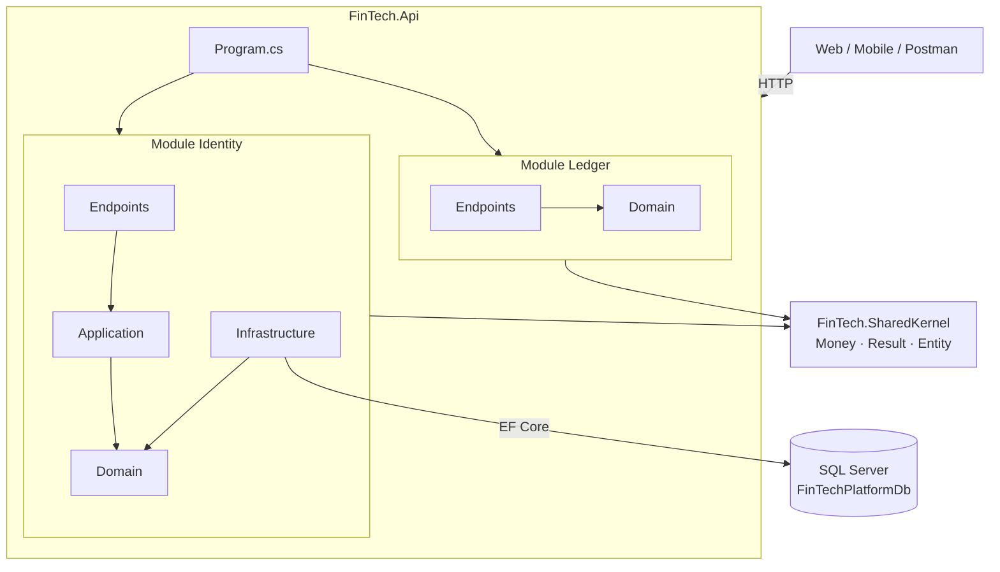

# 💹 FinTech Platform

Nền tảng quản lý tài chính cho **cá nhân, hộ gia đình và doanh nghiệp SME**: sổ cái kế toán kép, giao dịch, ngân sách, khoản vay, hóa đơn, đầu tư và phê duyệt chi tiêu nhiều cấp. Hệ thống được thiết kế theo tiêu chuẩn bảo mật và toàn vẹn dữ liệu của ngành tài chính.


> [!NOTE]
> Dự án đang ở **giai đoạn khởi tạo**. Phần nền (kiến trúc, SharedKernel, schema `iam`) đã xong; các tính năng nghiệp vụ như Đăng nhập, Sổ cái đang được phát triển. Xem [Lộ trình](#-lộ-trình).

---

## 📑 Mục lục

- [Tính năng](#-tính-năng)
- [Công nghệ](#-công-nghệ)
- [Kiến trúc](#-kiến-trúc)
- [Cấu trúc thư mục](#-cấu-trúc-thư-mục)
- [Bắt đầu nhanh](#-bắt-đầu-nhanh)
- [Database & Migration](#-database--migration)
- [Kiểm thử](#-kiểm-thử)
- [Quy tắc phát triển](#-quy-tắc-phát-triển)
- [Tài liệu](#-tài-liệu)
- [Lộ trình](#-lộ-trình)

---

## ✨ Tính năng

| Nhóm | Mô tả | Trạng thái |
|---|---|---|
| 🔐 Identity & IAM | Người dùng, Workspace (Tenant), phân quyền RBAC, thiết bị tin cậy, Passkey | 🟡 Đã có schema DB |
| 🔑 Xác thực | Đăng nhập JWT, Refresh Token Rotation, Argon2id, khóa tài khoản, Rate limit | ⏳ Đang làm |
| 📒 Sổ cái kép | Ghi sổ Nợ/Có bất biến (append-only), bút toán đảo, đa tiền tệ | ⏳ Kế hoạch |
| 💳 Giao dịch | Giao dịch, tách giao dịch, danh mục, nhập sao kê ngân hàng | ⏳ Kế hoạch |
| 📊 Ngân sách & Mục tiêu | Ngân sách theo kỳ, mục tiêu tiết kiệm | ⏳ Kế hoạch |
| 🏦 Khoản vay & Hóa đơn | Lịch trả góp, nhắc hạn hóa đơn định kỳ | ⏳ Kế hoạch |
| 🏢 SME | Hóa đơn AR/AP, tài sản cố định, phê duyệt chi nhiều cấp | ⏳ Kế hoạch |

---

## 🛠 Công nghệ

| Lớp | Công nghệ |
|---|---|
| Ngôn ngữ / Framework | C# 14, ASP.NET Core 10 (Minimal APIs) |
| Kiến trúc | Modular Monolith + Clean Architecture + DDD |
| Database | SQL Server 2025, EF Core 10 |
| Tài liệu API | OpenAPI 3.1 + [Scalar](https://scalar.com) |
| Kiểm thử | xUnit, NetArchTest |
| Web / Mobile *(dự kiến)* | React 19 + Vite, React Native + Expo |

---

## 🏗 Kiến trúc

Dự án là **một ứng dụng duy nhất** nhưng chia thành nhiều **module theo nghiệp vụ**. Mỗi module có ranh giới riêng và chỉ giao tiếp với module khác qua project `Contracts`.



Bên trong mỗi module có 4 tầng:

| Tầng | Vai trò |
|---|---|
| `Domain/` | Entity và luật nghiệp vụ. Không phụ thuộc thư viện ngoài |
| `Application/` | Từng use case (Command/Query + Handler + Validator), tổ chức theo Vertical Slice |
| `Infrastructure/` | DbContext, cấu hình EF Core, migration, dịch vụ bên ngoài |
| `Endpoints/` | Minimal API: nhận HTTP request, trả HTTP response |

📘 Người mới nên đọc **[Hướng dẫn kiến trúc cho người mới](docs/architecture_beginner_guide.md)** trước.

---

## 📁 Cấu trúc thư mục

```text
FindTechPlatform/
├── src/
│   ├── BuildingBlocks/
│   │   └── FinTech.SharedKernel/        # Money, Result<T>, Entity, IUnitOfWork
│   ├── Hosts/
│   │   ├── FinTech.Api/                 # Web API: điểm khởi động chính
│   │   └── FinTech.Worker/              # Tiến trình chạy nền
│   └── Modules/
│       ├── Identity/
│       │   ├── FinTech.Modules.Identity/            # Domain, Infrastructure, Endpoints
│       │   └── FinTech.Modules.Identity.Contracts/  # API công khai cho module khác
│       └── Ledger/
│           ├── FinTech.Modules.Ledger/
│           └── FinTech.Modules.Ledger.Contracts/
├── tests/
│   ├── FinTech.SharedKernel.UnitTests/
│   └── FinTech.ArchitectureTests/       # Kiểm tra luật kiến trúc tự động
├── docs/                                # Tài liệu phân tích & thiết kế
├── Directory.Build.props                # Cấu hình build chung
└── FinTechPlatform.sln
```

---

## 🚀 Bắt đầu nhanh

### Yêu cầu

- [.NET SDK 10](https://dotnet.microsoft.com/download) (xem phiên bản trong `global.json`)
- SQL Server 2022/2025 (bản Developer hoặc Express đều được)
- Công cụ EF Core CLI:
  ```bash
  dotnet tool install --global dotnet-ef
  ```

### Cài đặt

```bash
git clone https://github.com/nguyenhoangphiCoder/FinTech-Platform.git
cd FinTech-Platform
dotnet restore
```

### Cấu hình chuỗi kết nối

Sửa `ConnectionStrings:FinTechDb` trong `src/Hosts/FinTech.Api/appsettings.json` cho đúng SQL Server của bạn:

```json
"ConnectionStrings": {
  "FinTechDb": "Server=<TEN_MAY_CHU>;Database=FinTechPlatformDb;Trusted_Connection=True;TrustServerCertificate=True;MultipleActiveResultSets=true"
}
```

> [!TIP]
> Nên đặt chuỗi kết nối riêng của máy bằng **User Secrets** thay vì sửa file trong repo:
> ```bash
> dotnet user-secrets init --project src/Hosts/FinTech.Api
> dotnet user-secrets set "ConnectionStrings:FinTechDb" "Server=...;..." --project src/Hosts/FinTech.Api
> ```

### Tạo database và chạy

```bash
dotnet ef database update \
  --project src/Modules/Identity/FinTech.Modules.Identity \
  --startup-project src/Hosts/FinTech.Api

dotnet run --project src/Hosts/FinTech.Api
```

Mở địa chỉ in ra trên terminal. Trang chủ tự chuyển tới **`/scalar/v1`**, nơi xem và gọi thử toàn bộ API.

| Endpoint | Mô tả |
|---|---|
| `GET /api/health` | Tình trạng hệ thống |
| `GET /api/identity/health` | Tình trạng module Identity |
| `GET /api/ledger/health` | Tình trạng module Ledger |

---

## 🗄 Database & Migration

Mỗi module dùng một **schema SQL riêng** (`iam`, `ledger`, …). Schema `iam` hiện có:

| Bảng | Vai trò |
|---|---|
| `iam.Tenants` | Workspace: cá nhân / hộ gia đình / SME |
| `iam.Users` | Người dùng toàn hệ thống |
| `iam.TenantMemberships` | Thành viên Workspace và vai trò |
| `iam.UserRefreshTokens` | Phiên đăng nhập (chỉ lưu SHA-256 của token) |
| `iam.UserDevices` | Thiết bị đã đăng nhập |
| `iam.PasskeyCredentials` | Khóa Passkey / FIDO2 |

Tạo migration mới cho module Identity:

```bash
dotnet ef migrations add <TenMigration> \
  --project src/Modules/Identity/FinTech.Modules.Identity \
  --startup-project src/Hosts/FinTech.Api \
  --output-dir Infrastructure/Persistence/Migrations
```

Thiết kế đầy đủ 72 bảng: [fintech_database_deep_dive.md](docs/fintech_database_deep_dive.md).

---

## 🧪 Kiểm thử

```bash
dotnet test
```

- **Unit test**: kiểm tra phép tính tiền tệ (`Money`), gồm thuật toán chia tiền không mất phần dư.
- **Architecture test**: dùng NetArchTest để chặn vi phạm kiến trúc, ví dụ Domain phụ thuộc Infrastructure.

Build được cấu hình nghiêm ngặt (`TreatWarningsAsErrors`, `Nullable`, `AnalysisLevel=latest-recommended`): **mọi cảnh báo đều làm build thất bại**.

---

## 📐 Quy tắc phát triển

Bộ quy tắc đầy đủ: [`.agents/skills/fintech-platform-coding-rules/SKILL.md`](.agents/skills/fintech-platform-coding-rules/SKILL.md). Các quy tắc bắt buộc quan trọng nhất:

- 💰 **Tiền tệ:** chỉ dùng `decimal` / `Money` (C#), `DECIMAL(19,4)` (SQL). **Cấm** `float`/`double`.
- 📒 **Sổ cái bất biến:** bảng `Postings` chỉ được thêm; sửa sai bằng bút toán đảo, cấm `UPDATE`/`DELETE`.
- 🔁 **Idempotency:** mọi API ghi nhận tài chính bắt buộc có header `Idempotency-Key`.
- 🏢 **Multi-tenant:** mọi truy vấn nghiệp vụ lọc theo `TenantId`, kèm Row-Level Security ở SQL Server.
- 🕒 **Thời gian:** dùng `TimeProvider`, không gọi `DateTime.UtcNow` trực tiếp.
- 🔒 **Bảo mật:** không log mật khẩu/token/số thẻ; web dùng cookie `HttpOnly` qua BFF, không lưu token ở `localStorage`.
- 🧩 **Ranh giới module:** cấm JOIN bảng giữa các module; giao tiếp qua `Contracts` hoặc Integration Events.
- 🆔 **Khóa chính:** `Guid.CreateVersion7()`.

### Quy ước commit

Theo [Conventional Commits](https://www.conventionalcommits.org/):

```text
feat(identity): add login endpoint
fix(ledger): correct balance rounding
docs: update architecture guide
```

---

## 📚 Tài liệu

| Tài liệu | Nội dung |
|---|---|
| [architecture_beginner_guide.md](docs/architecture_beginner_guide.md) | ⭐ Hướng dẫn kiến trúc cho người mới |
| [fintech_platform_analysis.md](docs/fintech_platform_analysis.md) | Phân tích tổng quan sản phẩm |
| [fintech_functional_specification.md](docs/fintech_functional_specification.md) | Đặc tả chức năng |
| [fintech_architecture_dotnet.md](docs/fintech_architecture_dotnet.md) | Kiến trúc kỹ thuật .NET |
| [fintech_modules_deep_dive.md](docs/fintech_modules_deep_dive.md) | Chi tiết từng module |
| [fintech_business_workflows_deep_dive.md](docs/fintech_business_workflows_deep_dive.md) | Luồng nghiệp vụ |
| [fintech_database_deep_dive.md](docs/fintech_database_deep_dive.md) | Thiết kế CSDL (72 bảng) |
| [fintech_security_deep_dive.md](docs/fintech_security_deep_dive.md) | Kiến trúc bảo mật & mô hình đe dọa |

---

## 🗺 Lộ trình

- [x] Khởi tạo solution .NET 10, SharedKernel (`Money`, `Result`, `Entity`)
- [x] OpenAPI 3.1 + Scalar
- [x] Module Identity: domain + schema `iam` + migration đầu tiên
- [ ] Đăng nhập: Argon2id, JWT, Refresh Token Rotation, khóa tài khoản, Rate limit
- [ ] Đăng ký, xác thực email, 2FA TOTP, Passkey
- [ ] Module Ledger: tài khoản, bút toán kép, số dư
- [ ] Row-Level Security cho multi-tenant
- [ ] Module Transactions, Import sao kê
- [ ] Web SPA (React 19) + BFF Gateway
- [ ] Ứng dụng Mobile (React Native + Expo)

---

## 👤 Tác giả

**Nguyễn Hoàng Phi** · [@nguyenhoangphiCoder](https://github.com/nguyenhoangphiCoder)
