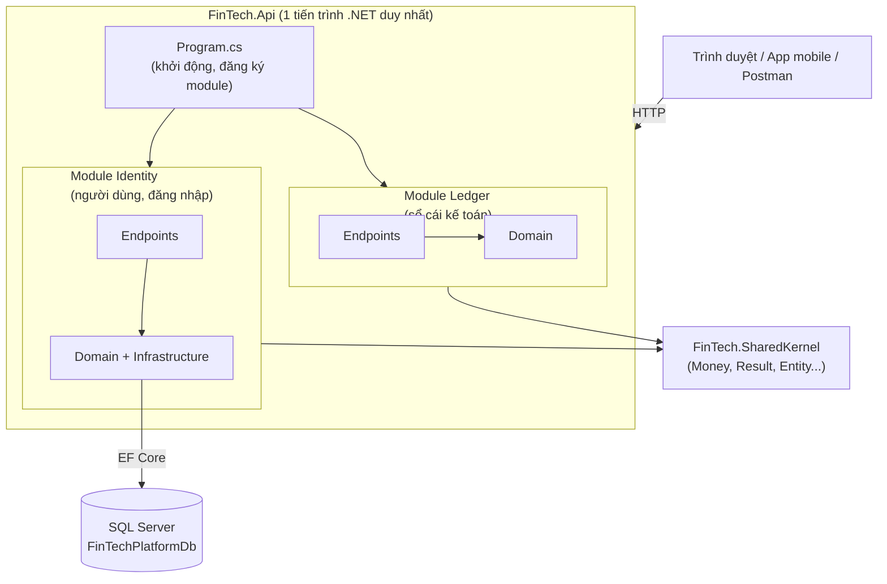
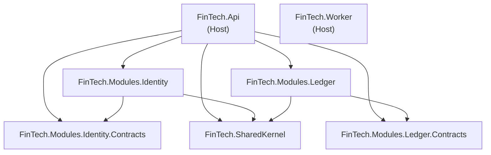
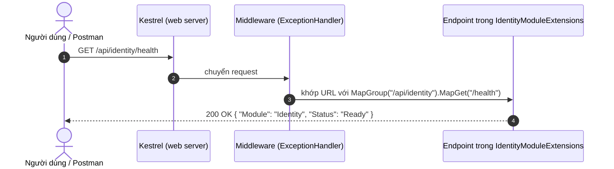
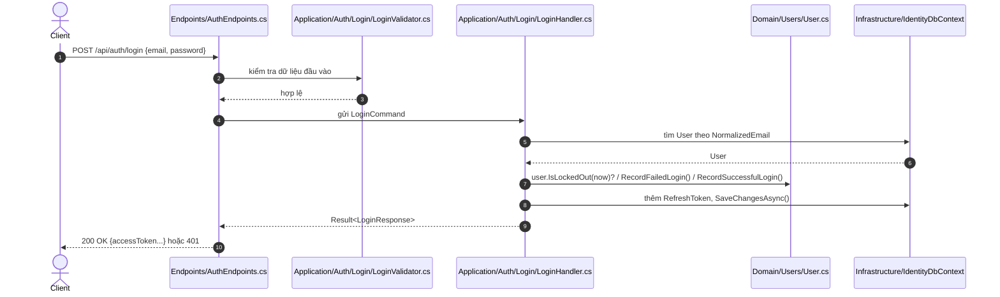
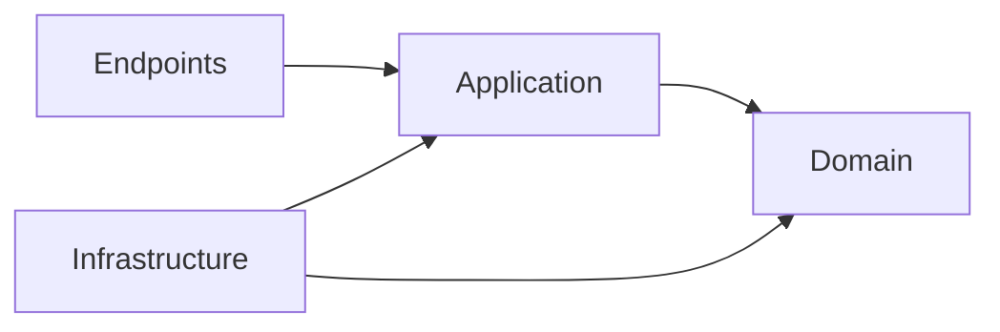
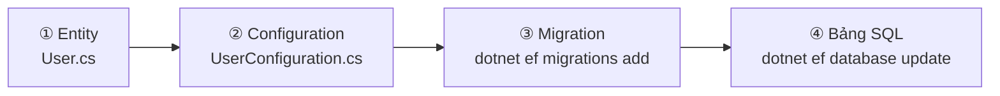
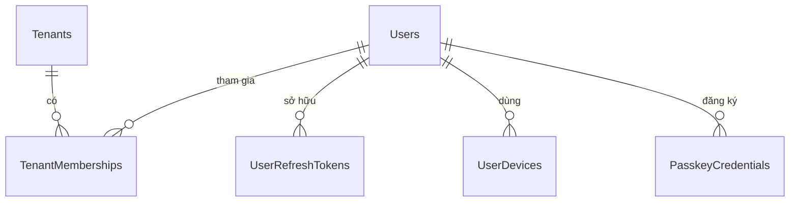

# 📘 Hướng dẫn Kiến trúc FindTechPlatform cho Người mới

> **Đối tượng:** Lập trình viên mới vào dự án, đã biết C# cơ bản nhưng chưa quen với Modular Monolith / Clean Architecture.
> **Phạm vi:** Mô tả **đúng trạng thái code hiện tại** trong repo (10/2026), không phải bản thiết kế tương lai.
> **Tài liệu liên quan:** [fintech_architecture_dotnet.md](./fintech_architecture_dotnet.md) (thiết kế đầy đủ) · [SKILL.md – quy tắc code](../.agents/skills/fintech-platform-coding-rules/SKILL.md)

---

## Mục lục

1. [Bức tranh tổng quát trong 1 phút](#1-bức-tranh-tổng-quát-trong-1-phút)
2. [Từ điển thuật ngữ cần biết trước](#2-từ-điển-thuật-ngữ-cần-biết-trước)
3. [Cây thư mục và ý nghĩa từng file](#3-cây-thư-mục-và-ý-nghĩa-từng-file)
4. [Các project tham chiếu nhau như thế nào](#4-các-project-tham-chiếu-nhau-như-thế-nào)
5. [Chuyện gì xảy ra khi bấm Run](#5-chuyện-gì-xảy-ra-khi-bấm-run)
6. [Một request HTTP đi qua hệ thống như thế nào](#6-một-request-http-đi-qua-hệ-thống-như-thế-nào)
7. [Bên trong một Module: 4 tầng](#7-bên-trong-một-module-4-tầng)
8. [Database: từ class C# đến bảng SQL Server](#8-database-từ-class-c-đến-bảng-sql-server)
9. [SharedKernel: bộ đồ nghề dùng chung](#9-sharedkernel-bộ-đồ-nghề-dùng-chung)
10. [Test và các "luật" tự động](#10-test-và-các-luật-tự-động)
11. [Đối chiếu với mô hình Controller → Service → Repository](#11-đối-chiếu-với-mô-hình-controller--service--repository)
12. [Hiện trạng: cái gì đã có, cái gì chưa](#12-hiện-trạng-cái-gì-đã-có-cái-gì-chưa)
13. [Thực hành: chạy dự án và thêm một tính năng](#13-thực-hành-chạy-dự-án-và-thêm-một-tính-năng)
14. [Câu hỏi thường gặp](#14-câu-hỏi-thường-gặp)

---

## 1. Bức tranh tổng quát trong 1 phút

FindTechPlatform là **một ứng dụng duy nhất** (một tiến trình .NET chạy lên là phục vụ toàn bộ API), nhưng code bên trong được **chia thành nhiều module theo nghiệp vụ**. Kiểu tổ chức này gọi là **Modular Monolith**:

- **Monolith** = khối liền: build ra một ứng dụng, deploy một lần, dùng chung một database.
- **Modular** = chia ngăn: mỗi mảng nghiệp vụ (Đăng nhập, Sổ cái, Ngân sách…) nằm trong một "ngăn" riêng, có ranh giới rõ ràng.



### Ví dụ đời thường

Hãy tưởng tượng dự án là **một tòa nhà văn phòng**:

| Trong tòa nhà | Trong dự án |
|---|---|
| Tòa nhà | Solution `FinTechPlatform.sln` |
| Cửa chính + lễ tân | `FinTech.Api` (nhận mọi request, chỉ đường đến đúng phòng) |
| Các phòng ban (Nhân sự, Kế toán…) | Các module (`Identity`, `Ledger`…) |
| Bên trong mỗi phòng có người tiếp khách, chuyên viên, tủ hồ sơ | Bên trong mỗi module có Endpoints, logic nghiệp vụ, truy cập DB |
| Kho văn phòng phẩm dùng chung | `FinTech.SharedKernel` |
| Kho lưu trữ hồ sơ tầng hầm | SQL Server |
| Nhân viên ca đêm | `FinTech.Worker` (chạy việc nền) |

**Điểm mấu chốt:** Phòng Kế toán **không được tự ý vào lục tủ hồ sơ** của phòng Nhân sự. Muốn gì phải hỏi qua "quầy giao dịch" chính thức (project `Contracts`). Đó là quy tắc ranh giới module.

---

## 2. Từ điển thuật ngữ cần biết trước

| Thuật ngữ | Giải thích dễ hiểu | Ví dụ trong dự án |
|---|---|---|
| **Solution (`.sln`)** | File "mục lục" gom nhiều project lại để mở cùng lúc trong IDE | [FinTechPlatform.sln](../FinTechPlatform.sln) |
| **Project (`.csproj`)** | Một đơn vị build, ra một file `.dll` (thư viện) hoặc `.exe` (ứng dụng) | `FinTech.Api.csproj` |
| **ProjectReference** | Khai báo "project A được phép dùng code của project B" | Api tham chiếu Identity |
| **Namespace** | "Địa chỉ" của class, thường trùng đường dẫn thư mục | `FinTech.Modules.Identity.Domain.Users` |
| **Entity** | Class đại diện cho một "thứ" có định danh (Id), thường ánh xạ thành một bảng | `User`, `Tenant` |
| **Aggregate Root** | Entity "trưởng nhóm"; muốn sửa các entity con phải đi qua nó | `User` quản lý `RefreshTokens`, `Devices` |
| **Value Object** | Đối tượng không có Id, so sánh bằng giá trị | `Money(100, VND)` |
| **EF Core** | Thư viện ORM: viết C# thay cho SQL để đọc/ghi DB | `IdentityDbContext` |
| **DbContext** | "Phiên làm việc" với DB, chứa các `DbSet<T>` (≈ bảng) | `IdentityDbContext.Users` |
| **Migration** | File C# mô tả thay đổi cấu trúc DB (tạo bảng, thêm cột…), chạy để cập nhật DB | `20261007023459_InitialIdentityCreate.cs` |
| **Dependency Injection (DI)** | Đăng ký sẵn các đối tượng, khi class nào cần thì hệ thống tự "bơm" vào qua constructor | `services.AddDbContext<IdentityDbContext>(...)` |
| **Minimal API** | Cách viết API của .NET bằng hàm `MapGet/MapPost` thay vì tạo class Controller | `group.MapGet("/health", ...)` |
| **Endpoint** | Một địa chỉ API cụ thể (method + URL) | `GET /api/identity/health` |
| **Module** | Một mảng nghiệp vụ độc lập, gồm 2 project: chính + Contracts | `Identity`, `Ledger` |
| **Contracts** | Project chứa những gì module **công khai** cho module khác dùng (DTO, interface, sự kiện) | `FinTech.Modules.Identity.Contracts` |
| **Tenant** | Một "không gian làm việc": ví cá nhân, hộ gia đình hoặc doanh nghiệp SME | bảng `iam.Tenants` |
| **Schema (SQL)** | Nhóm bảng trong DB, giống thư mục | `iam`, `ledger` |

---

## 3. Cây thư mục và ý nghĩa từng file

```text
FindTechPlatform/
│
├── FinTechPlatform.sln            ← Mục lục solution (mở file này bằng Visual Studio / Rider)
├── Directory.Build.props          ← Cấu hình build ÁP DỤNG CHO MỌI project (net10.0, Nullable, coi warning là lỗi…)
├── global.json                    ← Ghim phiên bản .NET SDK
├── .editorconfig                  ← Quy tắc định dạng code (file-scoped namespace, dấu ngoặc…)
├── .agents/skills/.../SKILL.md    ← Bộ quy tắc bắt buộc khi viết code (AI và người đều phải theo)
├── docs/                          ← Tài liệu phân tích, thiết kế (bạn đang đọc ở đây)
│
├── src/
│   ├── BuildingBlocks/
│   │   └── FinTech.SharedKernel/          ── 🧱 ĐỒ DÙNG CHUNG
│   │       ├── Money.cs                   Kiểu tiền tệ chính xác (decimal + mã tiền)
│   │       ├── Result.cs                  Kiểu trả về Thành công/Thất bại thay cho throw exception
│   │       ├── Entity.cs                  Lớp cha cho mọi Entity / AggregateRoot
│   │       └── IUnitOfWork.cs             Interface "lưu tất cả thay đổi một lần"
│   │
│   ├── Hosts/                             ── 🚪 NƠI CHƯƠNG TRÌNH KHỞI ĐỘNG
│   │   ├── FinTech.Api/
│   │   │   ├── Program.cs                 Điểm bắt đầu: đăng ký module, bật OpenAPI/Scalar, chạy web server
│   │   │   ├── appsettings.json           Cấu hình (chuỗi kết nối DB "FinTechDb", logging)
│   │   │   ├── appsettings.Development.json  Cấu hình riêng khi chạy ở máy dev
│   │   │   ├── Properties/launchSettings.json  Cổng chạy, môi trường khi bấm Run
│   │   │   └── FinTech.Api.http           File gửi thử request ngay trong IDE
│   │   └── FinTech.Worker/
│   │       ├── Program.cs                 Khởi động tiến trình chạy nền
│   │       └── Worker.cs                  Hiện chỉ ghi log mỗi 30 giây (khung mẫu)
│   │
│   └── Modules/                           ── 🏢 CÁC PHÒNG BAN NGHIỆP VỤ
│       ├── Identity/                      (Người dùng, Workspace, Đăng nhập)
│       │   ├── FinTech.Modules.Identity/
│       │   │   ├── Domain/
│       │   │   │   ├── Tenants/
│       │   │   │   │   ├── Tenant.cs              Workspace (cá nhân / hộ gia đình / SME)
│       │   │   │   │   └── TenantMembership.cs    Ai thuộc Workspace nào, với vai trò gì
│       │   │   │   └── Users/
│       │   │   │       ├── User.cs                Người dùng (email, mật khẩu băm, khóa tài khoản…)
│       │   │   │       ├── UserRefreshToken.cs    Phiên đăng nhập / Refresh token (chỉ lưu bản băm)
│       │   │   │       ├── UserDevice.cs          Thiết bị đã đăng nhập
│       │   │   │       └── PasskeyCredential.cs   Khóa Passkey / vân tay (FIDO2)
│       │   │   ├── Infrastructure/
│       │   │   │   └── Persistence/
│       │   │   │       ├── IdentityDbContext.cs   Cầu nối tới DB cho module Identity
│       │   │   │       ├── Configurations/        Mô tả mỗi Entity → bảng/cột/index ra sao
│       │   │   │       └── Migrations/            File sinh tự động để tạo/sửa bảng
│       │   │   └── IdentityModuleExtensions.cs    "Công tắc" của module: đăng ký DI + khai báo API
│       │   └── FinTech.Modules.Identity.Contracts/  (hiện đang trống)
│       │
│       └── Ledger/                        (Sổ cái kế toán kép)
│           ├── FinTech.Modules.Ledger/
│           │   ├── Domain/LedgerAccountId.cs      Kiểu Id mạnh cho tài khoản sổ cái
│           │   └── LedgerModuleExtensions.cs      Đăng ký module + API /api/ledger/health
│           └── FinTech.Modules.Ledger.Contracts/  (hiện đang trống)
│
└── tests/
    ├── FinTech.SharedKernel.UnitTests/
    │   └── MoneyTests.cs                  Kiểm thử phép tính tiền
    └── FinTech.ArchitectureTests/
        └── CleanArchitectureTests.cs      Kiểm thử TỰ ĐỘNG rằng code không vi phạm luật kiến trúc
```

> [!NOTE]
> Thư mục `bin/` và `obj/` trong mỗi project là **sản phẩm build sinh tự động**, không cần đọc, không commit.

---

## 4. Các project tham chiếu nhau như thế nào

Mỗi mũi tên nghĩa là "**được phép dùng code của**":



### 3 luật vàng về tham chiếu

1. **SharedKernel không phụ thuộc ai.** Nó là đáy của kim tự tháp. Nếu SharedKernel tham chiếu một module thì mọi module sẽ dính vào nhau.
2. **Host (Api/Worker) đứng trên cùng**, được tham chiếu mọi module để "lắp ráp" chúng lại.
3. **Module A không tham chiếu trực tiếp project chính của Module B.** Nếu Ledger cần biết thông tin người dùng, nó chỉ được tham chiếu `FinTech.Modules.Identity.Contracts`, **không bao giờ** tham chiếu `FinTech.Modules.Identity`. Cũng **cấm JOIN bảng** giữa hai module trong SQL.

> **Vì sao phải khắt khe vậy?** Nếu ngày nào đó cần tách Ledger ra thành một service riêng (microservice), chỉ cần thay "quầy giao dịch" Contracts bằng một lời gọi HTTP/message, không phải đập code. Ngoài ra, khi sửa Identity, bạn chắc chắn không làm hỏng Ledger.

---

## 5. Chuyện gì xảy ra khi bấm Run

Mở [Program.cs](../src/Hosts/FinTech.Api/Program.cs), luồng chạy từ trên xuống dưới:

```csharp
var builder = WebApplication.CreateBuilder(args);       // ① Đọc appsettings.json, chuẩn bị DI

builder.Services.AddProblemDetails();                    // ② Lỗi trả về theo chuẩn JSON RFC 7807
builder.Services.AddOpenApi(...);                        // ③ Sinh tài liệu API tự động

builder.Services.AddIdentityModule(builder.Configuration); // ④ "Cắm" module Identity
builder.Services.AddLedgerModule(builder.Configuration);   //    "Cắm" module Ledger

var app = builder.Build();                               // ⑤ Đóng gói thành ứng dụng

app.UseExceptionHandler();                               // ⑥ Bắt mọi lỗi chưa xử lý
app.MapIdentityEndpoints();                              // ⑦ Khai báo các URL của Identity
app.MapLedgerEndpoints();                                //    Khai báo các URL của Ledger

if (app.Environment.IsDevelopment()) { app.MapOpenApi(); app.MapScalarApiReference(...); } // ⑧ Trang tài liệu /scalar/v1

app.Run();                                               // ⑨ Bắt đầu lắng nghe request
```

### Bước ④ làm gì bên trong?

Mở [IdentityModuleExtensions.cs](../src/Modules/Identity/FinTech.Modules.Identity/IdentityModuleExtensions.cs):

```csharp
public static IServiceCollection AddIdentityModule(this IServiceCollection services, IConfiguration configuration)
{
    // Lấy chuỗi kết nối "FinTechDb" từ appsettings.json
    var connectionString = configuration.GetConnectionString("FinTechDb") ?? throw ...;

    // Đăng ký IdentityDbContext vào DI, dùng SQL Server
    services.AddDbContext<IdentityDbContext>(options =>
        options.UseSqlServer(connectionString, sql =>
        {
            sql.MigrationsHistoryTable("__EFMigrationsHistory", "iam"); // Bảng ghi lịch sử migration nằm ở schema iam
            sql.EnableRetryOnFailure(5, TimeSpan.FromSeconds(30), null); // Tự thử lại khi mất kết nối tạm thời
        }));

    return services;
}
```

👉 **Ý tưởng quan trọng:** `Program.cs` **không biết** bên trong module có gì. Nó chỉ gọi một hàm `AddXxxModule()` và một hàm `MapXxxEndpoints()`. Mỗi module tự lo phần của mình. Muốn thêm module mới (ví dụ `Budgeting`) chỉ cần thêm 2 dòng vào `Program.cs`.

---

## 6. Một request HTTP đi qua hệ thống như thế nào

### 6.1 Request có thật ngay bây giờ: `GET /api/identity/health`



Request này **chưa chạm tới database**. Hiện tại tất cả API trong dự án đều là API kiểm tra tình trạng (health).

### 6.2 Request trong tương lai: `POST /api/auth/login`

Khi tính năng Login được viết theo đúng kiến trúc hiện tại, request sẽ đi như sau:



Mỗi bước nằm ở một tầng khác nhau. Mục 7 sẽ giải thích chi tiết từng tầng.

---

## 7. Bên trong một Module: 4 tầng

Quy tắc dự án ([SKILL.md mục 2.1](../.agents/skills/fintech-platform-coding-rules/SKILL.md)) quy định mỗi module có **4 thư mục tầng** trong cùng một project:

```text
FinTech.Modules.<TênModule>/
├── Domain/          🧠 "Luật chơi" của nghiệp vụ
├── Application/     🎬 "Kịch bản" từng tình huống sử dụng (use case)
├── Infrastructure/  🔌 "Ống nước": DB, gọi dịch vụ ngoài
└── Endpoints/       🚪 "Cửa": nhận HTTP request
```

Quy tắc phụ thuộc giữa các tầng (mũi tên = "được dùng"):



**Domain nằm ở trung tâm và không phụ thuộc vào bất kỳ thứ gì** (không EF Core, không ASP.NET). Đây chính là ý tưởng cốt lõi của **Clean Architecture**: logic nghiệp vụ quan trọng nhất phải "sạch", không bị trộn với chi tiết kỹ thuật.

### 7.1 Domain — luật nghiệp vụ

**Câu hỏi Domain trả lời:** "Một người dùng bị khóa khi nào? Refresh token hết hiệu lực khi nào?"

Ví dụ thật trong [User.cs](../src/Modules/Identity/FinTech.Modules.Identity/Domain/Users/User.cs):

```csharp
public sealed class User : AggregateRoot<Guid>
{
    public int AccessFailedCount { get; private set; }   // private set: bên ngoài KHÔNG được gán bừa
    public DateTimeOffset? LockoutEnd { get; private set; }

    // Luật: sai mật khẩu 5 lần → khóa 15 phút
    public void RecordFailedLogin(int maxFailedAttempts = 5, TimeSpan? lockoutDuration = null)
    {
        AccessFailedCount++;
        if (AccessFailedCount >= maxFailedAttempts)
            LockoutEnd = DateTimeOffset.UtcNow.Add(lockoutDuration ?? TimeSpan.FromMinutes(15));
    }

    public bool IsLockedOut(DateTimeOffset now) => LockoutEnd.HasValue && LockoutEnd.Value > now;
}
```

**Vì sao dùng `private set` và method thay vì cho gán thuộc tính trực tiếp?**
Nếu ai cũng viết được `user.AccessFailedCount = 0` ở bất kỳ đâu, luật "5 lần thì khóa" sẽ bị phá vỡ âm thầm. Gom luật vào method `RecordFailedLogin()` đảm bảo **chỉ có một cách đúng** để thay đổi trạng thái.

**Vì sao có constructor `private User() { }`?**
EF Core cần constructor rỗng để đọc dữ liệu từ DB lên. Đặt `private` để code của chúng ta không tạo được `User` "rỗng" không hợp lệ, mà phải đi qua `User.Create(email, fullName, ...)`.

**Vì sao dùng `Guid.CreateVersion7()` làm Id?**
GUID v7 có phần đầu là thời gian, nên các Id tạo sau luôn "lớn hơn" Id tạo trước. Nhờ đó SQL Server chèn dữ liệu vào cuối index, tránh phân mảnh như GUID ngẫu nhiên (v4).

### 7.2 Application — kịch bản use case *(chưa có trong code)*

**Câu hỏi Application trả lời:** "Để đăng nhập, cần làm những bước nào, theo thứ tự nào?"

Tổ chức theo kiểu **Vertical Slice**: mỗi tình huống sử dụng là một thư mục chứa đủ mọi thứ của nó, thay vì gom tất cả Command vào một chỗ, tất cả Handler vào một chỗ:

```text
Application/
└── Auth/
    ├── Login/
    │   ├── LoginCommand.cs      Dữ liệu đầu vào (email, password)
    │   ├── LoginValidator.cs    Kiểm tra đầu vào (email đúng định dạng…)
    │   ├── LoginHandler.cs      Các bước xử lý
    │   └── LoginResponse.cs     Dữ liệu trả về
    └── RefreshToken/
        └── ...
```

> **Lợi ích:** Muốn sửa Login, bạn chỉ mở **một thư mục**, không phải nhảy qua lại 4–5 thư mục khác nhau.

Handler trả về `Result<T>` (xem mục 9) thay vì throw exception khi gặp lỗi nghiệp vụ (sai mật khẩu, tài khoản bị khóa…).

### 7.3 Infrastructure — ống nước kỹ thuật

**Câu hỏi Infrastructure trả lời:** "Dữ liệu lưu ở đâu, bằng công nghệ gì?"

Hiện có:
- [IdentityDbContext.cs](../src/Modules/Identity/FinTech.Modules.Identity/Infrastructure/Persistence/IdentityDbContext.cs): khai báo các bảng (`DbSet<User> Users`…), đồng thời hiện thực `IUnitOfWork`.
- `Configurations/*.cs`: mỗi file mô tả một Entity được lưu thành bảng như thế nào (xem mục 8).
- `Migrations/`: các file EF Core sinh tự động.

Sau này sẽ thêm ở đây: băm mật khẩu Argon2id, sinh JWT, gửi email/SMS…

### 7.4 Endpoints — cửa ra vào *(hiện viết tạm trong `IdentityModuleExtensions.cs`)*

Dự án dùng **Minimal API** thay vì Controller. So sánh:

```csharp
// Cách quen thuộc: Controller
[ApiController, Route("api/identity")]
public class IdentityController : ControllerBase
{
    [HttpGet("health")]
    public IActionResult Health() => Ok(new { Module = "Identity", Status = "Ready" });
}

// Cách dự án đang dùng: Minimal API
var group = app.MapGroup("/api/identity").WithTags("Identity & IAM Module");
group.MapGet("/health", () => Results.Ok(new { Module = "Identity", Status = "Ready" }));
```

Hai cách cho **cùng một kết quả**. Minimal API ngắn gọn hơn, khởi động nhanh hơn và là hướng Microsoft khuyến nghị cho API mới từ .NET 6 trở đi.

**Quy tắc cho Endpoints:** chỉ làm việc "phiên dịch" (đọc HTTP request → gọi Application → đổi kết quả thành HTTP response). **Không viết logic nghiệp vụ ở đây.**

---

## 8. Database: từ class C# đến bảng SQL Server

### 8.1 Hành trình 4 bước



**① Entity:** class C# thuần ([User.cs](../src/Modules/Identity/FinTech.Modules.Identity/Domain/Users/User.cs)).

**② Configuration:** nói cho EF Core biết chi tiết bảng. Ví dụ từ [UserConfiguration.cs](../src/Modules/Identity/FinTech.Modules.Identity/Infrastructure/Persistence/Configurations/UserConfiguration.cs):

```csharp
builder.ToTable("Users", "iam");                       // Bảng iam.Users
builder.HasKey(u => u.Id).IsClustered(false);          // Khóa chính, không phải clustered index
builder.Property(u => u.Email).HasMaxLength(256).IsRequired();   // NVARCHAR(256) NOT NULL
builder.HasIndex(u => u.NormalizedEmail).IsUnique();   // Email không được trùng
builder.Property(u => u.RowVer).IsRowVersion();        // Chống 2 người sửa cùng lúc (optimistic concurrency)
```

> **Vì sao tách Configuration ra khỏi Entity mà không dùng attribute `[MaxLength]`, `[Table]` ngay trên Entity?**
> Vì Domain phải "sạch", không biết đến EF Core (mục 7). Mọi chi tiết DB nằm ở Infrastructure.

**③ Migration:** EF Core so sánh Configuration với snapshot lần trước rồi sinh file C# mô tả phần chênh lệch:

```powershell
dotnet ef migrations add <TenMigration> `
  --project src/Modules/Identity/FinTech.Modules.Identity `
  --startup-project src/Hosts/FinTech.Api `
  --output-dir Infrastructure/Persistence/Migrations
```

- `--project`: project chứa DbContext và nơi lưu file migration.
- `--startup-project`: project có `Program.cs` và `appsettings.json`, để EF đọc được chuỗi kết nối.

**④ Cập nhật DB:**

```powershell
dotnet ef database update `
  --project src/Modules/Identity/FinTech.Modules.Identity `
  --startup-project src/Hosts/FinTech.Api
```

EF Core ghi tên các migration đã chạy vào bảng `iam.__EFMigrationsHistory` để lần sau không chạy lại.

### 8.2 Database hiện có

| Thông tin | Giá trị |
|---|---|
| Server | `LAPTOP-55DIT0G6` (Windows Authentication) |
| Database | `FinTechPlatformDb` |
| Chuỗi kết nối | `ConnectionStrings:FinTechDb` trong [appsettings.json](../src/Hosts/FinTech.Api/appsettings.json) |
| Migration đã chạy | `20261007023459_InitialIdentityCreate` |

| Bảng | Vai trò | Quan hệ |
|---|---|---|
| `iam.Tenants` | Workspace (cá nhân / hộ gia đình / SME) | 1 Tenant — nhiều Membership |
| `iam.Users` | Người dùng toàn hệ thống | 1 User — nhiều Membership, Token, Device, Passkey |
| `iam.TenantMemberships` | User X thuộc Tenant Y với vai trò Z | Khóa chính kép `(TenantId, UserId)` |
| `iam.UserRefreshTokens` | Phiên đăng nhập; **chỉ lưu SHA-256 của token**, không lưu token gốc | Xóa User → xóa theo (Cascade) |
| `iam.UserDevices` | Thiết bị đã đăng nhập | Mỗi User + Fingerprint là duy nhất |
| `iam.PasskeyCredentials` | Khóa Passkey / sinh trắc học | Xóa User → xóa theo |



> **Một User có thể thuộc nhiều Tenant.** Ví dụ chị Lan vừa có ví cá nhân (Owner), vừa là kế toán (Accountant) của công ty A. Đó là lý do cần bảng trung gian `TenantMemberships`.

---

## 9. SharedKernel: bộ đồ nghề dùng chung

### 9.1 `Money` — tiền tệ chính xác tuyệt đối

[Money.cs](../src/BuildingBlocks/FinTech.SharedKernel/Money.cs)

```csharp
var a = new Money(100_000m, Currency.VND);
var b = new Money(50_000m, Currency.VND);
var total = a + b;                       // 150.000 VND

var usd = new Money(10m, Currency.USD);
var bad = a + usd;                       // ❌ Ném lỗi: không cộng VND với USD

var parts = new Money(100m, Currency.USD).Allocate(1, 1, 1);
// 33.34 + 33.33 + 33.33 = 100.00  ✅ không mất 1 cent nào
```

**Vì sao không dùng `double`?** Vì `0.1 + 0.2` trong `double` ra `0.30000000000000004`. Trong tài chính, sai 1 đồng cũng là lỗi nghiêm trọng. `decimal` tính theo hệ 10 nên chính xác.

### 9.2 `Result<T>` — trả kết quả thay vì ném lỗi

[Result.cs](../src/BuildingBlocks/FinTech.SharedKernel/Result.cs)

```csharp
public Result<LoginResponse> Login(...)
{
    if (user is null)
        return DomainError.NotFound("Auth.InvalidCredentials", "Email hoặc mật khẩu không đúng");
    return new LoginResponse(...);   // tự chuyển thành Result thành công
}

// Nơi gọi:
var result = Login(...);
if (result.IsFailure) { /* trả 401 */ }
else { var data = result.Value; }
```

**Vì sao?** Exception tốn hiệu năng và dễ quên `try/catch`. "Sai mật khẩu" là chuyện **bình thường, có thể đoán trước**, không phải sự cố, nên trả về Result. Exception chỉ dành cho lỗi bất ngờ thật sự (mất kết nối DB…).

### 9.3 `Entity<TId>` và `AggregateRoot<TId>`

[Entity.cs](../src/BuildingBlocks/FinTech.SharedKernel/Entity.cs)

- `Entity<TId>`: mọi entity có `Id`; hai entity **bằng nhau khi cùng Id**, dù các thuộc tính khác nhau.
- `AggregateRoot<TId>`: thêm danh sách **Domain Events** (ví dụ "Người dùng vừa đăng nhập"). Sau này dùng để báo cho module khác mà không cần gọi trực tiếp.

### 9.4 `IUnitOfWork`

```csharp
public interface IUnitOfWork
{
    Task<int> SaveChangesAsync(CancellationToken cancellationToken = default);
}
```

Một "đơn vị công việc": mọi thay đổi (sửa User, thêm Token…) được **lưu cùng lúc trong một transaction**. Hoặc tất cả thành công, hoặc không gì thay đổi. `IdentityDbContext` hiện thực interface này.

---

## 10. Test và các "luật" tự động

### 10.1 Unit test

[MoneyTests.cs](../tests/FinTech.SharedKernel.UnitTests/MoneyTests.cs) kiểm tra các phép tính tiền. Chạy:

```powershell
dotnet test
```

### 10.2 Architecture test: luật kiến trúc được kiểm bằng máy

[CleanArchitectureTests.cs](../tests/FinTech.ArchitectureTests/CleanArchitectureTests.cs) dùng thư viện **NetArchTest** để kiểm tra, ví dụ:

```csharp
[Fact]
public void Domain_ShouldNot_DependOn_Infrastructure()
{
    var result = Types.InAssembly(LedgerAssembly)
        .That().ResideInNamespace("FinTech.Modules.Ledger.Domain")
        .ShouldNot().HaveDependencyOn("FinTech.Modules.Ledger.Infrastructure")
        .GetResult();
    Assert.True(result.IsSuccessful);
}
```

Nếu ai đó lỡ viết code trong Domain dùng tới Infrastructure, **test sẽ đỏ** ngay. Luật kiến trúc không chỉ nằm trên giấy.

> [!WARNING]
> Hiện architecture test **mới chỉ kiểm tra module Ledger và SharedKernel**, chưa kiểm tra module Identity. Cần bổ sung.

### 10.3 Build nghiêm ngặt

[Directory.Build.props](../Directory.Build.props) bật:
- `TreatWarningsAsErrors=true`: **mọi cảnh báo đều là lỗi**, build sẽ thất bại.
- `Nullable=enable`: trình biên dịch bắt lỗi null.
- `AnalysisLevel=latest-recommended`: bật bộ phân tích chất lượng code.

> 💡 Nếu build báo lỗi kiểu `IDE0161` hay `CA1861`, đó là **quy tắc phong cách/chất lượng**, không phải lỗi logic. Thư mục `Migrations/` (code sinh tự động) đã được miễn các quy tắc này trong [.editorconfig](../.editorconfig).

---

## 11. Đối chiếu với mô hình Controller → Service → Repository

Nếu bạn đã quen mô hình 3 tầng truyền thống, bảng sau giúp "dịch" sang kiến trúc hiện tại:

| Mô hình 3 tầng quen thuộc | Kiến trúc hiện tại | Khác biệt chính |
|---|---|---|
| `Controllers/AuthController.cs` | `Endpoints/AuthEndpoints.cs` (Minimal API) | Hàm thay cho class; cùng vai trò |
| `Services/AuthService.cs` (1 class nhiều method) | `Application/Auth/Login/LoginHandler.cs` (1 class = 1 use case) | Chia nhỏ hơn, mỗi file một việc |
| `Repositories/UserRepository.cs` | Dùng `IdentityDbContext` trực tiếp trong Handler, hoặc thêm Repository khi cần | DbContext của EF Core vốn đã là một dạng Repository + Unit of Work |
| `DTOs/LoginRequest.cs` | `LoginCommand.cs`, `LoginResponse.cs` (nội bộ) và project `Contracts` (công khai cho module khác) | Có thêm khái niệm "DTO công khai giữa các module" |
| `Models/User.cs` (chỉ có thuộc tính) | `Domain/Users/User.cs` (thuộc tính **và** luật nghiệp vụ) | Entity "thông minh", tự bảo vệ dữ liệu của nó |
| Chia thư mục theo **kỹ thuật** (toàn dự án) | Chia theo **nghiệp vụ** (module) rồi mới chia tầng | Ranh giới giữa nghiệp vụ rõ ràng hơn |

```text
Mô hình 3 tầng:                     Kiến trúc hiện tại:
Controllers/  ← mọi nghiệp vụ        Modules/
Services/     ← mọi nghiệp vụ          ├── Identity/  (Endpoints, Application, Domain, Infrastructure)
Repositories/ ← mọi nghiệp vụ          └── Ledger/    (Endpoints, Application, Domain, Infrastructure)
```

---

## 12. Hiện trạng: cái gì đã có, cái gì chưa

| Hạng mục | Trạng thái |
|---|---|
| Solution, cấu hình build, quy tắc định dạng | ✅ Có |
| SharedKernel (`Money`, `Result`, `Entity`, `IUnitOfWork`) + unit test | ✅ Có |
| Host `FinTech.Api` (OpenAPI, Scalar, health check) | ✅ Có |
| Host `FinTech.Worker` | ⚠️ Chỉ là khung mẫu |
| Module Identity — Domain (6 entity) | ✅ Có |
| Module Identity — Infrastructure (DbContext, Configurations, Migration) | ✅ Có, đã tạo bảng trong SQL Server |
| Module Identity — Application (Login, Register…) | ❌ Chưa có |
| Module Identity — Endpoints thật | ❌ Chỉ có `/health` |
| Module Identity — Contracts | ❌ Trống |
| Module Ledger | ⚠️ Chỉ có `LedgerAccountId` + `/health` |
| Xác thực JWT, phân quyền, Rate limit | ❌ Chưa có |
| Row-Level Security (RLS) trên SQL Server | ❌ Chưa có |

### Những điểm chưa đúng quy tắc cần sửa

> [!CAUTION]
> 1. **Entity đang gọi `DateTimeOffset.UtcNow` trực tiếp** (trong `User`, `Tenant`, `UserRefreshToken`, `UserDevice`, `PasskeyCredential`, và `Worker.cs`). Quy tắc dự án yêu cầu dùng `TimeProvider` để có thể giả lập thời gian khi test. Cách sửa: Entity nhận tham số `DateTimeOffset now`, giá trị lấy từ `TimeProvider` ở tầng Application.
> 2. **Tài liệu [fintech_architecture_dotnet.md](./fintech_architecture_dotnet.md) mục 3** mô tả mỗi module gồm 4 project (`.Domain`, `.Application`, `.Infrastructure`, `.Presentation`), trong khi code thực tế và SKILL.md dùng **2 project** (project chính chứa 4 thư mục + `.Contracts`). **Code và SKILL.md là chuẩn**; tài liệu kia cần cập nhật.
> 3. Architecture test chưa bao phủ module Identity (mục 10.2).

---

## 13. Thực hành: chạy dự án và thêm một tính năng

### 13.1 Chạy dự án

```powershell
# Tại thư mục gốc D:\PROJECT\FindTechPlatform
dotnet build                                   # Build toàn bộ
dotnet test                                    # Chạy test
dotnet run --project src/Hosts/FinTech.Api     # Chạy API
```

Mở trình duyệt vào địa chỉ in ra trong terminal (cổng trong `launchSettings.json`). Trang chủ tự chuyển tới `/scalar/v1`, nơi bạn xem và gọi thử mọi API.

### 13.2 Công thức thêm một tính năng mới (ví dụ: "Lấy thông tin người dùng theo Id")

| Bước | Tầng | File tạo/sửa | Việc cần làm |
|---|---|---|---|
| 1 | Domain | `Domain/Users/User.cs` | Có sẵn. Chỉ thêm method nếu có luật nghiệp vụ mới |
| 2 | Application | `Application/Users/GetUserById/GetUserByIdQuery.cs` | `record GetUserByIdQuery(Guid UserId)` |
| 3 | Application | `.../GetUserById/UserResponse.cs` | DTO trả về; **không** chứa `PasswordHash`, `SecurityStamp` |
| 4 | Application | `.../GetUserById/GetUserByIdHandler.cs` | Đọc DB, trả `Result<UserResponse>`; không tìm thấy → `DomainError.NotFound` |
| 5 | Endpoints | `Endpoints/UserEndpoints.cs` | `MapGet("/users/{id:guid}", ...)` gọi Handler, đổi `Result` → HTTP 200/404 |
| 6 | Module | `IdentityModuleExtensions.cs` | Đăng ký Handler vào DI, gọi `MapUserEndpoints()` |
| 7 | Test | `tests/...` | Unit test cho Handler |
| 8 | Kiểm tra | — | `dotnet build`, `dotnet test`, gọi thử trên Scalar |

Nếu tính năng **thay đổi cấu trúc bảng** (thêm cột/bảng): sửa Entity → sửa Configuration → `dotnet ef migrations add ...` → `dotnet ef database update` (mục 8.1).

### 13.3 Checklist trước khi commit (rút gọn từ SKILL.md)

- [ ] Tiền dùng `decimal` / `Money`, không dùng `double`/`float`
- [ ] Không gọi `DateTime.Now` / `DateTimeOffset.UtcNow` trực tiếp, dùng `TimeProvider`
- [ ] Query dữ liệu nghiệp vụ có lọc `TenantId`
- [ ] Không trả Entity ra API, chỉ trả DTO
- [ ] Không JOIN bảng của module khác
- [ ] API ghi nhận tài chính có `Idempotency-Key`
- [ ] `dotnet build` không cảnh báo, `dotnet test` xanh

---

## 14. Câu hỏi thường gặp

**Hỏi: Sao không chia thành nhiều microservice luôn cho "xịn"?**
Đáp: Microservice phải lo mạng, đồng bộ dữ liệu phân tán, deploy nhiều dịch vụ. Với đội nhỏ và dự án mới thì rất tốn kém. Modular Monolith cho ranh giới rõ ràng như microservice nhưng vận hành đơn giản như một app; khi thật sự cần thì tách module ra sau.

**Hỏi: Có bắt buộc phải có Repository không?**
Đáp: Không. `DbContext` của EF Core vốn đã đóng vai trò Repository + Unit of Work. Chỉ nên tạo Repository riêng khi cần đóng gói truy vấn phức tạp hoặc cần **giới hạn thao tác**, ví dụ repository sổ cái `Postings` chỉ cho phép thêm, cấm sửa/xóa.

**Hỏi: `Contracts` khác gì DTO bình thường?**
Đáp: DTO bình thường (như `LoginResponse`) dùng nội bộ trong module. `Contracts` là **DTO/interface công khai cho module khác**. Ví dụ Ledger cần biết "User này có thuộc Tenant kia không", nó gọi qua một interface trong `Identity.Contracts`, không đụng vào bảng `iam.Users`.

**Hỏi: Vì sao mỗi bảng có cột `RowVer`?**
Đáp: Chống ghi đè lẫn nhau. Nếu hai người cùng mở một bản ghi rồi cùng lưu, người lưu sau sẽ nhận lỗi xung đột thay vì âm thầm xóa thay đổi của người trước.

**Hỏi: Vì sao refresh token chỉ lưu bản băm (hash)?**
Đáp: Nếu database bị lộ, kẻ tấn công chỉ thấy chuỗi băm SHA-256, không dùng được để đăng nhập. Nguyên tắc giống như lưu mật khẩu.

**Hỏi: Tôi muốn chuyển sang mô hình Controller → Service → Repository có được không?**
Đáp: Được. Kế hoạch chi tiết đã được soạn (`refactor_layered_plan.md`). Lưu ý khi chuyển phải cập nhật luôn SKILL.md mục 2 và architecture test, nếu không quy tắc cũ và code mới sẽ mâu thuẫn.

---

> 📌 **Tóm lại:** Dự án chia theo **nghiệp vụ** (Module) trước, rồi trong mỗi module chia theo **tầng** (Domain → Application → Infrastructure → Endpoints). Domain ở trung tâm, không phụ thuộc gì. Module chỉ nói chuyện với nhau qua `Contracts`. Hiện tại mới hoàn thành phần nền (SharedKernel, Host, bảng `iam`); logic nghiệp vụ như Login là bước tiếp theo.
