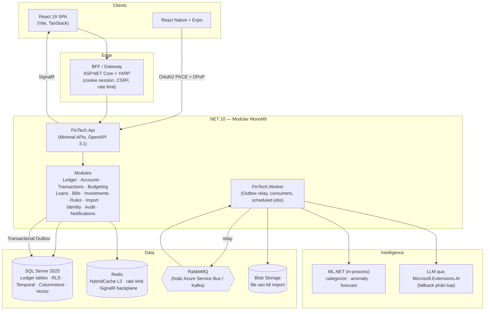
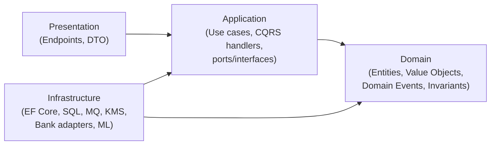
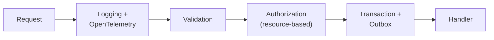
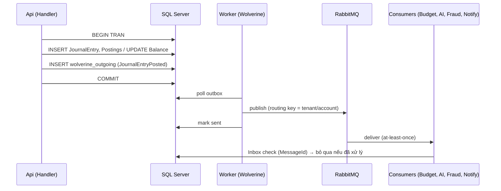
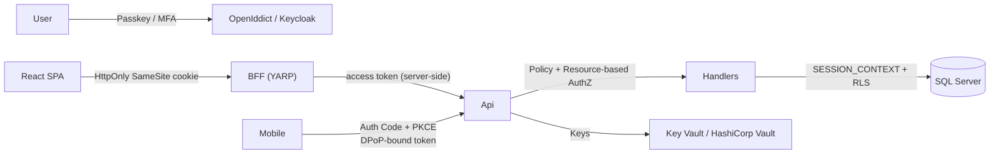
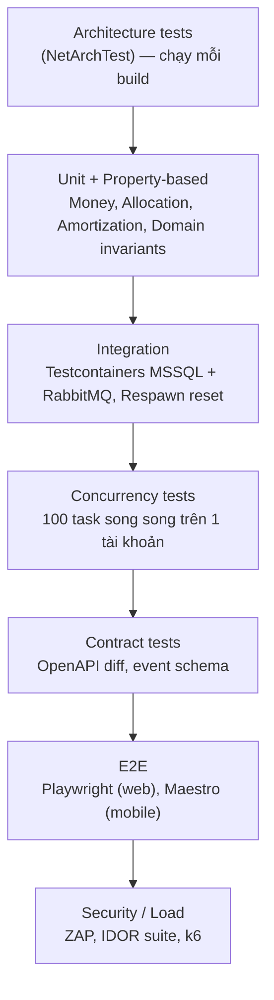

# 🏗️ FinTech Platform — Kiến trúc kỹ thuật (Clean Architecture · .NET 10 · SQL Server · React · React Native)

> Tài liệu này hiện thực hóa bản phân tích [fintech_platform_analysis.md](./fintech_platform_analysis.md) trên stack đã chốt.
> Cập nhật: 10/2026. Các phiên bản thư viện nên được kiểm tra lại khi khởi tạo dự án.

---

## 0. Stack đã chốt

| Lớp | Công nghệ |
|---|---|
| Ngôn ngữ backend | **C# 14** |
| Framework | **ASP.NET Core 10** (.NET 10 LTS) — Minimal APIs |
| Kiến trúc | **Clean Architecture** + **Modular Monolith** + DDD + CQRS |
| Database | **SQL Server 2025** (dev: container `mcr.microsoft.com/mssql/server:2025-latest`) |
| ORM | **EF Core 10** (ghi) + **Dapper** (đọc tối ưu / báo cáo) |
| Web | **React 19** + TypeScript + Vite |
| Mobile | **React Native (New Architecture)** + **Expo** |
| Orchestration local | **Aspire** (AppHost + Dashboard) |

---

## 1. Tổng quan kiến trúc



**Triết lý:**
- **1 solution, 1 database, nhiều schema** (`ledger`, `txn`, `budget`, `loan`, `audit`...). Mỗi module sở hữu schema của nó — module khác **không được JOIN chéo**, chỉ gọi qua *public contract* hoặc *integration event*.
- **Clean Architecture bên trong mỗi module** → khi cần tách microservice, nhấc nguyên module ra.
- Tách thành **2 tiến trình**: `Api` (đồng bộ, latency thấp) và `Worker` (bất đồng bộ: outbox, consumer, job, ML).

---

## 2. Clean Architecture — quy tắc phụ thuộc



| Lớp | Được phép phụ thuộc | Không được chứa |
|---|---|---|
| **Domain** | Chỉ `SharedKernel` | EF Core, ASP.NET, JSON attributes, `DateTime.Now` |
| **Application** | Domain | SQL, HTTP, chi tiết hạ tầng |
| **Infrastructure** | Application, Domain | Business rule |
| **Presentation** | Application | Business rule, truy cập DbContext trực tiếp |

> [!IMPORTANT]
> Quy tắc phụ thuộc phải được **ép bằng test** (NetArchTest / ArchUnitNET) chạy trong CI — không dựa vào kỷ luật.

---

## 3. Cấu trúc Solution

```text
FinTechPlatform/
├─ FinTechPlatform.slnx                     # định dạng solution mới (XML)
├─ Directory.Build.props                    # Nullable, TreatWarningsAsErrors, AnalysisLevel
├─ Directory.Packages.props                 # Central Package Management
├─ global.json                              # pin .NET 10 SDK
├─ .editorconfig
│
├─ src/
│  ├─ Aspire/
│  │  ├─ FinTech.AppHost/                   # orchestration: SQL, Redis, RabbitMQ, Api, Worker, Web
│  │  └─ FinTech.ServiceDefaults/           # OpenTelemetry, health checks, resilience
│  │
│  ├─ BuildingBlocks/
│  │  ├─ FinTech.SharedKernel/              # Entity, AggregateRoot, ValueObject, Result, DomainEvent, Money
│  │  ├─ FinTech.BuildingBlocks.Application/# ICommand/IQuery, pipeline behaviors, IUnitOfWork, ICurrentUser
│  │  ├─ FinTech.BuildingBlocks.Infrastructure/ # Outbox/Inbox, interceptors, tenant, encryption
│  │  └─ FinTech.BuildingBlocks.Web/        # ProblemDetails, idempotency filter, endpoint conventions
│  │
│  ├─ Modules/
│  │  ├─ Ledger/
│  │  │  ├─ FinTech.Modules.Ledger.Domain/
│  │  │  ├─ FinTech.Modules.Ledger.Application/
│  │  │  ├─ FinTech.Modules.Ledger.Infrastructure/
│  │  │  ├─ FinTech.Modules.Ledger.Presentation/
│  │  │  └─ FinTech.Modules.Ledger.Contracts/   # public API + integration events cho module khác
│  │  ├─ Accounts/   ├─ Transactions/  ├─ Budgeting/   ├─ Loans/
│  │  ├─ Bills/      ├─ Investments/   ├─ Rules/       ├─ Import/
│  │  ├─ Intelligence/ ├─ Identity/    ├─ Audit/       └─ Notifications/
│  │
│  ├─ Hosts/
│  │  ├─ FinTech.Api/                       # composition root HTTP
│  │  ├─ FinTech.Worker/                    # composition root background
│  │  └─ FinTech.Bff/                       # YARP + cookie auth cho React
│  │
│  └─ Database/
│     └─ FinTech.Database/                  # SQL project (SDK-style) cho RLS, ledger tables, functions
│
├─ tests/
│  ├─ FinTech.ArchitectureTests/
│  ├─ FinTech.Modules.Ledger.UnitTests/
│  ├─ FinTech.Modules.Ledger.IntegrationTests/   # Testcontainers MSSQL
│  ├─ FinTech.ConcurrencyTests/
│  └─ FinTech.E2E/                               # Playwright
│
└─ clients/                                 # monorepo frontend (pnpm + Turborepo)
   ├─ apps/web/                             # React 19 + Vite
   ├─ apps/mobile/                          # Expo / React Native
   └─ packages/
      ├─ api-client/                        # sinh từ OpenAPI (Orval / Kiota)
      ├─ money/                             # xử lý tiền chính xác dùng chung
      ├─ validation/                        # Zod schemas dùng chung
      └─ ui-tokens/                         # design tokens dùng chung web/mobile
```

### Cấu trúc bên trong 1 module (ví dụ Ledger)

```text
FinTech.Modules.Ledger.Domain/
├─ Accounts/        LedgerAccount.cs, AccountType.cs, AccountId.cs
├─ Entries/         JournalEntry.cs, Posting.cs, JournalEntryId.cs
├─ Events/          JournalEntryPosted.cs
└─ Errors/          LedgerErrors.cs

FinTech.Modules.Ledger.Application/
├─ Entries/PostEntry/      PostEntryCommand.cs, PostEntryHandler.cs, PostEntryValidator.cs
├─ Entries/ReverseEntry/
├─ Accounts/GetBalance/    GetBalanceQuery.cs, GetBalanceHandler.cs (Dapper)
└─ Abstractions/           ILedgerRepository.cs, IBalanceWriter.cs

FinTech.Modules.Ledger.Infrastructure/
├─ Persistence/     LedgerDbContext.cs, Configurations/, Migrations/
├─ Repositories/    LedgerRepository.cs, SqlBalanceWriter.cs
└─ LedgerModule.cs  (AddLedgerModule(IServiceCollection))

FinTech.Modules.Ledger.Presentation/
└─ Endpoints/       PostEntryEndpoint.cs, GetBalanceEndpoint.cs
```

> Tổ chức **theo feature (vertical slice) bên trong lớp Application** — mỗi use case một thư mục — dễ đọc hơn nhiều so với chia theo `Commands/`, `Queries/`, `Handlers/`.

---

## 4. Thư viện backend đề xuất

> [!WARNING]
> **Chú ý giấy phép (2025–2026):** **MediatR**, **AutoMapper**, **MassTransit v9+**, **FluentAssertions v8+** và **Duende IdentityServer** đã chuyển sang mô hình thương mại (miễn phí có điều kiện). Với dự án học/khởi nghiệp, bảng dưới ưu tiên lựa chọn **mã nguồn mở thuần**.

| Nhu cầu | Lựa chọn | Thay thế |
|---|---|---|
| Mediator / CQRS | **`Mediator`** (martinothamar — source generator, MIT) | Wolverine, tự viết dispatcher |
| Messaging + Outbox/Inbox | **Wolverine** (outbox SQL Server + RabbitMQ/ASB/Kafka) | MassTransit v8 (OSS), CAP |
| Validation | **FluentValidation** | Validation tích hợp sẵn của Minimal APIs .NET 10 |
| Mapping | **Mapperly** (source generator) | Map thủ công |
| ORM | **EF Core 10** + **Dapper** | |
| Strongly-typed IDs | **Vogen** hoặc `StronglyTypedId` | `readonly record struct` thủ công |
| Result pattern | Tự viết `Result<T>` trong SharedKernel | ErrorOr, FluentResults |
| Jobs định kỳ | **TickerQ** hoặc **Quartz.NET** | Hangfire |
| Workflow / Saga dài | **Temporal .NET SDK** | Wolverine Sagas |
| Cache | **HybridCache** (L1 memory + L2 Redis, chống stampede) | |
| Resilience | **Microsoft.Extensions.Http.Resilience** (Polly v8) | |
| Auth server | **OpenIddict** hoặc **Keycloak** | ASP.NET Core Identity (đã hỗ trợ **passkeys** từ .NET 10) |
| Authorization | Policy-based ASP.NET + **Cedar / OPA** cho ABAC | |
| API docs | `Microsoft.AspNetCore.OpenApi` (OpenAPI 3.1) + **Scalar** UI | |
| API versioning | **Asp.Versioning.Http** | |
| Logging | **Serilog** → OpenTelemetry | |
| Observability | **OpenTelemetry** + Aspire Dashboard (dev), Grafana/Tempo/Loki/Prometheus (prod) | Azure Monitor |
| Real-time | **SignalR** (Redis backplane) | |
| AI | **Microsoft.Extensions.AI**, **ML.NET** (TimeSeries, AnomalyDetection) | Semantic Kernel / Agent Framework |
| Test | **xUnit v3**, **Testcontainers.MsSql**, **Respawn**, **Shouldly** / AwesomeAssertions, **NSubstitute**, **CsCheck/FsCheck** (property-based), **Verify** (snapshot), **Stryker.NET** (mutation), **NetArchTest** | |
| Load test | **k6** / NBomber | |

### `Directory.Build.props`
```xml
<Project>
  <PropertyGroup>
    <TargetFramework>net10.0</TargetFramework>
    <LangVersion>latest</LangVersion>
    <Nullable>enable</Nullable>
    <ImplicitUsings>enable</ImplicitUsings>
    <TreatWarningsAsErrors>true</TreatWarningsAsErrors>
    <AnalysisLevel>latest-recommended</AnalysisLevel>
    <EnforceCodeStyleInBuild>true</EnforceCodeStyleInBuild>
    <InvariantGlobalization>false</InvariantGlobalization> <!-- cần vi-VN để format tiền -->
  </PropertyGroup>
</Project>
```

---

## 5. Domain Layer — mô hình hóa tiền và sổ cái

### 5.1 Money Value Object

C# `decimal` là kiểu **thập phân cơ số 10, 128-bit, 28–29 chữ số** → biểu diễn chính xác tiền tệ, không gặp lỗi `0.1 + 0.2` như `double`. Vì vậy trên .NET + SQL Server, khuyến nghị lưu `DECIMAL(19,4)` thay vì minor units `BIGINT`.

> [!CAUTION]
> **Không dùng kiểu `money` / `smallmoney` của SQL Server** — độ chính xác cố định 4 chữ số và mất chính xác khi chia/nhân trung gian. Dùng `DECIMAL(19,4)` cho số tiền, `DECIMAL(28,10)` cho tỉ giá / số lượng chứng chỉ quỹ / crypto.

```csharp
namespace FinTech.SharedKernel.Money;

public readonly record struct Currency
{
    public string Code { get; }
    public int MinorUnits { get; }   // VND = 0, USD = 2, BHD = 3

    private Currency(string code, int minorUnits) => (Code, MinorUnits) = (code, minorUnits);

    public static readonly Currency VND = new("VND", 0);
    public static readonly Currency USD = new("USD", 2);

    public static Currency FromCode(string code) => code switch
    {
        "VND" => VND,
        "USD" => USD,
        _ => throw new DomainException($"Unsupported currency {code}")
    };
}

public readonly record struct Money(decimal Amount, Currency Currency)
{
    public static Money Zero(Currency c) => new(0m, c);

    public static Money operator +(Money a, Money b) { EnsureSame(a, b); return a with { Amount = a.Amount + b.Amount }; }
    public static Money operator -(Money a, Money b) { EnsureSame(a, b); return a with { Amount = a.Amount - b.Amount }; }
    public static Money operator -(Money a) => a with { Amount = -a.Amount };

    public bool IsNegative => Amount < 0;

    /// Làm tròn theo số chữ số của tiền tệ. Mặc định banker's rounding.
    public Money Round(MidpointRounding mode = MidpointRounding.ToEven)
        => this with { Amount = Math.Round(Amount, Currency.MinorUnits, mode) };

    /// Chia tiền không mất đồng nào (largest remainder).
    public IReadOnlyList<Money> Allocate(params int[] ratios)
    {
        var unit = 1m / (decimal)Math.Pow(10, Currency.MinorUnits);
        var total = ratios.Sum();
        var shares = ratios
            .Select(r => Math.Floor(Amount * r / total / unit) * unit)
            .ToArray();
        var remainder = Amount - shares.Sum();
        var order = Enumerable.Range(0, ratios.Length)
            .OrderByDescending(i => Amount * ratios[i] / total - shares[i]);
        foreach (var i in order)
        {
            if (remainder < unit) break;
            shares[i] += unit; remainder -= unit;
        }
        return shares.Select(s => new Money(s, Currency)).ToArray();
    }

    private static void EnsureSame(Money a, Money b)
    {
        if (a.Currency != b.Currency)
            throw new CurrencyMismatchException(a.Currency, b.Currency);
    }
}
```

### 5.2 Aggregate `JournalEntry`

```csharp
public sealed class JournalEntry : AggregateRoot<JournalEntryId>
{
    private readonly List<Posting> _postings = [];
    public TenantId TenantId { get; private set; }
    public string IdempotencyKey { get; private set; } = default!;
    public DateOnly EffectiveDate { get; private set; }
    public DateTimeOffset RecordedAt { get; private set; }
    public string? Description { get; private set; }
    public JournalEntryId? ReversesId { get; private set; }
    public IReadOnlyList<Posting> Postings => _postings;

    private JournalEntry() { } // EF

    public static Result<JournalEntry> Create(
        TenantId tenantId, string idempotencyKey, DateOnly effectiveDate,
        IEnumerable<(AccountId Account, Money Amount)> lines,
        string? description, TimeProvider clock)
    {
        var postings = lines.Select(l => new Posting(l.Account, l.Amount)).ToList();

        if (postings.Count < 2)
            return LedgerErrors.TooFewPostings;

        // Invariant: tổng = 0 theo TỪNG loại tiền
        var unbalanced = postings
            .GroupBy(p => p.Amount.Currency)
            .Any(g => g.Sum(p => p.Amount.Amount) != 0m);
        if (unbalanced)
            return LedgerErrors.Unbalanced;

        var entry = new JournalEntry
        {
            Id = JournalEntryId.New(),
            TenantId = tenantId,
            IdempotencyKey = idempotencyKey,
            EffectiveDate = effectiveDate,
            RecordedAt = clock.GetUtcNow(),
            Description = description
        };
        entry._postings.AddRange(postings);
        entry.Raise(new JournalEntryPosted(entry.Id, tenantId, effectiveDate,
            postings.Select(p => new PostingDto(p.AccountId, p.Amount)).ToList()));
        return entry;
    }

    /// Không bao giờ sửa/xóa — chỉ ghi bút toán đảo.
    public JournalEntry Reverse(string idempotencyKey, TimeProvider clock) =>
        Create(TenantId, idempotencyKey, DateOnly.FromDateTime(clock.GetUtcNow().Date),
               _postings.Select(p => (p.AccountId, -p.Amount)),
               $"Reversal of {Id}", clock)
        .Value.WithReverses(Id);
}
```

> Dùng **`TimeProvider`** (built-in từ .NET 8) thay cho `DateTime.UtcNow` → test được thời gian (FakeTimeProvider).

---

## 6. Application Layer — CQRS & Pipeline

### 6.1 Pipeline behaviors (thứ tự)



### 6.2 Command handler ghi sổ

```csharp
public sealed record PostEntryCommand(
    string IdempotencyKey,
    DateOnly EffectiveDate,
    IReadOnlyList<PostingLine> Lines,
    string? Description) : ICommand<Result<JournalEntryId>>;

internal sealed class PostEntryHandler(
    ILedgerRepository repo,
    IBalanceWriter balances,
    ICurrentTenant tenant,
    TimeProvider clock) : ICommandHandler<PostEntryCommand, Result<JournalEntryId>>
{
    public async ValueTask<Result<JournalEntryId>> Handle(PostEntryCommand cmd, CancellationToken ct)
    {
        var created = JournalEntry.Create(tenant.Id, cmd.IdempotencyKey, cmd.EffectiveDate,
            cmd.Lines.Select(l => (l.AccountId, l.Amount)), cmd.Description, clock);
        if (created.IsFailure) return created.Error;

        var entry = created.Value;

        // Áp delta theo THỨ TỰ AccountId cố định → tránh deadlock
        foreach (var (accountId, delta) in entry.DeltasByAccount().OrderBy(x => x.AccountId))
        {
            var ok = await balances.TryApplyAsync(accountId, delta, ct);
            if (!ok) return LedgerErrors.InsufficientFunds(accountId);
        }

        repo.Add(entry); // domain event → outbox trong cùng transaction (TransactionBehavior commit)
        return entry.Id;
    }
}
```

---

## 7. Infrastructure — SQL Server chuyên sâu

### 7.1 Cấu hình database bắt buộc

```sql
ALTER DATABASE FinTech SET READ_COMMITTED_SNAPSHOT ON;   -- reader không block writer
ALTER DATABASE FinTech SET ALLOW_SNAPSHOT_ISOLATION ON;  -- báo cáo nhất quán
ALTER DATABASE FinTech SET ACCELERATED_DATABASE_RECOVERY ON;
```

### 7.2 Cập nhật số dư an toàn với concurrency

Thay vì "đọc → tính → ghi" (lost update), dùng **UPDATE có điều kiện, nguyên tử**:

```csharp
internal sealed class SqlBalanceWriter(LedgerDbContext db) : IBalanceWriter
{
    public async Task<bool> TryApplyAsync(AccountId id, Money delta, CancellationToken ct)
    {
        var rows = await db.Database.ExecuteSqlInterpolatedAsync($"""
            UPDATE ledger.Accounts WITH (ROWLOCK)
            SET    Balance = Balance + {delta.Amount},
                   Version = Version + 1
            WHERE  Id = {id.Value}
              AND  Currency = {delta.Currency.Code}
              AND  (AllowNegative = 1 OR Balance + {delta.Amount} >= 0);
            """, ct);
        return rows == 1;
    }
}
```

| Kỹ thuật SQL Server | Dùng cho |
|---|---|
| `UPDATE ... SET Balance = Balance + @d WHERE ...` | Ghi số dư (nguyên tử, không lost update) |
| `WITH (UPDLOCK, HOLDLOCK)` | Kiểm tra-rồi-ghi trên tập dữ liệu (vd: hạn mức chi tiêu tháng) |
| `rowversion` + EF `IsRowVersion()` | Optimistic concurrency cho Budget, Rule, Settings |
| `sp_getapplock` | Đảm bảo chỉ 1 instance chạy job (trả góp hằng tháng) |
| `SERIALIZABLE` | Hiếm khi; luôn kèm retry |
| EF `EnableRetryOnFailure` + `CreateExecutionStrategy().ExecuteAsync(...)` | Retry tự động khi **deadlock 1205** / lỗi transient |

### 7.3 Schema lõi + SQL Server Ledger Tables

SQL Server có **Ledger tables** (từ 2022) — bảng append-only được bảo vệ bằng **chuỗi hash mật mã**, phát hiện sửa đổi kể cả bởi DBA. Rất phù hợp cho `Postings` và `AuditLog`.

```sql
CREATE SCHEMA ledger;
GO
CREATE TABLE ledger.Accounts (
    Id             UNIQUEIDENTIFIER NOT NULL CONSTRAINT PK_Accounts PRIMARY KEY NONCLUSTERED,
    TenantId       UNIQUEIDENTIFIER NOT NULL,
    Code           NVARCHAR(50)     NOT NULL,
    Type           TINYINT          NOT NULL,      -- Asset/Liability/Equity/Income/Expense
    Currency       CHAR(3)          NOT NULL,
    Balance        DECIMAL(19,4)    NOT NULL DEFAULT 0,
    AllowNegative  BIT              NOT NULL DEFAULT 1,
    Version        BIGINT           NOT NULL DEFAULT 0,
    RowVer         ROWVERSION,
    CreatedAt      DATETIMEOFFSET(3) NOT NULL DEFAULT SYSUTCDATETIME(),
    INDEX CIX_Accounts_Tenant CLUSTERED (TenantId, Id)
);

CREATE TABLE ledger.JournalEntries (
    Id              UNIQUEIDENTIFIER NOT NULL PRIMARY KEY NONCLUSTERED,
    TenantId        UNIQUEIDENTIFIER NOT NULL,
    IdempotencyKey  VARCHAR(100)     NOT NULL,
    EffectiveDate   DATE             NOT NULL,
    RecordedAt      DATETIMEOFFSET(3) NOT NULL,
    Description     NVARCHAR(500)    NULL,
    ReversesId      UNIQUEIDENTIFIER NULL,
    Metadata        JSON             NULL,          -- kiểu JSON native (SQL Server 2025)
    CONSTRAINT UQ_Journal_Idem UNIQUE (TenantId, IdempotencyKey),
    INDEX CIX_Journal CLUSTERED (TenantId, EffectiveDate, Id)
)
WITH (LEDGER = ON (APPEND_ONLY = ON));

CREATE TABLE ledger.Postings (
    Id         BIGINT IDENTITY      NOT NULL PRIMARY KEY,
    EntryId    UNIQUEIDENTIFIER     NOT NULL,
    TenantId   UNIQUEIDENTIFIER     NOT NULL,
    AccountId  UNIQUEIDENTIFIER     NOT NULL,
    Amount     DECIMAL(19,4)        NOT NULL CHECK (Amount <> 0),
    Currency   CHAR(3)              NOT NULL,
    INDEX IX_Postings_Account (AccountId) INCLUDE (Amount)
)
WITH (LEDGER = ON (APPEND_ONLY = ON));

-- Snapshot số dư hằng ngày cho dashboard, columnstore để aggregate nhanh
CREATE TABLE ledger.DailyBalances (
    TenantId UNIQUEIDENTIFIER, AccountId UNIQUEIDENTIFIER, [Date] DATE,
    Balance DECIMAL(19,4), Currency CHAR(3),
    INDEX CCI_DailyBalances CLUSTERED COLUMNSTORE
);
```

> [!NOTE]
> - Dùng **GUID v7** (`Guid.CreateVersion7()` — .NET 9+) làm khóa: có thứ tự thời gian, giảm phân mảnh index so với GUID v4.
> - Xác minh toàn vẹn định kỳ bằng `sys.sp_verify_database_ledger` và lưu **database digest** ra Azure Immutable Blob / S3 Object Lock.
> - Ledger table có một số giới hạn (không đổi được schema tùy ý, không dùng với một số tính năng) — kiểm tra tài liệu trước khi áp dụng cho bảng thay đổi nhiều.

### 7.4 Bảng nghiệp vụ có lịch sử → Temporal Tables

Budget, Loan schedule, Rule, cài đặt tài khoản dùng **System-Versioned Temporal Tables** → truy vấn trạng thái quá khứ (`FOR SYSTEM_TIME AS OF '2026-03-01'`) mà không cần tự viết bảng history. EF Core hỗ trợ trực tiếp `.ToTable(t => t.IsTemporal())` và `TemporalAsOf()`.

### 7.5 Multi-tenancy — 2 lớp phòng thủ

**Lớp 1 — EF Core 10 named query filters:**
```csharp
modelBuilder.Entity<LedgerAccount>()
    .HasQueryFilter("Tenant", a => a.TenantId == _tenant.Id)
    .HasQueryFilter("SoftDelete", a => !a.IsDeleted);
```

**Lớp 2 — SQL Server Row-Level Security** (lưới an toàn khi dev quên filter, hoặc dùng Dapper/raw SQL):
```sql
CREATE SCHEMA security;
GO
CREATE FUNCTION security.fn_tenant_predicate(@TenantId UNIQUEIDENTIFIER)
RETURNS TABLE WITH SCHEMABINDING AS
RETURN SELECT 1 AS ok
WHERE @TenantId = CAST(SESSION_CONTEXT(N'TenantId') AS UNIQUEIDENTIFIER);
GO
CREATE SECURITY POLICY security.TenantPolicy
  ADD FILTER PREDICATE security.fn_tenant_predicate(TenantId) ON ledger.Accounts,
  ADD BLOCK  PREDICATE security.fn_tenant_predicate(TenantId) ON ledger.Accounts AFTER INSERT
  -- ... lặp lại cho các bảng khác
WITH (STATE = ON);
```

```csharp
// DbConnectionInterceptor: set SESSION_CONTEXT mỗi khi mở kết nối
public sealed class TenantSessionInterceptor(ICurrentTenant tenant) : DbConnectionInterceptor
{
    public override async Task ConnectionOpenedAsync(DbConnection conn, ConnectionEndEventData e, CancellationToken ct = default)
    {
        await using var cmd = conn.CreateCommand();
        cmd.CommandText = "EXEC sp_set_session_context @key=N'TenantId', @value=@t, @read_only=1;";
        cmd.Parameters.Add(new SqlParameter("@t", tenant.Id.Value));
        await cmd.ExecuteNonQueryAsync(ct);
    }
}
```

### 7.6 Bảo vệ dữ liệu trong SQL Server

| Tính năng | Áp dụng |
|---|---|
| **TDE** | Mã hóa toàn bộ file DB & backup at-rest |
| **Always Encrypted (secure enclaves)** | Số tài khoản ngân hàng, CCCD, token kết nối ngân hàng — DB/DBA không đọc được plaintext |
| **Envelope encryption ở app** (Azure Key Vault / Vault) | Dữ liệu cần crypto-shredding (xóa DEK của user = xóa dữ liệu) |
| **Blind index** (HMAC cột phụ) | Tìm kiếm trên trường đã mã hóa |
| **Dynamic Data Masking** | Tài khoản support/BI chỉ thấy `•••1234` |
| **SQL Audit** | Ghi lại truy cập ở tầng DB |
| Least privilege | `app_writer` chỉ có `INSERT` trên ledger, không `UPDATE/DELETE`; migration dùng tài khoản riêng |

### 7.7 Tính năng SQL Server 2025 tận dụng được

| Tính năng | Ứng dụng |
|---|---|
| Kiểu **`JSON` native** + JSON index | Metadata giao dịch, cấu hình rule |
| Kiểu **`VECTOR`** + vector search | Embedding mô tả giao dịch → phân loại bằng kNN, tìm merchant tương tự |
| **Hàm RegEx** (`REGEXP_LIKE`, `REGEXP_REPLACE`...) | Chuẩn hóa mô tả giao dịch ngân hàng ngay trong DB |
| **Change Event Streaming** / CDC | Đẩy thay đổi ra event bus (thay thế/bổ sung outbox relay) |
| **Optimized locking** | Giảm lock escalation, tăng concurrency khi ghi nhiều |

---

## 8. Event-Driven với Transactional Outbox (Wolverine)



```csharp
// Program.cs (Worker/Api)
builder.Host.UseWolverine(opts =>
{
    opts.PersistMessagesWithSqlServer(connString, schemaName: "messaging");
    opts.UseEntityFrameworkCoreTransactions();
    opts.Policies.UseDurableOutboxOnAllSendingEndpoints();
    opts.Policies.UseDurableInboxOnAllListeners();      // consumer idempotent

    opts.UseRabbitMq(builder.Configuration.GetConnectionString("rabbitmq")!)
        .AutoProvision()
        .UseConventionalRouting();

    opts.Policies.OnException<SqlException>()
        .RetryWithCooldown(50.Milliseconds(), 250.Milliseconds(), 1.Seconds())
        .Then.MoveToErrorQueue();
});
```

**Domain event vs Integration event:**
- *Domain event* (`JournalEntryPosted` trong `Ledger.Domain`) — dispatch nội bộ trong cùng transaction.
- *Integration event* (`LedgerEntryPostedV1` trong `Ledger.Contracts`) — public, versioned, đi qua outbox → broker. Module khác **chỉ tham chiếu `*.Contracts`**.

---

## 9. Presentation — ASP.NET Core 10 Minimal APIs

### 9.1 Endpoint mẫu

```csharp
internal sealed class PostEntryEndpoint : IEndpoint
{
    public void Map(IEndpointRouteBuilder app) =>
        app.MapPost("/v1/ledger/entries", async (
                PostEntryRequest req,
                [FromHeader(Name = "Idempotency-Key")] string idempotencyKey,
                ISender sender, CancellationToken ct) =>
            {
                var result = await sender.Send(req.ToCommand(idempotencyKey), ct);
                return result.Match(
                    id => TypedResults.Created($"/v1/ledger/entries/{id}", new { id }),
                    error => error.ToProblem());
            })
            .WithName("PostLedgerEntry")
            .WithTags("Ledger")
            .RequireAuthorization(Policies.LedgerWrite)
            .AddEndpointFilter<IdempotencyFilter>()
            .RequireRateLimiting("money-write")
            .Produces(StatusCodes.Status201Created)
            .ProducesProblem(StatusCodes.Status422UnprocessableEntity);
}
```

### 9.2 Idempotency filter

```csharp
public sealed class IdempotencyFilter(IIdempotencyStore store) : IEndpointFilter
{
    public async ValueTask<object?> InvokeAsync(EndpointFilterInvocationContext ctx, EndpointFilterDelegate next)
    {
        var http = ctx.HttpContext;
        if (!http.Request.Headers.TryGetValue("Idempotency-Key", out var key) || !Guid.TryParse(key, out _))
            return TypedResults.Problem("Idempotency-Key header (UUID) is required", statusCode: 400);

        var requestHash = await RequestHasher.HashAsync(http.Request);
        var claim = await store.TryBeginAsync(key!, requestHash, http.RequestAborted);

        return claim switch
        {
            { State: IdemState.Completed, Hash: var h } when h == requestHash => claim.CachedResult,
            { State: IdemState.Completed }   => TypedResults.Problem("Key reused with different payload", statusCode: 422),
            { State: IdemState.InProgress }  => TypedResults.Problem("Request in progress", statusCode: 409),
            _ => await ExecuteAndStore(ctx, next, key!, requestHash)
        };
    }
    // ExecuteAndStore: chạy next(), lưu status + body; bảng có UNIQUE(TenantId, Key), TTL 48h
}
```

### 9.3 Cấu hình `Program.cs` (Api)

```csharp
var builder = WebApplication.CreateBuilder(args);
builder.AddServiceDefaults();                       // Aspire: OTel, health, resilience
builder.AddSqlServerDbContext<LedgerDbContext>("fintechdb");
builder.AddRedisDistributedCache("redis");

builder.Services
    .AddProblemDetails()
    .AddOpenApi()                                   // OpenAPI 3.1 built-in
    .AddValidation()                                // validation built-in cho Minimal APIs (.NET 10)
    .AddHybridCache();

builder.Services.AddAuthentication().AddJwtBearer();
builder.Services.AddAuthorizationBuilder()
    .AddPolicy(Policies.LedgerWrite, p => p.RequireClaim("scope", "ledger:write"));

builder.Services.AddRateLimiter(o =>
{
    o.AddPolicy("money-write", ctx => RateLimitPartition.GetTokenBucketLimiter(
        ctx.User.FindFirstValue("sub") ?? ctx.Connection.RemoteIpAddress!.ToString(),
        _ => new() { TokenLimit = 20, TokensPerPeriod = 10, ReplenishmentPeriod = TimeSpan.FromSeconds(10) }));
});

builder.Services
    .AddLedgerModule(builder.Configuration)
    .AddTransactionsModule(builder.Configuration)
    .AddBudgetingModule(builder.Configuration);
    // ...

var app = builder.Build();
app.UseExceptionHandler();
app.UseAuthentication();
app.UseAuthorization();
app.UseRateLimiter();
app.MapOpenApi();
app.MapScalarApiReference();                         // chỉ bật ở môi trường dev
app.MapModuleEndpoints();                            // quét IEndpoint
app.MapDefaultEndpoints();                           // /health, /alive
app.Run();
```

### 9.4 Quy ước API
- **Tiền trong JSON luôn là string**: `{ "amount": "1250000.00", "currency": "VND" }` — tránh JS làm tròn số lớn. Custom `JsonConverter<Money>`.
- Lỗi theo **RFC 9457 Problem Details** + mã lỗi nghiệp vụ (`ledger.insufficient_funds`).
- Phân trang **cursor-based** (keyset) cho danh sách giao dịch, không dùng `OFFSET` trên bảng lớn.
- Thời gian: `DateTimeOffset` UTC ở API; ngày nghiệp vụ (`DateOnly`) tính theo **timezone của user/tenant** (lưu IANA tz, ví dụ `Asia/Ho_Chi_Minh`).

---

## 10. Hiện thực các module trên .NET

| Module | Điểm hiện thực chính |
|---|---|
| **Accounts** | Mỗi tài khoản user ↔ 1 `ledger.Accounts`. Thẻ tín dụng = Liability, có kỳ sao kê. |
| **Transactions** | Trạng thái `Pending → Posted → Reconciled / Voided / Reversed`; split = 1 entry nhiều posting; phát hiện transfer nội bộ. |
| **Budgeting** | Read model cập nhật từ `TransactionCategorized`; ngưỡng 50/80/100% bắn event 1 lần/kỳ (dedupe bằng unique key `(BudgetId, Period, Threshold)`). |
| **Loans** | Sinh amortization schedule (annuity / gốc đều / lãi phẳng + tính APR thực); schedule versioned bằng Temporal Table; Temporal workflow nhắc & ghi nhận kỳ trả. |
| **Bills & Subscriptions** | Recurrence bằng RRULE (thư viện **Ical.Net**); recurring detector chạy trong Worker. |
| **Investments** | Lot-based (FIFO/Average), realized/unrealized P&L, TWR/XIRR; giá thị trường cache bằng HybridCache. |
| **Import** | Upload → Blob → queue → parser adapter theo ngân hàng (**CsvHelper**, **ClosedXML** cho Excel, parser OFX/MT940/CAMT.053) → fingerprint dedupe → review → post. Import theo batch, hoàn tác được. |
| **Intelligence – Categorization** | Cascade: User rules → merchant dictionary → **ML.NET** (text featurizer + LightGBM / SdcaMaximumEntropy) → **kNN vector search trong SQL Server 2025** → LLM qua `IChatClient` (đã mask PII) → human review. Lưu `Source`, `Confidence`, `ModelVersion`. |
| **Intelligence – Anomaly** | Rule realtime (velocity, double-charge, > k·σ) + **ML.NET `DetectSpikeBySsa` / `DetectEntireAnomalyBySrCnn`** cho chuỗi thời gian chi tiêu; kết quả có lý do giải thích được. |
| **Intelligence – Forecast** | Lớp deterministic (schedule, bill, lương) + **ML.NET `ForecastBySsa`** cho chi tiêu biến đổi + scenario. Trả về P10/P50/P90. |
| **Rules** | DSL JSON → biên dịch thành **Expression Tree** (an toàn, nhanh, không `eval`); hoặc dùng **CEL** / NRules. Giới hạn độ sâu chuỗi rule, dry-run trước khi áp dụng. |
| **Audit** | `audit.AuditLog` là **SQL Server Ledger table (append-only)**; ghi qua EF `SaveChangesInterceptor` (before/after) + audit hành động đọc dữ liệu nhạy cảm. |
| **Notifications** | Consumer → preference, quiet hours, throttle, digest → kênh: **SignalR** (in-app), **FCM/APNs/Expo Push**, email (SMTP/SendGrid), SMS, Zalo ZNS, webhook ký HMAC. |
| **Identity** | OpenIddict/Keycloak, MFA TOTP + **passkeys (WebAuthn)**, refresh token rotation + reuse detection, step-up auth cho hành động nhạy cảm, RBAC + ABAC cho SME. |

---

## 11. 🔐 Security trên stack .NET



| Hạng mục | Thực hiện |
|---|---|
| **Web token** | **Pattern BFF**: React không bao giờ giữ access token; dùng cookie `HttpOnly; Secure; SameSite=Strict` + antiforgery. |
| **Mobile token** | Authorization Code + PKCE, lưu trong `expo-secure-store` (Keychain/Keystore), **DPoP** ràng buộc token với thiết bị. |
| **IDOR/BOLA** | `IAuthorizationService.AuthorizeAsync(user, resource, "Owner")` cho mọi truy cập tài nguyên + RLS ở DB. Test tự động: user A gọi mọi endpoint với ID của user B → phải 404. |
| **Mass assignment** | Request DTO riêng (`record`), không bind entity. |
| **Rate limiting** | Middleware built-in; policy riêng cho login, money-write, import. |
| **Secrets** | User Secrets (dev), Key Vault/Vault (prod), **Managed Identity**, không connection string có mật khẩu trong config. |
| **Data Protection API** | Key ring lưu trong Redis/Blob + mã hóa bằng Key Vault (cho cookie, antiforgery khi chạy nhiều instance). |
| **Headers** | HSTS, CSP nghiêm ngặt, `X-Content-Type-Options`, `Referrer-Policy` (NetEscapades.AspNetCore.SecurityHeaders). |
| **File upload** | Giới hạn kích thước, kiểm tra magic bytes, parse trong Worker, chống XXE (`DtdProcessing.Prohibit`), CSV injection khi export. |
| **Supply chain** | `dotnet list package --vulnerable`, NuGet audit (bật mặc định), Dependabot, SBOM, ký container image. |
| **Logging** | Serilog destructuring policy + masking PII; không log body endpoint nhạy cảm. |
| **Tuân thủ** | Nghị định 13/2023 (dữ liệu cá nhân), PCI DSS (không lưu số thẻ), lưu chứng từ ≥ 10 năm. |

---

## 12. 🌐 Frontend Web — React 19

### 12.1 Stack

| Nhu cầu | Lựa chọn |
|---|---|
| Build | **Vite** + **TypeScript (strict)** |
| Compiler | **React Compiler** (tự memo, bỏ phần lớn `useMemo/useCallback`) |
| Routing | **TanStack Router** (type-safe, file-based) |
| Server state | **TanStack Query** |
| Client state | **Zustand** (tối thiểu) |
| Form | **React Hook Form** + **Zod** (schema dùng chung với mobile) |
| UI | **Tailwind CSS v4** + **shadcn/ui** (Radix primitives) |
| Bảng dữ liệu | **TanStack Table** + **TanStack Virtual** (danh sách giao dịch lớn) |
| Biểu đồ | **Recharts** hoặc **Apache ECharts** (dashboard tài chính, candlestick đầu tư) |
| API client | Sinh tự động từ OpenAPI bằng **Orval** (kèm hooks TanStack Query + Zod) |
| Real-time | `@microsoft/signalr` |
| i18n | **i18next** (vi/en), `Intl.NumberFormat('vi-VN', { style: 'currency', currency: 'VND' })` |
| Test | **Vitest** + **Testing Library** + **MSW** + **Playwright** |
| Lint/format | **Biome** hoặc ESLint 9 flat config + Prettier |

> Vì toàn bộ app nằm sau đăng nhập (không cần SEO), **SPA Vite + BFF** đơn giản và an toàn hơn Next.js. Trang landing/marketing có thể làm riêng bằng Astro/Next.js.

### 12.2 Xử lý tiền ở frontend
```ts
// packages/money — dùng chung web & mobile
import Big from 'big.js';

export type Money = { amount: string; currency: 'VND' | 'USD' };

export const add = (a: Money, b: Money): Money => {
  if (a.currency !== b.currency) throw new Error('Currency mismatch');
  return { amount: new Big(a.amount).plus(b.amount).toString(), currency: a.currency };
};

export const format = (m: Money, locale = 'vi-VN') =>
  new Intl.NumberFormat(locale, { style: 'currency', currency: m.currency })
    .format(Number(m.amount)); // chỉ chuyển sang number ở bước HIỂN THỊ cuối cùng
```

### 12.3 Cấu trúc web app
```text
apps/web/src/
├─ routes/                 # TanStack Router file-based
│  ├─ _auth/dashboard.tsx
│  ├─ _auth/transactions/index.tsx
│  ├─ _auth/budgets/...
├─ features/               # theo domain: transactions, budgets, loans, investments...
│  └─ transactions/
│     ├─ components/  hooks/  api/  schemas.ts
├─ shared/ui/              # shadcn components
├─ shared/lib/             # signalr, i18n, format
└─ main.tsx
```

---

## 13. 📱 Mobile — React Native + Expo

| Nhu cầu | Lựa chọn |
|---|---|
| Framework | **Expo SDK mới nhất** (New Architecture — Fabric/TurboModules mặc định, Hermes) |
| Routing | **Expo Router** (file-based, typed routes, deep link) |
| State / data | **TanStack Query** + Zustand (dùng chung logic với web) |
| Lưu trữ nhanh | **react-native-mmkv** (có mã hóa) |
| Offline-first | TanStack Query persist + hàng đợi mutation offline (giao dịch nhập tay khi mất mạng, gửi lại với **cùng Idempotency-Key**) |
| Bảo mật lưu token | **expo-secure-store** |
| Sinh trắc học | **expo-local-authentication** (Face ID / vân tay) cho mở app & step-up |
| UI | **NativeWind v4** (Tailwind cho RN) hoặc Tamagui; **Reanimated 4** + Gesture Handler |
| Danh sách lớn | **FlashList** |
| Biểu đồ | **Victory Native (Skia)** / react-native-gifted-charts |
| Camera | **expo-camera** — chụp hóa đơn → OCR → tạo giao dịch |
| Push | **expo-notifications** (FCM/APNs) |
| Build & update | **EAS Build**, **EAS Update** (OTA cho JS — không OTA thay đổi native) |
| Test | Jest + React Native Testing Library, **Maestro** cho E2E |

**Bảo mật mobile bắt buộc với app tài chính:**
- **Certificate pinning** (`react-native-ssl-public-key-pinning`).
- **App attestation**: Play Integrity API (Android), App Attest (iOS) → server xác minh request đến từ app thật.
- Phát hiện root/jailbreak, chặn chụp màn hình ở màn hình nhạy cảm, làm mờ khi app vào background.
- Tự khóa sau N phút không hoạt động; không lưu dữ liệu tài chính chưa mã hóa trên máy.

---

## 14. Aspire — chạy toàn bộ hệ thống local bằng 1 lệnh

```csharp
// FinTech.AppHost/AppHost.cs
var builder = DistributedApplication.CreateBuilder(args);

var sql = builder.AddSqlServer("sql")
                 .WithDataVolume()
                 .WithLifetime(ContainerLifetime.Persistent);
var db = sql.AddDatabase("fintechdb");

var redis    = builder.AddRedis("redis");
var rabbitmq = builder.AddRabbitMQ("rabbitmq").WithManagementPlugin();

var migrator = builder.AddProject<Projects.FinTech_MigrationService>("migrator")
                      .WithReference(db).WaitFor(db);

var api = builder.AddProject<Projects.FinTech_Api>("api")
                 .WithReference(db).WithReference(redis).WithReference(rabbitmq)
                 .WaitForCompletion(migrator);

builder.AddProject<Projects.FinTech_Worker>("worker")
       .WithReference(db).WithReference(redis).WithReference(rabbitmq)
       .WaitForCompletion(migrator);

var bff = builder.AddProject<Projects.FinTech_Bff>("bff").WithReference(api);

builder.AddViteApp("web", "../../clients/apps/web")
       .WithReference(bff)
       .WithExternalHttpEndpoints();

builder.Build().Run();
```

`dotnet run --project src/Aspire/FinTech.AppHost` → SQL Server, Redis, RabbitMQ, Api, Worker, BFF, Web chạy cùng lúc, có **Aspire Dashboard** hiển thị logs/traces/metrics xuyên suốt.

---

## 15. Testing Strategy



```csharp
// Architecture test
[Fact]
public void Domain_should_not_depend_on_infrastructure_or_efcore()
{
    var result = Types.InAssembly(typeof(JournalEntry).Assembly)
        .ShouldNot().HaveDependencyOnAny("Microsoft.EntityFrameworkCore", "FinTech.Modules.Ledger.Infrastructure")
        .GetResult();
    result.IsSuccessful.ShouldBeTrue();
}

// Property-based: chia tiền không bao giờ mất đồng nào
[Fact]
public void Allocate_preserves_total() =>
    Gen.Select(Gen.Decimal[0m, 1_000_000_000m], Gen.Int[1, 100].Array[1, 12])
       .Sample((amount, ratios) =>
       {
           var money = new Money(Math.Round(amount, 0), Currency.VND);
           money.Allocate(ratios).Sum(m => m.Amount).ShouldBe(money.Amount);
       });

// Concurrency: 200 lệnh chi 10.000đ trên tài khoản 1.000.000đ không cho âm
[Fact]
public async Task Concurrent_debits_never_overdraw()
{
    var tasks = Enumerable.Range(0, 200).Select(_ => PostDebitAsync(accountId, 10_000m));
    var results = await Task.WhenAll(tasks);
    results.Count(r => r.IsSuccess).ShouldBe(100);
    (await GetBalance(accountId)).ShouldBe(0m);
    (await LedgerInvariantHolds()).ShouldBeTrue(); // SUM(postings) == Balance
}
```

---

## 16. CI/CD & Triển khai

| Giai đoạn | Công cụ |
|---|---|
| CI | **GitHub Actions**: build → test (Testcontainers) → architecture tests → Stryker (nightly) → SCA → build image |
| Container | `dotnet publish /t:PublishContainer` (không cần Dockerfile), image chiseled/distroless |
| Migration | Migration service riêng (EF bundle / `migrationBuilder`) chạy trước khi deploy app; SQL project cho RLS/ledger objects |
| Triển khai | **Azure Container Apps** (đơn giản, Aspire deploy trực tiếp bằng `azd`) hoặc **Kubernetes** (AKS) để học sâu |
| DB prod | **Azure SQL Database / SQL Managed Instance** (Business Critical: zone-redundant, readable secondary cho báo cáo) |
| Web | Azure Static Web Apps / CDN (sau BFF) |
| Mobile | EAS Build → TestFlight / Google Play internal track |
| Observability | OpenTelemetry → Azure Monitor hoặc Grafana stack; cảnh báo **business invariant** (entry mất cân bằng ≠ 0) |

---

## 17. Lộ trình triển khai trên stack đã chốt

| Sprint (2 tuần) | Mục tiêu | Deliverable |
|---|---|---|
| **S1** | Nền móng | Solution + Aspire + CPM + architecture tests + CI; SharedKernel (`Money`, `Result`, `Entity`); monorepo frontend |
| **S2** | Ledger | Schema SQL Server (ledger tables), `JournalEntry`, post/reverse, balance writer, idempotency, concurrency tests |
| **S3** | Identity & Security | OpenIddict/Keycloak, BFF, passkeys + MFA, RBAC, RLS + `SESSION_CONTEXT`, audit interceptor |
| **S4** | Accounts & Transactions | CRUD tài khoản/giao dịch, split, transfer; web dashboard đầu tiên |
| **S5** | Outbox & Events | Wolverine + RabbitMQ, inbox idempotent, projections, SignalR notifications |
| **S6** | Budget & Bills | Budget read model, cảnh báo ngưỡng, bills, RRULE, recurring detector |
| **S7** | Loans | Amortization, schedule versioning (temporal table), payoff planner |
| **S8** | Import | CSV/Excel/OFX adapters, dedupe fingerprint, review queue, reconciliation |
| **S9** | Mobile MVP | Expo app: đăng nhập, sinh trắc học, xem số dư/giao dịch, nhập nhanh offline, push |
| **S10** | AI Categorization | Rule engine + ML.NET + vector kNN + LLM fallback + feedback loop |
| **S11** | Anomaly & Forecast | Rule realtime, ML.NET anomaly/forecast, cảnh báo dòng tiền |
| **S12** | Investments & SME | Lots, P&L, multi-currency; multi-user, approval workflow (Temporal) |
| **S13** | Hardening | Pentest/ZAP, k6 load test, chaos test, runbook, backup/restore drill |

---

## 18. Checklist quyết định kỹ thuật (ADR) nên viết ngay

1. ADR-001: Modular Monolith + Clean Architecture per module.
2. ADR-002: `DECIMAL(19,4)` + C# `decimal` cho tiền; tiền trong JSON là string.
3. ADR-003: Double-entry ledger, append-only (SQL Server Ledger tables).
4. ADR-004: Atomic conditional UPDATE + thứ tự khóa cố định cho số dư.
5. ADR-005: Idempotency-Key bắt buộc cho mọi lệnh ghi liên quan tiền.
6. ADR-006: Transactional Outbox/Inbox với Wolverine + RabbitMQ.
7. ADR-007: Multi-tenant shared DB + EF query filters + SQL Server RLS.
8. ADR-008: BFF cho web, PKCE + DPoP cho mobile.
9. ADR-009: Ưu tiên thư viện OSS (tránh MediatR/AutoMapper/MassTransit v9 thương mại).
10. ADR-010: Aspire cho local dev & observability.

> [!TIP]
> Lưu ADR trong `docs/adr/` theo định dạng MADR — mỗi quyết định 1 file ngắn: *Context → Decision → Consequences*. Đây là thói quen của các đội backend chuyên nghiệp.
