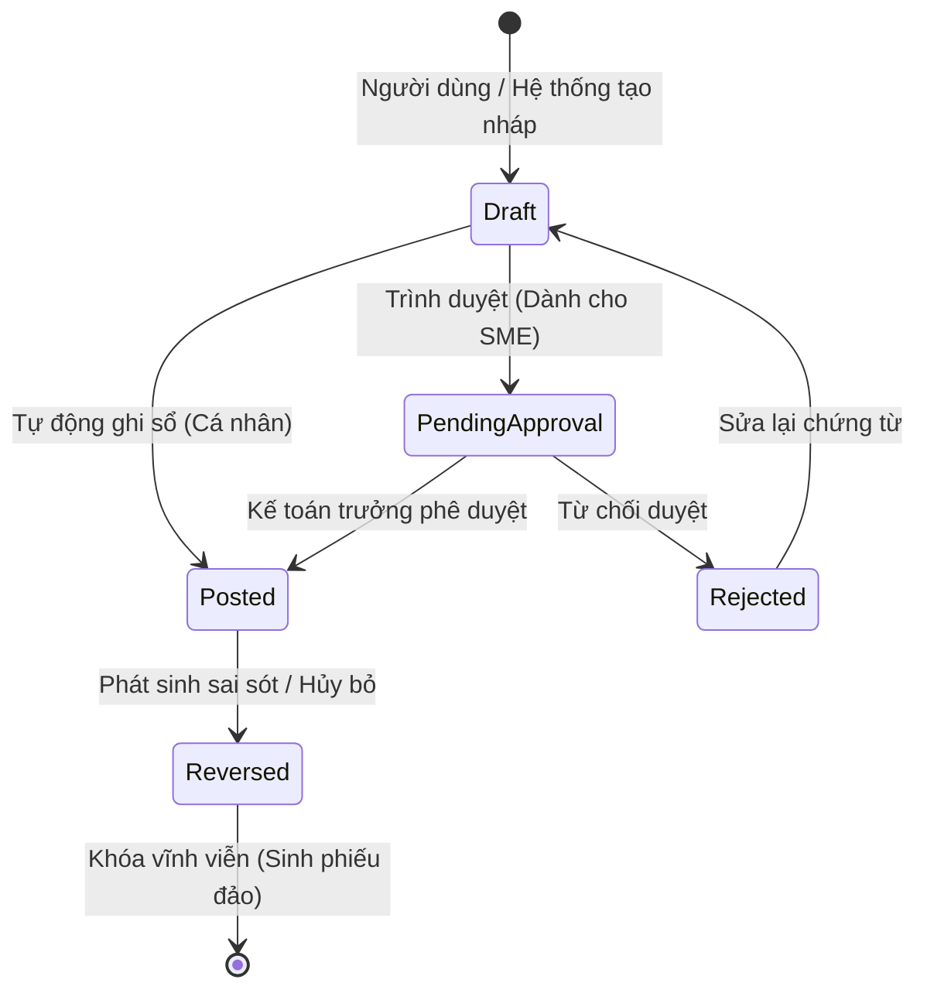
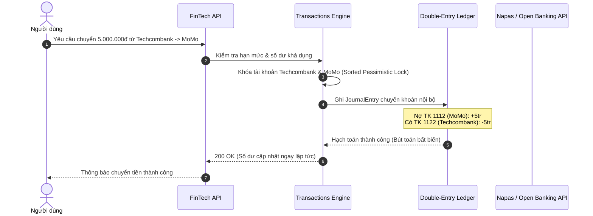
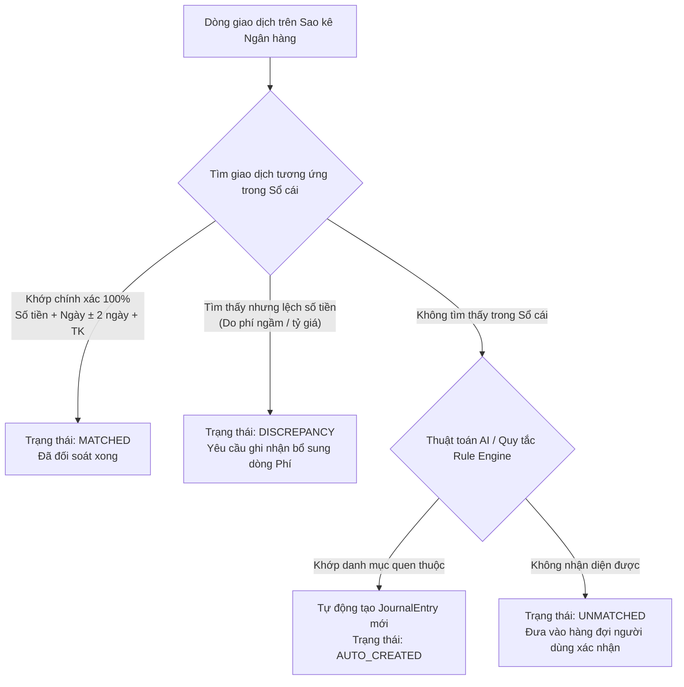
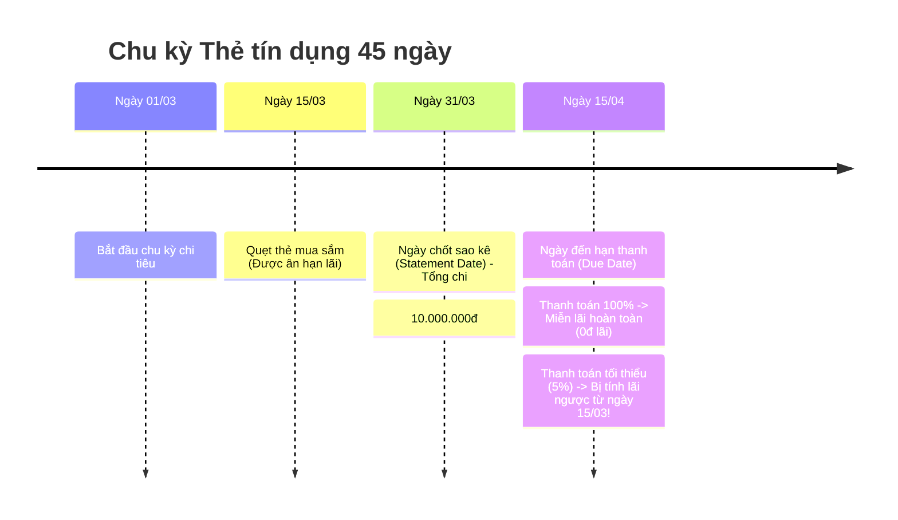
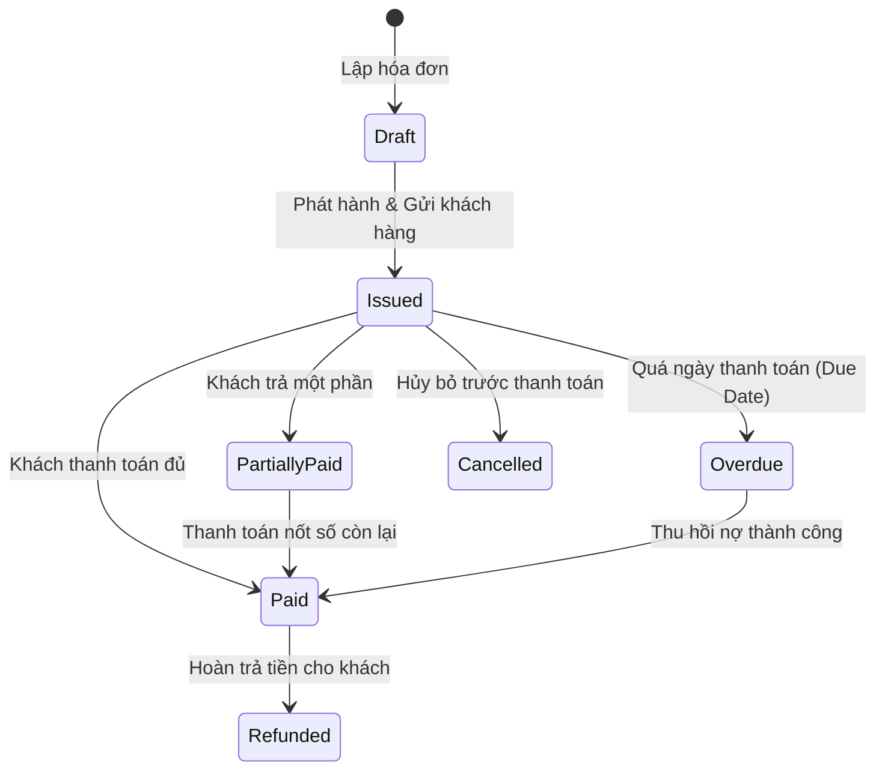
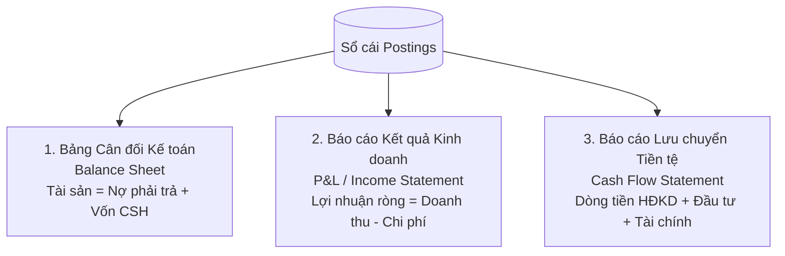

# 📘 BẢN THIẾT KẾ & PHÂN TÍCH CHUYÊN SÂU TỪNG NGHIỆP VỤ FINTECH
## Cẩm nang Nghiệp vụ Thực chiến, Định khoản Kế toán, State Machine & Ánh xạ Code Clean Architecture (.NET 10)

> **Tài liệu tham chiếu:** 
> - Kiến trúc hệ thống: [fintech_architecture_dotnet.md](./fintech_architecture_dotnet.md)
> - Đặc tả CSDL 72 bảng: [fintech_database_deep_dive.md](./fintech_database_deep_dive.md)
> - Quy tắc Coding FinTech: [.agents/skills/fintech-platform-coding-rules/SKILL.md](../.agents/skills/fintech-platform-coding-rules/SKILL.md)

---

## MỤC LỤC TỔNG QUAN CÁC KHỐI NGHIỆP VỤ

1. [Bản chất kiến trúc FinTech: Vì sao không bao giờ lưu trực tiếp "Balance"?](#1-bản-chất-kiến-trúc-fintech-vì-sao-không-bao-giờ-lưu-trực-tiếp-balance)
2. [Nghiệp vụ 1: Sổ cái Kế toán kép (Double-Entry General Ledger & COA)](#nghiệp-vụ-1-sổ-cái-kế-toán-kép-double-entry-general-ledger--chart-of-accounts)
3. [Nghiệp vụ 2: Dòng tiền, Quản lý Ví & Giao dịch Chuyển khoản (Money Flow & Wallets)](#nghiệp-vụ-2-dòng-tiền-quản-lý-ví--giao-dịch-chuyển-khoản)
4. [Nghiệp vụ 3: Đối soát Ngân hàng & Sao kê Tự động (Bank Statement Reconciliation)](#nghiệp-vụ-3-đối-soát-ngân-hàng--sao-kê-tự-động)
5. [Nghiệp vụ 4: Tín dụng, Khoản vay, Trả góp & Lãi suất (Loan Amortization & Credit Cards)](#nghiệp-vụ-4-tín-dụng-khoản-vay-trả-góp--lãi-suất)
6. [Nghiệp vụ 5: Quản lý Ngân sách Cá nhân/Hộ gia đình (Envelope Budgeting & Zero-Based)](#nghiệp-vụ-5-quản-lý-ngân-sách-cá-nhânhộ-gia-đình)
7. [Nghiệp vụ 6: Bán lẻ, Hóa đơn & Công nợ Khách hàng/Nhà cung cấp SME (Invoicing & AP/AR)](#nghiệp-vụ-6-bán-lẻ-hóa-đơn--công-nợ-sme-apar)
8. [Nghiệp vụ 7: Tính Lương, Bảo hiểm & Thuế TNCN (Payroll, Social Insurance & PIT)](#nghiệp-vụ-7-tính-lương-bảo-hiểm--thuế-tncn)
9. [Nghiệp vụ 8: Đầu tư & Danh mục Chứng khoán/Crypto (Investments & Lot Tracking)](#nghiệp-vụ-8-đầu-tư--danh-mục-chứng-khoáncrypto)
10. [Nghiệp vụ 9: Báo cáo Tài chính Tự động (P&L, Balance Sheet, Cash Flow)](#nghiệp-vụ-9-báo-cáo-tài-chính-tự-động)
11. [Hướng dẫn Lập trình viên: Quy trình 5 bước biến Nghiệp vụ thành Code C# hoàn chỉnh](#11-hướng-dẫn-lập-trình-viên-quy-trình-5-bước-biến-nghiệp-vụ-thành-code-c-hoàn-chỉnh)

---

## 1. BẢN CHẤT KIẾN TRÚC FINTECH: VÌ SAO KHÔNG BAO GIỜ LƯU TRỰC TIẾP "BALANCE"?

Trong các ứng dụng web thông thường (Todo, CRUD), lập trình viên thường có thói quen:
```csharp
// ❌ SAI LẦM CHẾT NGƯỜI TRONG FINTECH
public class UserAccount {
    public decimal Balance { get; set; } // Khi rút tiền: Balance = Balance - 100k
}
```

### Tại sao ngân hàng và hệ thống FinTech cấm tuyệt đối cách này?
1. **Mất dấu vết kiểm toán (Audit Trail):** Nếu số dư nhảy từ 10.000.000 VNĐ xuống 9.000.000 VNĐ, không ai biết 1.000.000 VNĐ đã biến đi đâu nếu bảng Transaction bị lỗi hoặc bị nhân viên gian lận sửa database.
2. **Race Condition (Tranh chấp đồng thời):** Người dùng bấm rút 500k cùng 1 mili-giây trên 2 máy POS hoặc 2 luồng API khác nhau. Nếu đọc `Balance = 10tr` cùng lúc, cả 2 luồng đều trừ thành `9tr5`, trong khi người dùng rút được 1 triệu mà tài khoản chỉ mất 500k.
3. **Nguyên lý bảo toàn giá trị (Conservation of Money):** Tiền không tự sinh ra và không tự mất đi. Tiền ra khỏi túi A thì bắt buộc phải chui vào túi B.

### Giải pháp FinTech chuẩn mực: Mô hình Bút toán Bất biến (Append-Only Ledger)
- **Số dư (Balance) là trạng thái suy diễn (Derived State):** Số dư của một tài khoản tại bất kỳ thời điểm nào là **TỔNG NỢ (Debit) trừ TỔNG CÓ (Credit)** của tất cả các dòng bút toán từ ngày thành lập đến thời điểm đó.
- Bảng bút toán (`postings`) chỉ có lệnh `INSERT`, **KHÔNG BAO GIỜ có `UPDATE` hoặc `DELETE`**.
- Để tối ưu hiệu năng đọc (không thể SUM 1 triệu dòng mỗi khi xem số dư), hệ thống sử dụng **Snapshot / Cached Balance Projection** kèm cơ chế khóa hàng bi quan (`Pessimistic Sort-Lock`).

---

## NGHIỆP VỤ 1: SỔ CÁI KẾ TOÁN KÉP (DOUBLE-ENTRY GENERAL LEDGER & CHART OF ACCOUNTS)

### 1.1 Khái niệm cốt lõi: 5 Nhóm Tài khoản Chuẩn (Standard COA)
Mọi dòng tiền trên thế giới đều phân loại vào đúng 5 nhóm sau:

| Mã loại | Tên nhóm (Account Type) | Bản chất tăng/giảm | Khi phát sinh TĂNG ghi | Khi phát sinh GIẢM ghi | Ví dụ thực tế |
| :--- | :--- | :--- | :--- | :--- | :--- |
| **1 - Asset** | Tài sản | Có giá trị sở hữu | **Nợ (Debit)** | **Có (Credit)** | Tiền mặt, Tiền gửi Techcombank, Hàng tồn kho |
| **2 - Liability** | Nợ phải trả | Nghĩa vụ phải trả | **Có (Credit)** | **Nợ (Debit)** | Nợ thẻ tín dụng, Vay ngân hàng, Phải trả người bán |
| **3 - Equity** | Vốn chủ sở hữu | Giá trị ròng còn lại | **Có (Credit)** | **Nợ (Debit)** | Vốn góp ban đầu, Lợi nhuận giữ lại chưa phân phối |
| **4 - Revenue** | Doanh thu | Thu nhập kiếm được | **Có (Credit)** | **Nợ (Debit)** | Doanh thu bán hàng, Lương nhận về, Tiền lãi tiết kiệm |
| **5 - Expense** | Chi phí | Tiêu dùng cho hoạt động | **Nợ (Debit)** | **Có (Credit)** | Tiền ăn uống, Tiền thuê nhà, Tiền điện nước, Lãi vay |

> **Quy tắc vàng kế toán (Bất biến):**
> $$\sum \text{Debit} = \sum \text{Credit}$$
> **Mỗi một giao dịch (Journal Entry) bắt buộc phải có ít nhất 2 dòng bút toán (Postings), trong đó Tổng số tiền bên Nợ phải bằng chính xác Tổng số tiền bên Có đến từng đơn vị xu.**

---

### 1.2 Bảng Hạch toán Chi tiết Cho Mọi Tình huống Thực tế

#### Kịch bản 1: Nhận tiền lương 30.000.000 VNĐ vào tài khoản Vietcombank
- Tiền trong ngân hàng tăng (Tài sản tăng -> Ghi NỢ)
- Doanh thu từ tiền lương tăng (Doanh thu tăng -> Ghi CÓ)
```
Nợ: TK 1121 - Tiền gửi Vietcombank          30.000.000 VNĐ
    Có: TK 5111 - Thu nhập từ Tiền lương              30.000.000 VNĐ
(Kiểm tra: Nợ = 30tr, Có = 30tr => CÂN BẰNG)
```

#### Kịch bản 2: Đi ăn nhà hàng hết 550.000 VNĐ, quẹt thẻ ghi nợ (Debit Card) Vietcombank
- Chi phí ăn uống phát sinh (Chi phí tăng -> Ghi NỢ)
- Tiền trong tài khoản giảm (Tài sản giảm -> Ghi CÓ)
```
Nợ: TK 6421 - Chi phí Ăn uống ngoài          550.000 VNĐ
    Có: TK 1121 - Tiền gửi Vietcombank               550.000 VNĐ
```

#### Kịch bản 3: Mua Laptop 25.000.000 VNĐ bằng Thẻ tín dụng (Credit Card)
- Tài sản Laptop tăng lên (Tài sản tăng -> Ghi NỢ)
- Khoản nợ ngân hàng phát sinh (Nợ phải trả tăng -> Ghi CÓ)
```
Nợ: TK 2111 - Thiết bị công nghệ (Laptop)   25.000.000 VNĐ
    Có: TK 3381 - Dư nợ Thẻ tín dụng HSBC            25.000.000 VNĐ
```

#### Kịch bản 4: Trả nợ thẻ tín dụng 10.000.000 VNĐ từ tài khoản Vietcombank
- Nợ thẻ tín dụng giảm bớt (Nợ phải trả giảm -> Ghi NỢ)
- Tiền tài khoản Vietcombank giảm (Tài sản giảm -> Ghi CÓ)
```
Nợ: TK 3381 - Dư nợ Thẻ tín dụng HSBC       10.000.000 VNĐ
    Có: TK 1121 - Tiền gửi Vietcombank               10.000.000 VNĐ
```

#### Kịch bản 5: Hoàn tiền (Refund) 500.000 VNĐ do trả lại món hàng đã mua
- Không bao giờ xóa giao dịch cũ! Ghi một bút toán đảo (Reversal hoặc Contra-Entry):
```
Nợ: TK 1121 - Tiền gửi Vietcombank           500.000 VNĐ
    Có: TK 6421 - Chi phí Mua sắm hoàn trả           500.000 VNĐ
```

---

### 1.3 State Machine của Phiếu kế toán (`JournalEntry`)



- **Draft:** Có thể sửa nội dung, thêm bớt dòng bút toán.
- **Posted:** ĐÃ KHÓA HOÀN TOÀN (Read-Only). Không có bất kỳ lệnh SQL UPDATE/DELETE nào được phép chạm vào dòng này.
- **Reversed:** Muốn hủy một phiếu đã Posted, hệ thống tự động sinh ra một `JournalEntry` mới mang cờ `IsReversal = true` với các bút toán đảo chiều chính xác (Nợ thành Có, Có thành Nợ).

---

## NGHIỆP VỤ 2: DÒNG TIỀN, QUẢN LÝ VÍ & GIAO DỊCH CHUYỂN KHOẢN

### 2.1 Các Loại Tài khoản Tài chính (Account Classification)
1. **Ví tiền mặt (Cash Wallet):** Tiền mặt trong ví vật lý.
2. **Tài khoản thanh toán (Checking/Demand Deposit):** Tài khoản ngân hàng có số tài khoản và kết nối VietQR.
3. **Ví điện tử (E-Wallet):** MoMo, ZaloPay, ShopeePay (liên kết với ngân hàng).
4. **Tài khoản tiết kiệm có kỳ hạn (Term Deposit):** Tiền gửi hưởng lãi định kỳ, bị phạt lãi suất không kỳ hạn nếu rút trước hạn.
5. **Thẻ tín dụng (Credit Card):** Tài khoản hạn mức tín dụng âm được phép tiêu trước trả sau.

---

### 2.2 Luồng Chuyển tiền Nội bộ (Internal Transfer) vs Liên ngân hàng (VietQR)



### 2.3 Thuật toán Chống Race Condition & Deadlock khi Giao dịch Đồng thời
Nếu 2 giao dịch diễn ra cùng 1 thời điểm:
- Giao dịch A: Chuyển tiền từ Tài khoản 1 sang Tài khoản 2.
- Giao dịch B: Chuyển tiền từ Tài khoản 2 sang Tài khoản 1.
Nếu không có thuật toán, Luồng A khóa TK1 đợi TK2, trong khi Luồng B khóa TK2 đợi TK1 -> **Hệ thống rơi vào DEADLOCK vĩnh viễn!**

#### Giải pháp chuẩn ngân hàng: Sorted Account Lock Pattern
```csharp
// Luôn luôn sắp xếp thứ tự các Account ID trước khi Acquire Lock
var accountsToLock = new[] { sourceAccountId, destinationAccountId }
    .OrderBy(id => id)
    .ToArray();

// Khi chạy câu lệnh SQL Server, khóa theo đúng thứ tự tăng dần:
// SELECT * FROM ledger.accounts WITH (UPDLOCK, ROWLOCK) WHERE id = @FirstId
// SELECT * FROM ledger.accounts WITH (UPDLOCK, ROWLOCK) WHERE id = @SecondId
```
Nhờ sắp xếp thứ tự cố định, Luồng B sẽ luôn phải chờ Luồng A nhả khóa tài khoản nhỏ hơn trước, loại bỏ hoàn toàn 100% nguy cơ Deadlock!

---

## NGHIỆP VỤ 3: ĐỐI SOÁT NGÂN HÀNG & SAO KÊ TỰ ĐỘNG (BANK STATEMENT RECONCILIATION)

### 3.1 Vấn đề thực tế của sao kê ngân hàng
Người dùng nhập sao kê từ file Excel/CSV tải từ Vietcombank/Techcombank hoặc nhận Webhook từ ngân hàng. Tuy nhiên:
- Ngân hàng chỉ ghi nội dung thô: `FT240102123456 CHUYEN TIEN ND: NGUYEN VAN A MUA HANG BANH MI`.
- Ngày trên sao kê (Booking Date) có thể lệch 1-2 ngày so với ngày thực hiện giao dịch (Transaction Date/Value Date) do xử lý cuối tuần.
- Phí giao dịch có thể bị trừ ngầm 1 dòng riêng lẻ 3.300 VNĐ.

---

### 3.2 Quy trình Đối soát 3 Chiều (Three-Way Matching)



### 3.3 Cơ chế Bóc tách Nội dung & Chống trùng lặp (Deduplication)
Để đảm bảo người dùng tải lại file sao kê cả tháng 2 lần không bị nhân đôi số tiền:
- Sinh mã **Idempotency Hash**:
  $$\text{Hash} = \text{SHA256}(\text{BankCode} + \text{AccountNumber} + \text{TransactionDate} + \text{Amount} + \text{ReferenceNumber})$$
- Đặt ràng buộc `UNIQUE` trên cột `StatementRowHash` trong cơ sở dữ liệu. Bất kỳ dòng nào trùng lặp sẽ bị hệ thống bỏ qua an toàn mà không sinh lỗi.

---

## NGHIỆP VỤ 4: TÍN DỤNG, KHOẢN VAY, TRẢ GÓP & LÃI SUẤT

### 4.1 Hai Phương pháp Tính Lãi Vay Phổ biến

#### 1. Phương pháp Dư nợ giảm dần (Reducing Balance Amortization) — Chuẩn Ngân hàng
Mỗi tháng người dùng trả một số tiền cố định (bao gồm cả gốc và lãi):
$$\text{PMT} = P \times \frac{r(1 + r)^n}{(1 + r)^n - 1}$$
- Trong đó:
  - $P$: Số tiền vay ban đầu (Principal).
  - $r$: Lãi suất mỗi kỳ (Lãi năm chia 12).
  - $n$: Tổng số kỳ thanh toán (tháng).
- **Nguyên tắc phân bổ:** Lãi kỳ này được tính trên dư nợ thực tế còn lại. Tiền gốc trả trong kỳ = $\text{PMT} - \text{Lãi kỳ}$. Do đó, càng về cuối khoản vay, tiền lãi càng giảm và tiền gốc trả được càng tăng.

#### 2. Phương pháp Lãi phẳng trên nợ gốc (Flat Rate) — Thường dùng ở Mua hàng trả góp/Tín dụng đen
$$\text{Lãi mỗi tháng} = \frac{P \times \text{Lãi suất năm}}{12}$$
> **Cảnh báo FinTech:** Lãi phẳng thường tạo cảm giác rẻ (ví dụ 8%/năm), nhưng nếu quy đổi sang lãi suất thực tế theo dư nợ giảm dần (Effective APR), lãi suất thực có thể lên đến **14% - 16%/năm**! FinTech Platform tự động tính toán chỉ số APR minh bạch để cảnh báo người dùng.

---

### 4.2 Chu kỳ Thẻ tín dụng & Quản lý Ân hạn Lãi (Grace Period)



- **Quy tắc bẫy lãi suất:** Nếu người dùng chỉ trả số tiền tối thiểu (Minimum Payment, vd 5%), ngân hàng sẽ **hủy bỏ toàn bộ thời gian miễn lãi** và tính lãi lũy tiến trên toàn bộ dư nợ kể từ ngày quẹt thẻ!
- **Hệ thống FinTech xử lý:** Bật cảnh báo thông minh trước ngày Due Date 3 ngày, tính toán chính xác số tiền lãi sẽ phải chịu nếu không trả hết 100%.

---

## NGHIỆP VỤ 5: QUẢN LÝ NGÂN SÁCH CÁ NHÂN/HỘ GIA ĐÌNH

### 5.1 Phương pháp Ngân sách Zero-Based (Zero-Based Budgeting - ZBB)
> *"Every dollar has a job" — Mỗi đồng tiền kiếm được đều phải được giao một nhiệm vụ cụ thể trước khi chi tiêu.*

$$\text{Tổng thu nhập} - \sum \text{Ngân sách các phong bì} = 0$$

Người dùng chia thu nhập thành các Phong bì ảo (Virtual Envelopes):
1. **Chi phí cố định (50%):** Tiền thuê nhà, Tiền học con, Tiền điện nước, Tiền ăn uống cơ bản.
2. **Mong muốn cá nhân (30%):** Mua sắm, Du lịch, Xem phim, Nhà hàng cuối tuần.
3. **Tiết kiệm & Đầu tư (20%):** Quỹ khẩn cấp 6 tháng, Đầu tư cổ phiếu, Bảo hiểm nhân thọ.

---

### 5.2 Cơ chế Cảnh báo & Chặn Vượt Chi (Budget Enforcement)
Khi phát sinh một giao dịch chi tiêu (vd: Cà phê 50.000đ):
1. Giao dịch được phân loại vào danh mục `Ăn uống & Giải trí`.
2. Kiểm tra ngân sách còn lại của phong bì:
   $$\text{Remaining} = \text{BudgetAmount} - \sum \text{ExpensesInMonth}$$
3. **Ngưỡng cảnh báo đa cấp độ:**
   - **Xanh:** Đạt dưới 70% ngân sách.
   - **Vàng:** Đạt từ 70% đến 90% (Gửi Push Notification thông báo sắp hết hạn mức).
   - **Đỏ:** Vượt 100% (Hiển thị cảnh báo đỏ trên dashboard, gợi ý chuyển tiền từ phong bì khác bù sang).

---

## NGHIỆP VỤ 6: BÁN LẺ, HÓA ĐƠN & CÔNG NỢ SME (AP/AR)

### 6.1 Vòng đời của Hóa đơn Bán lẻ / Doanh nghiệp (Invoice Lifecycle)



---

### 6.2 Hóa đơn Điện tử theo Luật Việt Nam (Nghị định 123 / Thông tư 78)
Hệ thống hóa đơn SME trong FinTech Platform tuân thủ các quy tắc pháp lý nghiêm ngặt:
1. **Có mã của Cơ quan Thuế:** Hóa đơn gửi lên Tổng cục Thuế để lấy mã xác thực trước khi gửi khách.
2. **Ký số tập trung (HSM / Cloud CA):** Tự động ký số hóa đơn bằng chứng thư số doanh nghiệp.
3. **Không được sửa hóa đơn đã cấp mã:** Nếu phát hiện sai sót, bắt buộc phải xuất:
   - **Hóa đơn Điều chỉnh (Adjustment Invoice):** Điều chỉnh tăng/giảm tiền hoặc thuế.
   - **Hóa đơn Thay thế (Replacement Invoice):** Hủy hóa đơn cũ và phát hành hóa đơn mới thay thế hoàn toàn.

---

### 6.3 Hạch toán Công nợ Khách hàng (Accounts Receivable - AR)

#### Kịch bản: Bán lô hàng 100.000.000 VNĐ (chưa VAT), thuế VAT 10%, khách mua nợ 30 ngày
```
Nợ: TK 131 - Phải thu của khách hàng (AR)   110.000.000 VNĐ
    Có: TK 511 - Doanh thu bán hàng                  100.000.000 VNĐ
    Có: TK 3331 - Thuế GTGT phải nộp (VAT 10%)        10.000.000 VNĐ
```

#### Khi khách chuyển khoản trả trước 50.000.000 VNĐ:
```
Nợ: TK 1121 - Tiền gửi ngân hàng              50.000.000 VNĐ
    Có: TK 131 - Phải thu của khách hàng              50.000.000 VNĐ
(Số dư nợ còn lại của khách hàng trên TK 131 là 60.000.000 VNĐ)
```

---

## NGHIỆP VỤ 7: TÍNH LƯƠNG, BẢO HIỂM & THUẾ TNCN (PAYROLL, INSURANCE & PIT)

### 7.1 Công thức Tính Lương Thực nhận (Gross to Net) theo Luật Lao động Việt Nam

```
LƯƠNG THỰC NHẬN (NET) = LƯƠNG GROSS - CÁC KHOẢN BẢO HIỂM BẮT BUỘC - THUẾ TNCN
```

#### 1. Các tỷ lệ Trích nộp Bảo hiểm Người lao động đóng (Năm 2026):
- **Bảo hiểm Xã hội (BHXH):** 8% (mức lương trần đóng BHXH = 20 lần mức lương cơ sở).
- **Bảo hiểm Y tế (BHYT):** 1.5%.
- **Bảo hiểm Thất nghiệp (BHTN):** 1% (mức lương trần = 20 lần mức lương tối thiểu vùng).
- **Tổng trừ bảo hiểm:** **10.5%**.

#### 2. Tính Thu nhập Tính thuế TNCN:
$$\text{Thu nhập Chịu thuế} = \text{Lương Gross} - \text{Các khoản miễn thuế (ăn trưa, điện thoại, trang phục)}$$
$$\text{Thu nhập Tính thuế} = \text{Thu nhập Chịu thuế} - \text{Bảo hiểm (10.5%)} - \text{Giảm trừ bản thân} - \sum \text{Giảm trừ người phụ thuộc}$$

#### 3. Biểu thuế Lũy tiến từng phần Thuế TNCN:

| Bậc | Thu nhập tính thuế / tháng | Thuế suất | Cách tính nhanh |
| :---: | :--- | :---: | :--- |
| **1** | Đến 5 triệu VNĐ | **5%** | $0.05 \times \text{TNTT}$ |
| **2** | Trên 5 tr đến 10 triệu VNĐ | **10%** | $0.10 \times \text{TNTT} - 0.25\text{ tr}$ |
| **3** | Trên 10 tr đến 18 triệu VNĐ | **15%** | $0.15 \times \text{TNTT} - 0.75\text{ tr}$ |
| **4** | Trên 18 tr đến 32 triệu VNĐ | **20%** | $0.20 \times \text{TNTT} - 1.65\text{ tr}$ |
| **5** | Trên 32 tr đến 52 triệu VNĐ | **25%** | $0.25 \times \text{TNTT} - 3.25\text{ tr}$ |
| **6** | Trên 52 tr đến 80 triệu VNĐ | **30%** | $0.30 \times \text{TNTT} - 5.85\text{ tr}$ |
| **7** | Trên 80 triệu VNĐ | **35%** | $0.35 \times \text{TNTT} - 9.85\text{ tr}$ |

---

### 7.2 Hạch toán Bảng lương Doanh nghiệp vào Sổ cái
Khi phê duyệt bảng lương tháng với tổng lương Gross 500.000.000 VNĐ:
```
Nợ: TK 6422 - Chi phí Lương nhân viên       500.000.000 VNĐ
    Có: TK 334 - Phải trả người lao động (Lương Net)  435.000.000 VNĐ
    Có: TK 3383 - BHXH phải nộp (Người LĐ đóng)        40.000.000 VNĐ
    Có: TK 3335 - Thuế TNCN khấu trừ tại nguồn         25.000.000 VNĐ
```

---

## NGHIỆP VỤ 8: ĐẦU TƯ & DANH MỤC CHỨNG KHOÁN/CRYPTO (INVESTMENTS & LOT TRACKING)

### 8.1 Thuật toán Theo dõi Lô Cổ phiếu: FIFO vs Giá vốn Bình quân

Giả sử người dùng mua cổ phiếu FPT như sau:
- Ngày 01/02: Mua **1.000 cp** giá **100.000đ** (Tổng: 100tr)
- Ngày 10/02: Mua **1.000 cp** giá **120.000đ** (Tổng: 120tr)
- Ngày 20/02: Bán **1.500 cp** giá **130.000đ** (Tổng thu: 195tr)

#### Cách tính 1: Phương pháp FIFO (Nhập trước - Xuất trước)
- Lấy hết 1.000 cp lô 1: Giá vốn = $1.000 \times 100.000đ = 100\text{tr}$. Lãi = $1.000 \times (130k - 100k) = +30\text{tr}$.
- Lấy 500 cp từ lô 2: Giá vốn = $500 \times 120.000đ = 60\text{tr}$. Lãi = $500 \times (130k - 120k) = +5\text{tr}$.
- **Tổng Lãi thực hiện (Realized PnL):** **+35.000.000 VNĐ**.
- Danh mục còn lại: 500 cp giá vốn 120.000đ.

#### Cách tính 2: Phương pháp Bình quân gia quyền (Weighted Average)
- Giá vốn bình quân trước khi bán: $\frac{100\text{tr} + 120\text{tr}}{2.000\text{ cp}} = 110.000đ/\text{cp}$.
- Giá vốn của 1.500 cp bán ra: $1.500 \times 110.000đ = 165\text{tr}$.
- **Tổng Lãi thực hiện (Realized PnL):** $195\text{tr} - 165\text{tr} =$ **+30.000.000 VNĐ**.

FinTech Platform cho phép cấu hình linh hoạt từng danh mục (Chứng khoán VN tuân theo quy định FIFO hoặc Bình quân).

---

## NGHIỆP VỤ 9: BÁO CÁO TÀI CHÍNH TỰ ĐỘNG

Nhờ hệ thống Sổ cái Kế toán kép, việc lập 3 báo cáo tài chính cốt lõi hoàn toàn tự động chỉ bằng truy vấn SQL tổng hợp:



---

## 11. HƯỚNG DẪN LẬP TRÌNH VIÊN: QUY TRÌNH 5 BƯỚC BIẾN NGHIỆP VỤ THÀNH CODE C# HOÀN CHỈNH

Khi nhận bất kỳ yêu cầu nghiệp vụ nào mới, lập trình viên tuân thủ đúng quy trình chuẩn 5 bước sau đây:

### Bước 1: Thiết kế Value Objects & Entities tại `Domain Layer`
- Bảo vệ dữ liệu ngay từ constructor: Không để dữ liệu không hợp lệ lọt vào domain model.
- Không dùng kiểu `float`/`double`. Dùng kiểu [`Money`](file:///d:/PROJECT/FindTechPlatform/src/BuildingBlocks/FinTech.SharedKernel/Money.cs).

```csharp
// Ví dụ: Bút toán kế toán Posting trong FinTech.Modules.Ledger.Domain
public sealed class Posting
{
    public Guid Id { get; private set; }
    public Guid AccountId { get; private set; }
    public decimal DebitAmount { get; private set; }
    public decimal CreditAmount { get; private set; }
    public string Currency { get; private set; }

    private Posting() { } // EF Core

    public static Posting CreateDebit(Guid accountId, decimal amount, string currency)
    {
        if (amount <= 0) throw new ArgumentOutOfRangeException(nameof(amount), "Số tiền ghi Nợ phải lớn hơn 0.");
        return new Posting { Id = Guid.NewGuid(), AccountId = accountId, DebitAmount = amount, CreditAmount = 0, Currency = currency };
    }

    public static Posting CreateCredit(Guid accountId, decimal amount, string currency)
    {
        if (amount <= 0) throw new ArgumentOutOfRangeException(nameof(amount), "Số tiền ghi Có phải lớn hơn 0.");
        return new Posting { Id = Guid.NewGuid(), AccountId = accountId, DebitAmount = 0, CreditAmount = amount, Currency = currency };
    }
}
```

### Bước 2: Viết Aggregate Root kiểm tra Invariant (Bất biến)
- Aggregate Root `JournalEntry` đảm bảo Tổng Nợ = Tổng Có trước khi cho phép lưu:

```csharp
public sealed class JournalEntry
{
    private readonly List<Posting> _postings = new();
    public IReadOnlyCollection<Posting> Postings => _postings.AsReadOnly();

    public void AddPosting(Posting posting) => _postings.Add(posting);

    public void Post()
    {
        var totalDebit = _postings.Sum(p => p.DebitAmount);
        var totalCredit = _postings.Sum(p => p.CreditAmount);

        if (totalDebit != totalCredit)
            throw new InvalidOperationException($"Phiếu kế toán không cân! Tổng Nợ ({totalDebit}) != Tổng Có ({totalCredit})");

        Status = JournalEntryStatus.Posted;
        PostedAt = DateTimeOffset.UtcNow;
    }
}
```

### Bước 3: Định nghĩa Use Case (Command & Handler) tại `Application Layer`
- Nhận input DTO, điều phối Entity, gọi Repository lưu vào database:

```csharp
public record CreateTransactionCommand(
    Guid SourceAccountId, 
    Guid DestinationAccountId, 
    decimal Amount, 
    string Currency, 
    string Description);

public class CreateTransactionHandler(ILedgerRepository ledgerRepo, IUnitOfWork uow)
{
    public async Task<Guid> HandleAsync(CreateTransactionCommand cmd, CancellationToken ct)
    {
        // 1. Tạo bút toán kép
        var entry = JournalEntry.Create(cmd.Description);
        entry.AddPosting(Posting.CreateDebit(cmd.DestinationAccountId, cmd.Amount, cmd.Currency));
        entry.AddPosting(Posting.CreateCredit(cmd.SourceAccountId, cmd.Amount, cmd.Currency));
        entry.Post(); // Validate Nợ = Có

        // 2. Lưu vào DB thông qua Unit of Work
        await ledgerRepo.AddAsync(entry, ct);
        await uow.SaveChangesAsync(ct);

        return entry.Id;
    }
}
```

### Bước 4: Cấu hình ánh xạ Database tại `Infrastructure Layer`
- Cấu hình khóa chính, độ dài ký tự, schema SQL trong EF Core:

```csharp
public class PostingConfiguration : IEntityTypeConfiguration<Posting>
{
    public void Configure(EntityTypeBuilder<Posting> builder)
    {
        builder.ToTable("postings", "ledger");
        builder.HasKey(p => p.Id);
        builder.Property(p => p.DebitAmount).HasPrecision(19, 4).IsRequired();
        builder.Property(p => p.CreditAmount).HasPrecision(19, 4).IsRequired();
        builder.Property(p => p.Currency).HasMaxLength(3).IsRequired();
    }
}
```

### Bước 5: Phơi bày Endpoint API tại `FinTech.Api` (Presentation)
```csharp
app.MapPost("/api/v1/ledger/transactions", async (CreateTransactionCommand cmd, CreateTransactionHandler handler, CancellationToken ct) =>
{
    var id = await handler.HandleAsync(cmd, ct);
    return Results.Created($"/api/v1/ledger/transactions/{id}", new { Id = id });
})
.WithTags("Ledger Transactions")
.WithSummary("Thực hiện chuyển tiền và ghi nhận bút toán kép bất biến");
```

---

## TỔNG KẾT

Tài liệu này là kim chỉ nam xuyên suốt quá trình phát triển hệ thống FinTech Platform. Khi gặp bất kỳ logic nào liên quan đến tiền bạc, kế toán, hóa đơn hay đối soát, bạn chỉ cần mở mục tương ứng để đối chiếu **Bảng hạch toán định khoản Nợ/Có**, **State Machine** và áp dụng theo **Quy trình 5 bước** để code luôn chính xác, an toàn và chuẩn mực ngân hàng.
