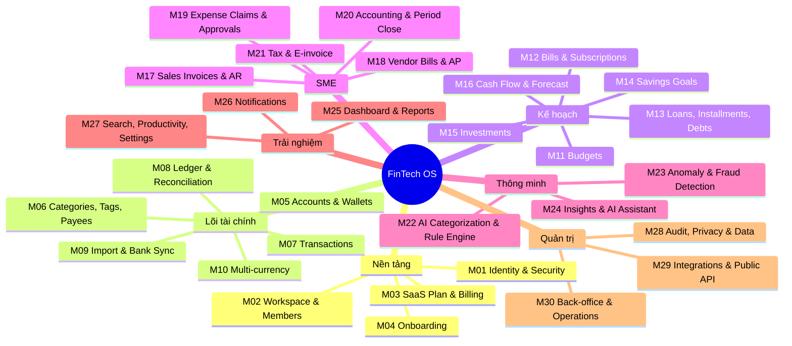
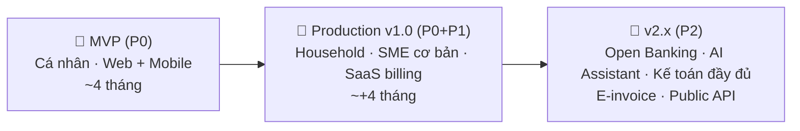

# 📋 FinTech Platform — Đặc tả chức năng hệ thống (Functional Specification)

> Phiên bản: 1.0 · Ngày: 10/2026
> Tài liệu liên quan: [fintech_platform_analysis.md](./fintech_platform_analysis.md) · [fintech_architecture_dotnet.md](./fintech_architecture_dotnet.md)
> Phạm vi: Personal Finance + Household + SME Finance, triển khai Web (React), Mobile (React Native), Back-office Admin, Public API.

---

## Mục lục

- [0. Quy ước](#0-quy-ước)
- [1. Tác nhân & vai trò](#1-tác-nhân--vai-trò)
- [2. Bản đồ chức năng tổng thể](#2-bản-đồ-chức-năng-tổng-thể)
- [3. Đặc tả chức năng theo module](#3-đặc-tả-chức-năng-theo-module) (M01 → M30)
- [4. Ma trận phân quyền](#4-ma-trận-phân-quyền)
- [5. Quy tắc nghiệp vụ toàn cục](#5-quy-tắc-nghiệp-vụ-toàn-cục)
- [6. Yêu cầu phi chức năng (NFR)](#6-yêu-cầu-phi-chức-năng-nfr)
- [7. Tiêu chí nghiệm thu mẫu (Gherkin)](#7-tiêu-chí-nghiệm-thu-mẫu-gherkin)
- [8. Phạm vi phát hành](#8-phạm-vi-phát-hành)
- [9. Production Readiness Checklist](#9-production-readiness-checklist)

---

## 0. Quy ước

| Ký hiệu | Ý nghĩa |
|---|---|
| **P0** | Bắt buộc cho MVP — không có thì không phát hành |
| **P1** | Bắt buộc cho bản Production v1.0 (public launch) |
| **P2** | Mở rộng / nâng cao (v1.x – v2) |
| **W / M / A** | Có trên Web / Mobile / Admin back-office |
| **Mã chức năng** | `<MODULE>-<số>` ví dụ `TXN-07` — dùng để truy vết với user story, test case, ADR |

---

## 1. Tác nhân & vai trò

### 1.1 Người dùng cuối
| Vai trò | Ngữ cảnh | Mô tả |
|---|---|---|
| **Guest** | — | Chưa đăng nhập: xem landing, đăng ký, đăng nhập, công cụ tính toán công khai |
| **Personal Owner** | Personal workspace | Chủ sở hữu dữ liệu tài chính cá nhân |
| **Household Member** | Household workspace | Thành viên gia đình dùng chung một số tài khoản/ngân sách |
| **Org Owner** | SME | Chủ doanh nghiệp, toàn quyền, quản lý gói dịch vụ |
| **Org Admin** | SME | Quản trị thành viên, cấu hình |
| **Accountant** | SME | Ghi sổ, đối soát, khóa kỳ, báo cáo |
| **Approver** | SME | Phê duyệt chi, đề nghị thanh toán, hoàn ứng theo hạn mức |
| **Employee / Requester** | SME | Tạo đề nghị chi, hoàn ứng, xem chi phí của mình |
| **Viewer / Auditor** | SME | Chỉ đọc (kiểm toán viên, nhà đầu tư) |
| **External Accountant** | SME | Kế toán dịch vụ được mời vào nhiều tổ chức |

### 1.2 Vận hành nền tảng
| Vai trò | Mô tả |
|---|---|
| **Platform Super Admin** | Toàn quyền cấu hình hệ thống |
| **Support Agent** | Hỗ trợ khách hàng; chỉ xem dữ liệu khách khi được khách cấp quyền tạm thời |
| **Risk / Fraud Analyst** | Xử lý hàng đợi cảnh báo bất thường |
| **Compliance / DPO** | Xử lý yêu cầu dữ liệu cá nhân, xuất audit |
| **Content Manager** | Quản lý FAQ, thông báo, mẫu email |
| **Finance Ops** | Quản lý doanh thu gói dịch vụ, hoàn tiền, hóa đơn của nền tảng |

### 1.3 Tác nhân hệ thống
Scheduler · Import worker · ML service · Notification service · Bank/Open API · Payment gateway · E-invoice provider · Market data provider · Email/SMS/Push provider.

---

## 2. Bản đồ chức năng tổng thể



---

## 3. Đặc tả chức năng theo module

### M01 — Identity, Authentication & Security (`IAM`)

| Mã | Chức năng | Mô tả & quy tắc nghiệp vụ | Ưu tiên | Nền tảng |
|---|---|---|---|---|
| IAM-01 | Đăng ký email | Email + mật khẩu; xác minh email bằng link có hạn 24h; chặn email dùng một lần (disposable) | P0 | W M |
| IAM-02 | Đăng ký số điện thoại | OTP SMS 6 số, hạn 5 phút, tối đa 5 lần gửi/giờ/số, chống SMS pumping | P1 | W M |
| IAM-03 | Đăng nhập mạng xã hội | Google, Apple (bắt buộc trên iOS nếu có social login), liên kết với tài khoản sẵn có | P1 | W M |
| IAM-04 | Passkeys (WebAuthn) | Đăng ký/đăng nhập không mật khẩu, quản lý nhiều passkey | P1 | W M |
| IAM-05 | Chính sách mật khẩu | ≥ 10 ký tự, kiểm tra với danh sách mật khẩu bị lộ (HIBP k-anonymity), không bắt đổi định kỳ | P0 | W M |
| IAM-06 | Quên / đặt lại mật khẩu | Link một lần hạn 30 phút; thông báo cho email; thu hồi mọi phiên sau khi đặt lại | P0 | W M |
| IAM-07 | Xác thực 2 lớp (MFA) | TOTP (Google Authenticator), SMS dự phòng, 10 mã khôi phục; **bắt buộc** với vai trò Owner/Admin/Accountant của SME | P0 | W M |
| IAM-08 | Sinh trắc học mobile | Face ID / vân tay để mở app và xác nhận hành động nhạy cảm | P0 | M |
| IAM-09 | Khóa ứng dụng (App lock) | PIN/biometric khi mở app hoặc sau N phút ở background | P0 | M |
| IAM-10 | Quản lý phiên & thiết bị | Danh sách thiết bị (tên, OS, IP, vị trí ước lượng, lần cuối), đăng xuất từng thiết bị / tất cả | P0 | W M |
| IAM-11 | Step-up authentication | Yêu cầu xác thực lại cho: đổi email/điện thoại/MFA, xuất dữ liệu, xóa tài khoản, kết nối ngân hàng, mời thành viên, thay đổi quyền, tạo API key | P0 | W M |
| IAM-12 | Khóa tài khoản chống brute-force | Khóa tạm tăng dần sau 5 lần sai; CAPTCHA sau 3 lần; thông báo cho chủ tài khoản | P0 | W M |
| IAM-13 | Cảnh báo đăng nhập | Email/push khi đăng nhập thiết bị mới, quốc gia mới, "impossible travel" | P1 | W M |
| IAM-14 | Hồ sơ cá nhân | Tên, ảnh, ngày sinh, nghề nghiệp, thu nhập ước tính (phục vụ insight), ngôn ngữ, múi giờ | P0 | W M |
| IAM-15 | Đổi email / số điện thoại | Xác minh giá trị mới + thông báo giá trị cũ; có thể hủy trong 72h | P1 | W M |
| IAM-16 | Xác minh danh tính (eKYC) | CCCD gắn chip (NFC) + khuôn mặt — chỉ cần khi có tính năng ví thật / thanh toán | P2 | M |
| IAM-17 | Đồng ý điều khoản & chính sách | Lưu phiên bản điều khoản đã đồng ý; yêu cầu đồng ý lại khi có phiên bản mới | P0 | W M |
| IAM-18 | SSO doanh nghiệp | SAML / OIDC (Google Workspace, Microsoft Entra ID) cho gói Business | P2 | W |
| IAM-19 | Chế độ riêng tư | Ẩn số tiền (hiển thị `••••`) bằng một chạm, hữu ích nơi công cộng | P1 | W M |

---

### M02 — Workspace, Household & Organization (`WSP`)

| Mã | Chức năng | Mô tả & quy tắc nghiệp vụ | Ưu tiên |
|---|---|---|---|
| WSP-01 | Personal workspace | Tự tạo khi đăng ký; 1 user có thể thuộc nhiều workspace | P0 |
| WSP-02 | Household workspace | Mời vợ/chồng/thành viên; chọn tài khoản nào chia sẻ, tài khoản nào riêng tư | P1 |
| WSP-03 | Organization (SME) | Tên pháp lý, MST, địa chỉ, ngành nghề, logo, năm tài chính, chế độ kế toán (TT200/TT133) | P1 |
| WSP-04 | Chuyển đổi workspace | Workspace switcher; dữ liệu cô lập tuyệt đối giữa các workspace | P0 |
| WSP-05 | Mời thành viên | Mời qua email/link có hạn 7 ngày, gán vai trò; thu hồi lời mời | P1 |
| WSP-06 | Vai trò & quyền | Vai trò mặc định (mục 1.1) + **vai trò tùy chỉnh** với quyền chi tiết theo module | P1 / P2 (custom) |
| WSP-07 | Phạm vi dữ liệu (ABAC) | Giới hạn thành viên theo chi nhánh, phòng ban, dự án, tài khoản, hạn mức số tiền | P2 |
| WSP-08 | Chi nhánh / phòng ban / cost center / dự án | Cây tổ chức; gắn vào giao dịch để báo cáo quản trị | P1 |
| WSP-09 | Cấu hình workspace | Tiền tệ gốc, múi giờ, ngày bắt đầu tuần/tháng tài chính (vd: lương ngày 5 → tháng tài chính bắt đầu ngày 5), định dạng số/ngày | P0 |
| WSP-10 | Chuyển quyền sở hữu | Owner chuyển cho thành viên khác; cần xác nhận của cả hai bên | P1 |
| WSP-11 | Rời / xóa thành viên | Thu hồi quyền ngay lập tức, giữ nguyên dữ liệu đã tạo (ghi tên người tạo) | P1 |
| WSP-12 | Lưu trữ / xóa workspace | Lưu trữ (read-only) hoặc xóa có thời gian ân hạn 30 ngày | P1 |
| WSP-13 | Kế toán dịch vụ đa khách hàng | External Accountant quản lý nhiều tổ chức từ một màn hình | P2 |

---

### M03 — SaaS Plan, Subscription & Billing của nền tảng (`PLN`)

> Hệ thống production cần **kiếm tiền** và **kiểm soát quota**. Đây là module hay bị quên.

| Mã | Chức năng | Mô tả & quy tắc nghiệp vụ | Ưu tiên |
|---|---|---|---|
| PLN-01 | Gói dịch vụ | Free / Premium (cá nhân) / Family / Business (theo số user) — cấu hình được ở Admin | P1 |
| PLN-02 | Feature flags theo gói | Giới hạn: số tài khoản, số lần import/tháng, AI, lịch sử dữ liệu, thành viên, báo cáo nâng cao | P1 |
| PLN-03 | Dùng thử (trial) | 14–30 ngày Premium, không cần thẻ; nhắc trước khi hết hạn | P1 |
| PLN-04 | Thanh toán | VNPay, MoMo, ZaloPay, thẻ quốc tế (Stripe); App Store / Google Play In-App Purchase cho mobile | P1 |
| PLN-05 | Gia hạn tự động & dunning | Retry thanh toán thất bại (ngày 1, 3, 7), email nhắc, hạ gói sau thời gian ân hạn — **không xóa dữ liệu** | P1 |
| PLN-06 | Nâng/hạ gói | Tính tiền theo tỷ lệ thời gian (proration); hạ gói vượt quota → chuyển read-only phần vượt | P1 |
| PLN-07 | Mã giảm giá & giới thiệu | Coupon, referral (thưởng tháng miễn phí) | P2 |
| PLN-08 | Hóa đơn của nền tảng | Xuất hóa đơn điện tử VAT cho khách doanh nghiệp; lịch sử thanh toán | P1 |
| PLN-09 | Hủy gói & hoàn tiền | Tự hủy trong app; chính sách hoàn tiền; khảo sát lý do hủy | P1 |

---

### M04 — Onboarding (`ONB`)

| Mã | Chức năng | Mô tả | Ưu tiên |
|---|---|---|---|
| ONB-01 | Wizard khởi tạo | Chọn mục tiêu (kiểm soát chi tiêu / trả nợ / tiết kiệm / quản lý doanh nghiệp), tiền tệ, ngày lương | P0 |
| ONB-02 | Thêm tài khoản đầu tiên | Hướng dẫn thêm tiền mặt + 1 tài khoản ngân hàng với số dư đầu kỳ | P0 |
| ONB-03 | Import nhanh | Gợi ý import sao kê 3 tháng gần nhất để có dữ liệu ngay | P1 |
| ONB-04 | Ngân sách gợi ý | Đề xuất ngân sách theo quy tắc 50/30/20 hoặc 6 chiếc lọ dựa trên thu nhập | P1 |
| ONB-05 | Dữ liệu mẫu / demo mode | Khám phá app với dữ liệu giả, xóa bằng một chạm | P2 |
| ONB-06 | Hướng dẫn theo ngữ cảnh | Tooltip/tour lần đầu vào mỗi màn hình; checklist "bắt đầu" | P1 |

---

### M05 — Accounts & Wallets (`ACC`)

| Mã | Chức năng | Mô tả & quy tắc nghiệp vụ | Ưu tiên |
|---|---|---|---|
| ACC-01 | Loại tài khoản | Tiền mặt, Ngân hàng (thanh toán), Thẻ tín dụng, Ví điện tử, Tiết kiệm có kỳ hạn, Đầu tư, Khoản vay, Khoản cho vay, Tài sản khác (xe, BĐS), Nợ khác | P0 |
| ACC-02 | Tạo / sửa tài khoản | Tên, tổ chức (danh mục ngân hàng VN có logo), 4 số cuối, tiền tệ, màu/biểu tượng, ghi chú | P0 |
| ACC-03 | Số dư đầu kỳ | Nhập số dư tại ngày bắt đầu → sinh bút toán `Opening Balance` (Equity) | P0 |
| ACC-04 | Thẻ tín dụng | Hạn mức, ngày sao kê, ngày đến hạn, lãi suất, phí thường niên; hiển thị hạn mức khả dụng, dư nợ kỳ sao kê, số tiền tối thiểu | P0 |
| ACC-05 | Tiết kiệm có kỳ hạn | Gốc, lãi suất, kỳ hạn, ngày đáo hạn, hình thức (lĩnh lãi cuối kỳ/định kỳ, tái tục); nhắc đáo hạn; tính lãi dự kiến | P1 |
| ACC-06 | Tài sản phi tiền tệ | Xe, BĐS, vàng vật chất: định giá thủ công theo thời điểm → tính vào tài sản ròng | P1 |
| ACC-07 | Nhóm tài khoản | Nhóm tùy chỉnh (vd: "Chi tiêu hằng ngày", "Quỹ khẩn cấp") | P1 |
| ACC-08 | Tính vào tài sản ròng | Bật/tắt từng tài khoản khỏi net worth và báo cáo | P0 |
| ACC-09 | Điều chỉnh số dư | Nhập số dư thực tế → hệ thống tạo giao dịch điều chỉnh chênh lệch (có lý do), không sửa trực tiếp số dư | P0 |
| ACC-10 | Lưu trữ / đóng tài khoản | Chỉ đóng khi số dư = 0 (hoặc chuyển phần dư); tài khoản đóng vẫn xuất hiện trong báo cáo lịch sử | P0 |
| ACC-11 | Xóa tài khoản | Chỉ khi chưa có giao dịch; ngược lại phải lưu trữ | P0 |
| ACC-12 | Lịch sử số dư | Biểu đồ số dư theo ngày, số dư tại một ngày bất kỳ trong quá khứ | P0 |
| ACC-13 | Sắp xếp & ẩn | Kéo thả thứ tự; ẩn tài khoản ít dùng | P1 |
| ACC-14 | Chia sẻ tài khoản | Trong household: chia sẻ toàn quyền / chỉ xem / chỉ số dư | P1 |
| ACC-15 | Hạn mức chi tiêu tài khoản | Cảnh báo khi số dư dưới ngưỡng tối thiểu | P1 |

---

### M06 — Categories, Tags, Payees & Merchants (`CAT`)

| Mã | Chức năng | Mô tả & quy tắc nghiệp vụ | Ưu tiên |
|---|---|---|---|
| CAT-01 | Danh mục mặc định | Cây danh mục chuẩn tiếng Việt/Anh (Ăn uống, Di chuyển, Nhà ở, Hóa đơn, Mua sắm, Sức khỏe, Giáo dục, Con cái, Giải trí, Hiếu hỉ, Biếu tặng, Đầu tư, Lương, Thưởng...) | P0 |
| CAT-02 | Danh mục tùy chỉnh | Tạo/sửa/ẩn; tối đa 2 cấp (cha/con); biểu tượng, màu | P0 |
| CAT-03 | Gộp danh mục | Gộp A vào B → chuyển toàn bộ giao dịch, ngân sách, rule | P1 |
| CAT-04 | Xóa danh mục | Bắt buộc chọn danh mục thay thế nếu đã có giao dịch | P0 |
| CAT-05 | Phân loại nhóm | Mỗi danh mục thuộc nhóm: Thiết yếu / Mong muốn / Tiết kiệm-Đầu tư (phục vụ 50/30/20) | P1 |
| CAT-06 | Tags | Nhãn tự do, nhiều tag/giao dịch (vd: `#du-lich-da-lat`, `#cong-tac`) | P0 |
| CAT-07 | Payees (người nhận/người trả) | Danh bạ đối tác, gợi ý danh mục mặc định theo payee | P1 |
| CAT-08 | Merchant chuẩn hóa | Gom các biến thể mô tả ngân hàng về 1 merchant (`GRAB*1234 HCM` → Grab); logo merchant | P1 |
| CAT-09 | Sự kiện / chuyến đi | Nhóm giao dịch theo sự kiện có ngân sách riêng (đám cưới, du lịch) | P2 |
| CAT-10 | Danh mục SME | Ánh xạ danh mục ↔ tài khoản kế toán (Chart of Accounts) | P1 |

---

### M07 — Transactions (`TXN`)

| Mã | Chức năng | Mô tả & quy tắc nghiệp vụ | Ưu tiên |
|---|---|---|---|
| TXN-01 | Loại giao dịch | Chi, Thu, Chuyển khoản nội bộ, Điều chỉnh, Hoàn tiền (refund), Phí, Lãi | P0 |
| TXN-02 | Tạo giao dịch | Số tiền, tài khoản, danh mục, ngày (mặc định hôm nay theo múi giờ user), payee, ghi chú, tag | P0 |
| TXN-03 | Nhập nhanh | Mobile: bàn phím số lớn, ≤ 3 chạm; gợi ý danh mục/payee gần nhất; widget màn hình chính | P0 |
| TXN-04 | Chuyển khoản nội bộ | Giữa 2 tài khoản của mình → không tính vào thu/chi; hỗ trợ phí chuyển | P0 |
| TXN-05 | Chuyển khoản khác tiền tệ | Số tiền nguồn, số tiền đích, tỷ giá áp dụng, phí | P1 |
| TXN-06 | Tách giao dịch (split) | 1 giao dịch → nhiều danh mục/tag; tổng các phần **bắt buộc** bằng tổng giao dịch | P0 |
| TXN-07 | Đính kèm chứng từ | Ảnh hóa đơn, PDF (≤ 10MB/file, ≤ 10 file); nén ảnh; quét virus | P1 |
| TXN-08 | OCR hóa đơn | Chụp hóa đơn → trích xuất số tiền, ngày, merchant, VAT → điền sẵn form | P1 |
| TXN-09 | Trạng thái | `Pending` → `Cleared` → `Reconciled`; `Void`; giao dịch đã đối soát bị khóa sửa | P0 |
| TXN-10 | Sửa giao dịch | Sửa giao dịch chưa đối soát → hệ thống ghi bút toán đảo + bút toán mới (lịch sử đầy đủ); hiển thị "Đã chỉnh sửa" | P0 |
| TXN-11 | Xóa giao dịch | Xóa mềm + bút toán đảo; khôi phục được trong 30 ngày (thùng rác) | P0 |
| TXN-12 | Lịch sử thay đổi | Xem ai sửa gì, khi nào, giá trị trước/sau | P1 |
| TXN-13 | Hoàn tiền liên kết | Liên kết refund với giao dịch gốc → báo cáo chi tiêu tính số ròng | P1 |
| TXN-14 | Giao dịch định kỳ | Mẫu lặp (hằng ngày/tuần/tháng/năm/tùy chỉnh RRULE), tự tạo hoặc tạo dạng chờ xác nhận | P0 |
| TXN-15 | Giao dịch tương lai | Ngày tương lai → trạng thái `Scheduled`, không ảnh hưởng số dư hiện tại, có trong dự báo | P1 |
| TXN-16 | Danh sách & lọc | Lọc theo thời gian, tài khoản, danh mục, tag, payee, khoảng số tiền, trạng thái, người tạo, có/không chứng từ | P0 |
| TXN-17 | Tìm kiếm | Full-text trên ghi chú/payee/mô tả gốc ngân hàng; không dấu tiếng Việt | P0 |
| TXN-18 | Bộ lọc đã lưu | Lưu và ghim bộ lọc thường dùng | P1 |
| TXN-19 | Sửa hàng loạt | Đổi danh mục/tag/tài khoản/trạng thái cho nhiều giao dịch; có preview và undo | P1 |
| TXN-20 | Phát hiện trùng lặp | Cảnh báo khi nhập tay trùng với giao dịch đã import (cùng tiền, ±2 ngày) → gộp | P0 |
| TXN-21 | Sao chép giao dịch | Nhân bản nhanh | P1 |
| TXN-22 | Vị trí | Gắn vị trí GPS (tùy chọn, xin quyền) | P2 |
| TXN-23 | Nhập bằng giọng nói / ngôn ngữ tự nhiên | "Cà phê 45k sáng nay bằng MoMo" → tạo giao dịch | P2 |
| TXN-24 | Chia tiền nhóm | Chia hóa đơn với bạn bè → sinh khoản "người khác nợ tôi" (liên kết M13) | P2 |
| TXN-25 | Offline (mobile) | Tạo/sửa khi mất mạng, đồng bộ lại với cùng idempotency key; xử lý xung đột | P1 |
| TXN-26 | Xuất giao dịch | CSV/Excel/PDF theo bộ lọc hiện tại | P0 |

---

### M08 — Ledger & Reconciliation (`LED`)

| Mã | Chức năng | Mô tả & quy tắc nghiệp vụ | Ưu tiên |
|---|---|---|---|
| LED-01 | Sổ cái kép | Mọi thay đổi số dư đi qua bút toán cân bằng; append-only | P0 |
| LED-02 | Đối soát với sao kê | Nhập số dư cuối kỳ theo sao kê → tick các giao dịch khớp → hệ thống báo chênh lệch → hoàn tất đối soát (khóa các giao dịch) | P1 |
| LED-03 | Gợi ý đối soát tự động | Ghép giao dịch nhập tay ↔ giao dịch import theo số tiền/ngày/payee | P1 |
| LED-04 | Lịch sử đối soát | Danh sách các phiên đối soát, ai thực hiện, chênh lệch đã xử lý | P1 |
| LED-05 | Kiểm tra toàn vẹn | Job hằng đêm: tổng bút toán = 0, số dư = tổng postings; cảnh báo vận hành nếu sai | P0 |
| LED-06 | Xem bút toán (chế độ kế toán) | Accountant xem Debit/Credit của mọi giao dịch | P1 |

---

### M09 — Import & Bank Sync (`IMP`)

| Mã | Chức năng | Mô tả & quy tắc nghiệp vụ | Ưu tiên |
|---|---|---|---|
| IMP-01 | Import CSV/Excel | Upload sao kê; tự nhận diện mẫu của ngân hàng VN phổ biến (Vietcombank, Techcombank, MB, BIDV, VietinBank, ACB, VPBank, TPBank, Sacombank, VIB...) | P0 |
| IMP-02 | Trình ánh xạ cột | Với file lạ: chọn cột ngày/số tiền/mô tả/ghi nợ-ghi có, định dạng ngày/số; lưu thành mẫu tái sử dụng | P0 |
| IMP-03 | OFX / QFX / QIF | Chuẩn file quốc tế | P1 |
| IMP-04 | MT940 / CAMT.053 | Sao kê chuẩn ngân hàng doanh nghiệp | P2 |
| IMP-05 | PDF sao kê | Trích xuất bảng từ PDF (một số ngân hàng chỉ xuất PDF) | P2 |
| IMP-06 | Import từ app khác | Money Lover, Misa MoneyKeeper, YNAB, Excel template của hệ thống | P1 |
| IMP-07 | Email forwarding | Địa chỉ email riêng mỗi user; chuyển tiếp email biến động số dư / e-receipt → tạo giao dịch chờ duyệt | P1 |
| IMP-08 | Đọc SMS biến động số dư | Android (xin quyền rõ ràng); iOS dùng Shortcuts automation | P2 |
| IMP-09 | Kết nối ngân hàng (Open API) | Qua aggregator / Open API theo quy định NHNN; đồng ý (consent) có thời hạn, thu hồi được; đồng bộ định kỳ | P2 |
| IMP-10 | Chống trùng | Fingerprint; import lại cùng file không sinh trùng; báo số dòng mới/trùng/lỗi | P0 |
| IMP-11 | Hàng đợi duyệt | Xem trước toàn bộ trước khi ghi sổ: sửa danh mục, bỏ dòng, đánh dấu chuyển khoản nội bộ | P0 |
| IMP-12 | Phát hiện chuyển khoản nội bộ | Ghép giao dịch ra/vào giữa 2 tài khoản của user | P1 |
| IMP-13 | Hoàn tác lô import | Gỡ toàn bộ giao dịch của một lần import | P0 |
| IMP-14 | Lịch sử import | Thời gian, file, người thực hiện, kết quả, báo cáo lỗi tải về | P0 |
| IMP-15 | Kiểm tra số dư sau import | So sánh số dư cuối file với số dư hệ thống → gợi ý đối soát | P1 |
| IMP-16 | Giới hạn & bảo mật file | ≤ 20MB, ≤ 100.000 dòng, kiểm tra định dạng, xử lý bất đồng bộ có thanh tiến trình | P0 |

---

### M10 — Multi-currency & Exchange Rates (`FXR`)

| Mã | Chức năng | Mô tả & quy tắc nghiệp vụ | Ưu tiên |
|---|---|---|---|
| FXR-01 | Tài khoản ngoại tệ | Mỗi tài khoản một tiền tệ (ISO 4217); hiển thị quy đổi về tiền tệ gốc | P1 |
| FXR-02 | Tỷ giá tự động | Cập nhật hằng ngày từ nguồn tin cậy (Vietcombank, NHNN, provider quốc tế); lưu lịch sử | P1 |
| FXR-03 | Tỷ giá thủ công | Ghi đè tỷ giá cho từng giao dịch | P1 |
| FXR-04 | Lãi/lỗ tỷ giá | Tách realized (khi chuyển đổi) và unrealized (đánh giá lại cuối kỳ) | P2 |
| FXR-05 | Crypto & vàng | Đơn vị phi tiền tệ (BTC, chỉ vàng SJC) với giá thị trường | P1 |

---

### M11 — Budgets (`BUD`)

| Mã | Chức năng | Mô tả & quy tắc nghiệp vụ | Ưu tiên |
|---|---|---|---|
| BUD-01 | Ngân sách theo danh mục | Hạn mức cho từng danh mục theo kỳ | P0 |
| BUD-02 | Kỳ ngân sách | Tuần / tháng / quý / năm / tùy chỉnh; theo tháng tài chính của workspace | P0 |
| BUD-03 | Ngân sách tổng | Hạn mức tổng chi tiêu của kỳ | P0 |
| BUD-04 | Envelope budgeting | Phân bổ toàn bộ thu nhập vào các "phong bì"; hiển thị "Số tiền chưa phân bổ" | P1 |
| BUD-05 | Chuyển dư (rollover) | Phần dư/thiếu chuyển sang kỳ sau (bật/tắt từng ngân sách) | P1 |
| BUD-06 | Theo dõi tiến độ | Đã chi / còn lại / % / tốc độ chi so với thời gian đã trôi qua ("đang chi nhanh hơn 23%") | P0 |
| BUD-07 | Cảnh báo ngưỡng | 50/80/100%/vượt (cấu hình được); mỗi ngưỡng gửi 1 lần/kỳ | P0 |
| BUD-08 | Dự báo vượt ngân sách | Dựa trên tốc độ chi + bill sắp tới: "Dự kiến vượt 1.200.000đ vào ngày 24" | P1 |
| BUD-09 | Mẫu ngân sách | 50/30/20, 6 chiếc lọ (JARS), sao chép từ kỳ trước, theo trung bình 3 tháng | P1 |
| BUD-10 | Ngân sách chia sẻ | Household cùng theo dõi một ngân sách | P1 |
| BUD-11 | Ngân sách theo tag/sự kiện | Ngân sách cho chuyến du lịch, dự án | P2 |
| BUD-12 | Ngân sách phòng ban (SME) | Ngân sách theo cost center/dự án; vượt ngân sách → yêu cầu phê duyệt | P2 |
| BUD-13 | Báo cáo ngân sách | So sánh kế hoạch vs thực tế theo kỳ, xu hướng 12 tháng | P0 |

---

### M12 — Bills & Subscriptions (`BIL`)

| Mã | Chức năng | Mô tả & quy tắc nghiệp vụ | Ưu tiên |
|---|---|---|---|
| BIL-01 | Hóa đơn định kỳ | Tên, nhà cung cấp, số tiền (cố định/ước tính), chu kỳ, ngày đến hạn, tài khoản thanh toán, danh mục | P0 |
| BIL-02 | Nhắc hạn | Trước N ngày (mặc định 3 và 1 ngày) + ngày đến hạn; cấu hình kênh | P0 |
| BIL-03 | Đánh dấu đã trả | Thủ công hoặc tự động khi có giao dịch khớp (payee + số tiền ±10%) | P0 |
| BIL-04 | Hóa đơn biến động | Điện, nước: ước tính theo trung bình 3 kỳ; cảnh báo tăng bất thường | P1 |
| BIL-05 | Quá hạn | Trạng thái `Overdue`, nhắc mỗi ngày; ghi nhận phí phạt | P0 |
| BIL-06 | Lịch hóa đơn | Calendar view tháng; tổng tiền cần chuẩn bị theo tuần | P1 |
| BIL-07 | Phát hiện subscription | Tự nhận diện khoản lặp (Netflix, Spotify, iCloud, YouTube Premium, gym...) → đề xuất tạo subscription | P1 |
| BIL-08 | Quản lý subscription | Tổng chi phí tháng/năm, ngày gia hạn, trial kết thúc, phương thức thanh toán | P1 |
| BIL-09 | Cảnh báo tăng giá | Khi số tiền gia hạn khác kỳ trước | P1 |
| BIL-10 | Gợi ý hủy | Subscription ít dùng / trùng chức năng; hướng dẫn hủy | P2 |
| BIL-11 | Đồng bộ lịch | Xuất ICS / Google Calendar cho ngày đến hạn | P2 |
| BIL-12 | Thanh toán hóa đơn | Thanh toán trực tiếp qua cổng (chỉ khi có giấy phép/đối tác) | P2 |

---

### M13 — Loans, Installments & Personal Debts (`LON`)

| Mã | Chức năng | Mô tả & quy tắc nghiệp vụ | Ưu tiên |
|---|---|---|---|
| LON-01 | Khoản vay | Ngân hàng/công ty tài chính: gốc, lãi suất (năm), kỳ hạn, ngày giải ngân, ngày trả hằng tháng, phương pháp tính | P0 |
| LON-02 | Phương pháp tính lãi | Dư nợ giảm dần – trả đều (annuity), Gốc đều – lãi giảm dần, Lãi phẳng (flat), Chỉ trả lãi – gốc cuối kỳ | P0 |
| LON-03 | Lịch trả nợ | Bảng amortization: kỳ, ngày, gốc, lãi, tổng, dư nợ còn lại; kỳ cuối điều chỉnh để khớp tuyệt đối | P0 |
| LON-04 | APR / lãi suất thực | Quy đổi lãi phẳng sang lãi suất thực và cảnh báo người dùng | P1 |
| LON-05 | Ghi nhận thanh toán | Mỗi kỳ trả → bút toán tách gốc (giảm nợ) và lãi (chi phí); liên kết với giao dịch ngân hàng | P0 |
| LON-06 | Ưu đãi lãi suất & thả nổi | Giai đoạn ưu đãi, sau đó lãi thả nổi = lãi cơ sở + biên độ; cập nhật lãi → tính lại lịch từ kỳ hiện tại (lưu phiên bản lịch) | P1 |
| LON-07 | Trả trước hạn | Trả một phần/toàn bộ; phí phạt trả trước theo % và theo năm; chọn giảm kỳ hạn hoặc giảm số tiền mỗi kỳ | P1 |
| LON-08 | Mô phỏng trả trước | "Nếu trả thêm 5tr/tháng → tiết kiệm X đồng lãi, xong sớm Y tháng" | P1 |
| LON-09 | Trễ hạn | Lãi phạt quá hạn, phí; trạng thái kỳ: `Upcoming / Due / Paid / Partially paid / Overdue` | P1 |
| LON-10 | Trả góp thẻ tín dụng / BNPL | Trả góp 0% (phí chuyển đổi), Kredivo, Home PayLater, Fundiin...; giảm hạn mức khả dụng của thẻ | P0 |
| LON-11 | Trả góp mua hàng | Trả góp tại cửa hàng (FE Credit, Home Credit): khoản trả trước, số kỳ, phí bảo hiểm | P1 |
| LON-12 | Vay/cho vay cá nhân (IOU) | Ghi nợ bạn bè/người thân: ai nợ ai, hạn trả, trả từng phần, nhắc nhẹ (gửi link nhắc qua Zalo) | P0 |
| LON-13 | Kế hoạch thoát nợ | Snowball vs Avalanche: thứ tự ưu tiên, ngày hết nợ, tổng lãi; so sánh | P1 |
| LON-14 | Tổng quan nợ | Tổng dư nợ, nợ/thu nhập (DTI), lãi đã trả năm nay, khoản sắp đến hạn | P0 |
| LON-15 | Cơ cấu nợ / gia hạn | Ghi nhận thay đổi điều khoản, giữ lịch sử | P2 |
| LON-16 | Khoản cho vay của SME | Cho nhân viên/đối tác vay, theo dõi thu hồi | P2 |

---

### M14 — Savings Goals (`GOL`)

| Mã | Chức năng | Mô tả | Ưu tiên |
|---|---|---|---|
| GOL-01 | Tạo mục tiêu | Tên, số tiền mục tiêu, hạn, ảnh, ưu tiên | P0 |
| GOL-02 | Gợi ý số tiền định kỳ | Tính số tiền cần để dành mỗi tháng/tuần để đạt hạn | P0 |
| GOL-03 | Góp quỹ | Ghi nhận đóng góp thủ công hoặc liên kết với tài khoản tiết kiệm | P0 |
| GOL-04 | Tiến độ & dự báo | % hoàn thành, dự kiến ngày đạt được theo tốc độ hiện tại | P0 |
| GOL-05 | Quỹ khẩn cấp | Mục tiêu đặc biệt = N tháng chi tiêu thiết yếu (tự tính) | P1 |
| GOL-06 | Mục tiêu chung | Household cùng góp | P1 |
| GOL-07 | Ăn mừng & nhắc | Thông báo mốc 25/50/75/100%; nhắc khi chậm tiến độ | P1 |

---

### M15 — Investments (`INV`)

| Mã | Chức năng | Mô tả & quy tắc nghiệp vụ | Ưu tiên |
|---|---|---|---|
| INV-01 | Danh mục đầu tư (portfolio) | Nhiều portfolio (theo công ty chứng khoán / mục tiêu) | P1 |
| INV-02 | Loại tài sản | Cổ phiếu VN (HOSE/HNX/UPCoM), ETF, chứng chỉ quỹ mở, trái phiếu, vàng, crypto, tiền gửi, BĐS, P2P, tài sản tùy chỉnh | P1 |
| INV-03 | Giao dịch mua/bán | Ngày, mã, số lượng, giá, phí giao dịch, thuế bán (0,1% với CK VN), tiền tệ | P1 |
| INV-04 | Lô & giá vốn | Theo lô; phương pháp FIFO / Bình quân gia quyền; không cho bán vượt số lượng nắm giữ | P1 |
| INV-05 | Cổ tức & lãi | Cổ tức tiền, cổ tức cổ phiếu, lãi trái phiếu, lãi tiền gửi | P1 |
| INV-06 | Sự kiện doanh nghiệp | Chia tách, gộp, quyền mua, thưởng cổ phiếu → điều chỉnh số lượng và giá vốn | P2 |
| INV-07 | Giá thị trường | Cập nhật giá cuối ngày (realtime nếu có nguồn); thời điểm giá hiển thị rõ | P1 |
| INV-08 | Lãi/lỗ | Đã thực hiện / chưa thực hiện, theo mã, theo portfolio, theo kỳ | P1 |
| INV-09 | Hiệu suất | TWR, XIRR, so sánh với VN-Index / benchmark | P2 |
| INV-10 | Phân bổ tài sản | Biểu đồ theo loại tài sản, ngành, tiền tệ; tỷ trọng mục tiêu & gợi ý tái cân bằng | P2 |
| INV-11 | Import lệnh | Import lịch sử giao dịch từ file công ty chứng khoán (SSI, VNDirect, TCBS, VPS...) | P2 |
| INV-12 | Watchlist & cảnh báo giá | Theo dõi mã, cảnh báo khi chạm giá | P2 |
| INV-13 | Báo cáo thuế đầu tư | Tổng hợp thuế đã nộp, cổ tức nhận được trong năm | P2 |

---

### M16 — Cash Flow & Forecasting (`CFL`)

| Mã | Chức năng | Mô tả & quy tắc nghiệp vụ | Ưu tiên |
|---|---|---|---|
| CFL-01 | Báo cáo dòng tiền | Tiền vào/ra theo ngày/tuần/tháng; theo tài khoản / danh mục | P0 |
| CFL-02 | Lịch dòng tiền | Calendar: thu nhập dự kiến, bill, trả góp, subscription từng ngày | P1 |
| CFL-03 | Dự báo số dư | 30/90/180 ngày cho từng tài khoản và tổng; dải tin cậy (thấp/trung bình/cao) | P1 |
| CFL-04 | Cảnh báo thiếu tiền | "Tài khoản VCB dự kiến âm vào 25/11 do bill + trả góp" | P1 |
| CFL-05 | Kịch bản What-if | Thêm khoản chi/thu giả định (mua xe trả góp, tăng lương, nghỉ việc) → so sánh với baseline | P2 |
| CFL-06 | Runway & burn rate (SME) | Số tháng hoạt động còn lại với tốc độ chi hiện tại | P1 |
| CFL-07 | Báo cáo lưu chuyển tiền tệ (SME) | Hoạt động kinh doanh / đầu tư / tài chính | P2 |

---

### M17 — Sales Invoices & Accounts Receivable — SME (`ARX`)

| Mã | Chức năng | Mô tả & quy tắc nghiệp vụ | Ưu tiên |
|---|---|---|---|
| ARX-01 | Khách hàng | Danh bạ khách hàng: tên, MST, địa chỉ, liên hệ, điều khoản thanh toán, hạn mức công nợ | P1 |
| ARX-02 | Sản phẩm / dịch vụ | Danh mục hàng hóa: mã, đơn giá, đơn vị, thuế suất VAT | P1 |
| ARX-03 | Báo giá | Tạo báo giá → chuyển thành hóa đơn | P2 |
| ARX-04 | Hóa đơn bán hàng | Dòng hàng, chiết khấu, VAT (0/5/8/10%), tổng; đánh số tự động; mẫu PDF có logo | P1 |
| ARX-05 | Gửi hóa đơn | Email kèm PDF + link xem online + QR chuyển khoản (VietQR có nội dung đối soát) | P1 |
| ARX-06 | Thu tiền | Ghi nhận thanh toán từng phần/toàn bộ; tự khớp khi giao dịch ngân hàng có mã hóa đơn | P1 |
| ARX-07 | Hóa đơn định kỳ | Tự phát hành theo chu kỳ (phí dịch vụ hằng tháng) | P2 |
| ARX-08 | Nhắc nợ | Tự động gửi nhắc trước/sau hạn theo lịch cấu hình | P1 |
| ARX-09 | Tuổi nợ phải thu | AR aging: 0–30 / 31–60 / 61–90 / > 90 ngày | P1 |
| ARX-10 | Credit note / điều chỉnh | Giảm trừ, hủy hóa đơn theo quy định | P2 |

---

### M18 — Vendor Bills & Accounts Payable — SME (`APX`)

| Mã | Chức năng | Mô tả & quy tắc nghiệp vụ | Ưu tiên |
|---|---|---|---|
| APX-01 | Nhà cung cấp | Danh bạ NCC, thông tin ngân hàng (mã hóa), điều khoản | P1 |
| APX-02 | Hóa đơn mua vào | Nhập tay / OCR / nhận hóa đơn điện tử XML → tạo bill phải trả | P1 |
| APX-03 | Đề nghị thanh toán | Tạo đề nghị → luồng phê duyệt → đánh dấu đã chi | P1 |
| APX-04 | Lịch thanh toán | Danh sách đến hạn, ưu tiên theo hạn/chiết khấu thanh toán sớm | P1 |
| APX-05 | Tuổi nợ phải trả | AP aging | P1 |
| APX-06 | Xuất lệnh chuyển tiền lô | File chuyển khoản theo mẫu ngân hàng doanh nghiệp | P2 |

---

### M19 — Expense Claims & Approval Workflows — SME (`APR`)

| Mã | Chức năng | Mô tả & quy tắc nghiệp vụ | Ưu tiên |
|---|---|---|---|
| APR-01 | Đề nghị hoàn ứng | Nhân viên chụp hóa đơn, chọn danh mục/dự án, gửi đề nghị | P1 |
| APR-02 | Tạm ứng | Đề nghị tạm ứng → quyết toán tạm ứng → hoàn trả phần thừa/chi thêm phần thiếu | P2 |
| APR-03 | Luồng phê duyệt | Nhiều cấp theo số tiền/phòng ban/danh mục (vd: < 5tr trưởng phòng; ≥ 5tr + giám đốc) | P1 |
| APR-04 | Hành động phê duyệt | Duyệt / từ chối (bắt buộc lý do) / yêu cầu bổ sung; duyệt trên mobile qua push | P1 |
| APR-05 | Ủy quyền & SLA | Ủy quyền khi vắng mặt; tự nhắc/escalate sau N giờ | P2 |
| APR-06 | Chính sách chi tiêu | Hạn mức theo danh mục (vd: tiếp khách ≤ 2tr/lần), cảnh báo vi phạm chính sách | P2 |
| APR-07 | Phân tách nhiệm vụ | Người tạo không tự duyệt yêu cầu của mình | P1 |
| APR-08 | Lịch sử phê duyệt | Dấu vết đầy đủ trong audit log | P1 |

---

### M20 — Accounting & Period Close — SME (`ACT`)

| Mã | Chức năng | Mô tả & quy tắc nghiệp vụ | Ưu tiên |
|---|---|---|---|
| ACT-01 | Hệ thống tài khoản kế toán | Chart of Accounts theo TT200/TT133; tùy chỉnh tài khoản chi tiết | P1 |
| ACT-02 | Bút toán thủ công | Accountant nhập bút toán tổng hợp nhiều dòng (phải cân) | P1 |
| ACT-03 | Bút toán định kỳ | Khấu hao, phân bổ chi phí trả trước tự động hằng tháng | P2 |
| ACT-04 | Tài sản cố định | Danh sách tài sản, phương pháp khấu hao đường thẳng | P2 |
| ACT-05 | Khóa sổ kỳ | Khóa tháng/quý → không thể tạo/sửa giao dịch có ngày trong kỳ đã khóa; mở khóa cần quyền + lý do + audit | P1 |
| ACT-06 | Sổ sách | Sổ nhật ký chung, sổ cái tài khoản, bảng cân đối số phát sinh | P1 |
| ACT-07 | Báo cáo tài chính | Kết quả kinh doanh (P&L), Bảng cân đối kế toán, Lưu chuyển tiền tệ | P1 |
| ACT-08 | Xuất cho phần mềm kế toán | Xuất định dạng nhập được vào MISA / FAST / Excel chuẩn | P2 |

---

### M21 — Tax & E-invoice — SME + Cá nhân (`TAX`)

| Mã | Chức năng | Mô tả & quy tắc nghiệp vụ | Ưu tiên |
|---|---|---|---|
| TAX-01 | Thuế suất VAT | Cấu hình thuế suất, theo dõi VAT đầu vào/đầu ra | P1 |
| TAX-02 | Tờ khai VAT tổng hợp | Bảng kê hỗ trợ lập tờ khai (không thay thế phần mềm nộp thuế) | P2 |
| TAX-03 | Tích hợp hóa đơn điện tử | Phát hành qua nhà cung cấp (VNPT, Viettel, MISA, BKAV) theo NĐ 123/2020 & TT 78/2021 | P2 |
| TAX-04 | Nhận hóa đơn đầu vào | Đọc XML hóa đơn điện tử, kiểm tra hợp lệ với cổng thuế | P2 |
| TAX-05 | Thuế TNCN cá nhân | Ước tính thuế TNCN từ lương, giảm trừ gia cảnh, người phụ thuộc; hỗ trợ quyết toán | P2 |
| TAX-06 | Hộ kinh doanh | Thuế khoán / kê khai cho hộ kinh doanh cá thể | P2 |

---

### M22 — AI Categorization & Rule Engine (`AIR`)

| Mã | Chức năng | Mô tả & quy tắc nghiệp vụ | Ưu tiên |
|---|---|---|---|
| AIR-01 | Tự phân loại | Mọi giao dịch import/email được đề xuất danh mục + payee + độ tin cậy | P0 |
| AIR-02 | Ngưỡng tự áp dụng | ≥ ngưỡng (vd 0,9) tự áp dụng; thấp hơn → chờ duyệt; user chỉnh ngưỡng | P1 |
| AIR-03 | Duyệt hàng loạt | Màn hình "Cần xem lại": chấp nhận tất cả / sửa nhanh | P0 |
| AIR-04 | Học từ phản hồi | Sửa danh mục → mô hình cá nhân hóa cập nhật; gợi ý tạo rule ("Luôn phân loại 'HIGHLANDS' là Cà phê?") | P0 |
| AIR-05 | Rule engine | Điều kiện: mô tả chứa/bắt đầu/regex, số tiền (=, <, >, khoảng), tài khoản, ngày trong tuần, payee, loại giao dịch; kết hợp AND/OR | P0 |
| AIR-06 | Hành động rule | Đặt danh mục, payee, tag, ghi chú, đánh dấu chuyển khoản nội bộ, tách giao dịch theo %, bỏ qua khi import, gửi thông báo, gắn cost center | P0 / P1 |
| AIR-07 | Thứ tự & xung đột | Ưu tiên rule, "dừng xử lý rule sau", rule của user ưu tiên hơn AI | P0 |
| AIR-08 | Chạy thử (dry-run) | Xem trước rule ảnh hưởng tới giao dịch nào trước khi lưu | P1 |
| AIR-09 | Áp dụng hồi tố | Áp rule cho giao dịch cũ trong khoảng thời gian, có undo | P1 |
| AIR-10 | Rule tự động hóa | Trigger theo sự kiện: "Khi nhận lương → chia 55/10/10/10/10/5 vào các quỹ"; "Khi chi > 2tr → thông báo vợ/chồng" | P2 |
| AIR-11 | Thống kê rule | Số lần khớp, lần cuối chạy; vô hiệu hóa rule không dùng | P1 |
| AIR-12 | Bảo vệ dữ liệu AI | Che PII trước khi gọi LLM bên ngoài; user có thể tắt AI đám mây | P0 |

---

### M23 — Anomaly & Fraud Detection (`ANM`)

| Mã | Chức năng | Mô tả & quy tắc nghiệp vụ | Ưu tiên |
|---|---|---|---|
| ANM-01 | Chi tiêu bất thường | Khoản chi cao hơn nhiều lần trung bình của danh mục/merchant | P1 |
| ANM-02 | Trừ tiền trùng | Cùng merchant + cùng số tiền trong thời gian ngắn | P1 |
| ANM-03 | Merchant lạ số tiền lớn | Lần đầu giao dịch với merchant + số tiền vượt ngưỡng | P1 |
| ANM-04 | Card testing | Nhiều giao dịch rất nhỏ liên tiếp | P1 |
| ANM-05 | Giao dịch nước ngoài / giờ lạ | So với hành vi thường ngày của user | P2 |
| ANM-06 | Phí ẩn | Phát hiện phí ngân hàng, phí thường niên, phí SMS banking lặp lại | P1 |
| ANM-07 | Đột biến danh mục | Chi tiêu một danh mục tăng mạnh so với trung bình 3 tháng | P1 |
| ANM-08 | Giải thích cảnh báo | Mỗi cảnh báo có lý do dễ hiểu + mức độ rủi ro | P1 |
| ANM-09 | Phản hồi cảnh báo | "Đúng là tôi" / "Không phải tôi" → điều chỉnh mô hình; "Không phải tôi" → hướng dẫn khóa thẻ + hotline ngân hàng | P1 |
| ANM-10 | Bảo mật tài khoản nền tảng | Hành vi đáng ngờ (thiết bị mới + đổi mật khẩu + xuất dữ liệu) → step-up / khóa tạm / chuyển cho Risk Analyst | P1 |
| ANM-11 | Hàng đợi Risk (Admin) | Analyst xem, phân loại, xử lý cảnh báo mức cao | P2 |

---

### M24 — Insights & AI Assistant (`INS`)

| Mã | Chức năng | Mô tả | Ưu tiên |
|---|---|---|---|
| INS-01 | Tóm tắt tuần/tháng | "Tháng 10 bạn chi 18,2tr (+12%), ăn uống tăng mạnh nhất" | P1 |
| INS-02 | Điểm sức khỏe tài chính | Điểm tổng hợp từ tỷ lệ tiết kiệm, nợ/thu nhập, quỹ khẩn cấp, tuân thủ ngân sách; gợi ý cải thiện | P1 |
| INS-03 | Gợi ý tiết kiệm | Subscription trùng, phí có thể tránh, danh mục vượt trung bình | P2 |
| INS-04 | Trợ lý hỏi đáp | Hỏi bằng tiếng Việt: "Năm nay tôi tiêu bao nhiêu cho Grab?" → trả lời + biểu đồ; chỉ đọc dữ liệu của user, có trích dẫn giao dịch | P2 |
| INS-05 | Year in review | Tổng kết năm dạng story chia sẻ được (ẩn số tiền tùy chọn) | P2 |
| INS-06 | Công cụ tính toán | Lãi kép, khoản vay, tiết kiệm hưu trí, so sánh thuê/mua nhà (công khai cho Guest) | P1 |

---

### M25 — Dashboard & Reports (`RPT`)

| Mã | Chức năng | Mô tả & quy tắc nghiệp vụ | Ưu tiên |
|---|---|---|---|
| RPT-01 | Dashboard tổng quan | Tài sản ròng, số dư khả dụng, thu/chi tháng, ngân sách, bill sắp tới, cảnh báo | P0 |
| RPT-02 | Widget tùy chỉnh | Thêm/bớt/sắp xếp widget; dashboard riêng theo vai trò SME | P1 |
| RPT-03 | Tài sản ròng theo thời gian | Tài sản − nợ, theo ngày/tháng, phân rã theo loại | P0 |
| RPT-04 | Thu nhập vs chi tiêu | Theo tháng, tỷ lệ tiết kiệm | P0 |
| RPT-05 | Phân tích danh mục | Donut/treemap, drill-down cha → con → giao dịch | P0 |
| RPT-06 | Xu hướng | So sánh kỳ này vs kỳ trước / cùng kỳ năm trước | P1 |
| RPT-07 | Báo cáo theo payee/merchant/tag/dự án | Top merchant, chi theo dự án/sự kiện | P1 |
| RPT-08 | Báo cáo tùy chỉnh | Chọn chiều (thời gian, danh mục, tài khoản, tag, thành viên) × chỉ số, lưu báo cáo | P2 |
| RPT-09 | Xuất báo cáo | PDF (có logo SME), Excel, CSV | P1 |
| RPT-10 | Báo cáo định kỳ qua email | Gửi tự động hằng tuần/tháng cho danh sách người nhận | P2 |
| RPT-11 | Chia sẻ báo cáo | Link chỉ đọc có hạn, có mật khẩu (gửi kế toán/ngân hàng) | P2 |
| RPT-12 | Tính nhất quán | Mọi báo cáo dùng chung định nghĩa: loại trừ chuyển khoản nội bộ, tính refund, theo tháng tài chính và múi giờ workspace | P0 |

---

### M26 — Notifications (`NTF`)

| Mã | Chức năng | Mô tả & quy tắc nghiệp vụ | Ưu tiên |
|---|---|---|---|
| NTF-01 | Kênh | In-app (realtime), push mobile, email; SMS & Zalo ZNS cho thông báo quan trọng | P0 / P1 |
| NTF-02 | Hộp thư thông báo | Danh sách trong app, đã đọc/chưa đọc, lọc theo loại, deep link đến đối tượng | P0 |
| NTF-03 | Tùy chọn theo loại | Ma trận loại thông báo × kênh do user bật/tắt; thông báo bảo mật không tắt được | P0 |
| NTF-04 | Giờ yên lặng | Không push trong khung giờ cấu hình (trừ bảo mật) | P1 |
| NTF-05 | Gộp (digest) | Gộp nhiều thông báo nhỏ thành bản tin ngày/tuần | P1 |
| NTF-06 | Chống spam | Throttle mỗi loại; không gửi trùng | P0 |
| NTF-07 | Nội dung an toàn | Không lộ số dư đầy đủ trên lock screen; che số tài khoản | P0 |
| NTF-08 | Mẫu đa ngôn ngữ | vi/en, quản lý ở Admin, có phiên bản | P1 |
| NTF-09 | Theo dõi gửi | Trạng thái gửi/nhận/mở/lỗi; retry; hủy đăng ký email (unsubscribe) đúng chuẩn | P1 |
| NTF-10 | Thông báo hệ thống | Bảo trì, tính năng mới, thay đổi điều khoản (từ Admin) | P1 |

**Danh mục sự kiện thông báo chính:** đăng nhập mới · đổi bảo mật · vượt ngân sách · bill sắp đến hạn/quá hạn · kỳ trả góp · đáo hạn tiết kiệm · cảnh báo bất thường · import xong/lỗi · dự báo thiếu tiền · mục tiêu đạt mốc · lời mời workspace · yêu cầu phê duyệt · hóa đơn khách đã thanh toán · gói dịch vụ sắp hết hạn · tóm tắt tuần/tháng.

---

### M27 — Search, Productivity & Settings (`UXS`)

| Mã | Chức năng | Mô tả | Ưu tiên |
|---|---|---|---|
| UXS-01 | Tìm kiếm toàn cục | Tìm giao dịch, tài khoản, payee, hóa đơn, báo cáo; tiếng Việt không dấu | P1 |
| UXS-02 | Command palette | `Ctrl/Cmd + K` trên web: tạo giao dịch, chuyển trang, tìm kiếm | P2 |
| UXS-03 | Phím tắt | Phím tắt cho thao tác thường dùng (web) | P2 |
| UXS-04 | Đa ngôn ngữ | Tiếng Việt, Tiếng Anh; định dạng số/ngày theo locale | P0 |
| UXS-05 | Giao diện sáng/tối | Theo hệ thống hoặc chọn thủ công | P0 |
| UXS-06 | Trợ năng | WCAG 2.2 AA: tương phản, screen reader, cỡ chữ động, điều hướng bàn phím | P1 |
| UXS-07 | Widget màn hình chính | iOS/Android: số dư, ngân sách còn lại, nút thêm nhanh | P1 |
| UXS-08 | Undo toàn cục | Hoàn tác thao tác vừa thực hiện (xóa, sửa hàng loạt) trong vài giây | P1 |
| UXS-09 | Responsive | Web dùng tốt trên tablet/mobile browser | P0 |
| UXS-10 | Cài đặt hiển thị | Ẩn số thập phân, định dạng số tiền rút gọn (18,2tr), ngày đầu tuần | P1 |

---

### M28 — Audit Log, Privacy & Data Management (`PRV`)

| Mã | Chức năng | Mô tả & quy tắc nghiệp vụ | Ưu tiên |
|---|---|---|---|
| PRV-01 | Nhật ký hoạt động (user) | User/Owner xem mọi hoạt động trong workspace: ai, làm gì, khi nào, từ thiết bị nào | P0 |
| PRV-02 | Audit log hệ thống | Append-only, chống sửa đổi (hash chain / ledger table); bao gồm hành động đọc dữ liệu nhạy cảm của nhân viên nền tảng | P0 |
| PRV-03 | Xuất audit | Lọc và xuất cho kiểm toán (SME, Compliance) | P1 |
| PRV-04 | Xuất toàn bộ dữ liệu | User tải về toàn bộ dữ liệu (JSON + CSV + chứng từ) dạng ZIP; xử lý nền, link có hạn | P0 |
| PRV-05 | Xóa tài khoản | Tự xóa trong app (bắt buộc với App Store/Google Play); ân hạn 30 ngày; sau đó xóa/ẩn danh hóa (crypto-shredding), giữ lại phần pháp luật yêu cầu | P0 |
| PRV-06 | Quản lý đồng ý | Bật/tắt: dùng dữ liệu để cải thiện AI, email marketing, phân tích sử dụng; lưu lịch sử đồng ý | P0 |
| PRV-07 | Yêu cầu dữ liệu cá nhân | Quy trình tiếp nhận & xử lý yêu cầu truy cập/chỉnh sửa/xóa theo NĐ 13/2023 (thời hạn phản hồi) | P1 |
| PRV-08 | Chính sách lưu trữ | Cấu hình thời gian lưu theo loại dữ liệu; chứng từ kế toán SME ≥ 10 năm | P1 |
| PRV-09 | Quyền truy cập hỗ trợ | User cấp quyền tạm thời (vd 24h) cho Support xem dữ liệu; mọi truy cập được ghi lại và thông báo | P1 |
| PRV-10 | Khôi phục dữ liệu | Thùng rác 30 ngày cho giao dịch/tài khoản/danh mục đã xóa | P1 |

---

### M29 — Integrations & Public API (`API`)

| Mã | Chức năng | Mô tả & quy tắc nghiệp vụ | Ưu tiên |
|---|---|---|---|
| API-01 | Public REST API | Tài liệu OpenAPI, versioning, sandbox; dành cho gói Business/Developer | P2 |
| API-02 | API keys & OAuth apps | Tạo key với scope (read/write theo module), hết hạn, thu hồi; OAuth cho ứng dụng bên thứ ba | P2 |
| API-03 | Webhooks | Đăng ký sự kiện (transaction.created, invoice.paid...); ký HMAC; retry; nhật ký gửi; gửi lại thủ công | P2 |
| API-04 | Google Sheets / Excel | Đồng bộ một chiều dữ liệu ra bảng tính | P2 |
| API-05 | Cổng thanh toán | VietQR động cho hóa đơn, webhook xác nhận thanh toán | P1 (SME) |
| API-06 | Nhà cung cấp dữ liệu | Tỷ giá, giá chứng khoán, giá vàng, danh mục ngân hàng VN | P1 |
| API-07 | Zapier / Make / n8n | Connector tự động hóa | P2 |
| API-08 | Rate limit & quota | Theo key và theo gói; header `RateLimit-*` | P2 |

---

### M30 — Back-office Admin & Operations (`ADM`)

| Mã | Chức năng | Mô tả & quy tắc nghiệp vụ | Ưu tiên |
|---|---|---|---|
| ADM-01 | Đăng nhập admin | Tách biệt hoàn toàn với app người dùng; SSO nội bộ + MFA phần cứng; giới hạn IP/VPN | P0 |
| ADM-02 | RBAC nội bộ | Vai trò mục 1.2; nguyên tắc đặc quyền tối thiểu; hành động nguy hiểm cần 2 người duyệt (four-eyes) | P1 |
| ADM-03 | Quản lý người dùng | Tìm kiếm, xem hồ sơ (không xem dữ liệu tài chính nếu chưa được cấp quyền), khóa/mở khóa, buộc đăng xuất, reset MFA (có quy trình xác minh) | P0 |
| ADM-04 | Quản lý workspace/tổ chức | Gói, quota, trạng thái, thành viên | P1 |
| ADM-05 | Quản lý gói & thanh toán | Cấu hình gói, giá, coupon; xem giao dịch thanh toán, hoàn tiền, đối soát cổng thanh toán | P1 |
| ADM-06 | Feature flags | Bật/tắt tính năng theo % người dùng, theo workspace, theo nền tảng; kill switch | P0 |
| ADM-07 | Dữ liệu tham chiếu | Danh mục ngân hàng VN & logo, mẫu sao kê import, danh mục mặc định, từ điển merchant, tiền tệ, thuế suất, ngày lễ | P0 |
| ADM-08 | Quản lý mô hình AI | Phiên bản mô hình, độ chính xác theo thời gian, rollout/rollback, dữ liệu gán nhãn | P2 |
| ADM-09 | Hàng đợi rủi ro | Cảnh báo gian lận/lạm dụng mức cao, xử lý và ghi chú | P2 |
| ADM-10 | Hỗ trợ khách hàng | Ticket, xem nhật ký lỗi của user, phiên truy cập hỗ trợ được cấp quyền (PRV-09) | P1 |
| ADM-11 | Nội dung | FAQ/Help center, thông báo hệ thống, banner, mẫu email/push, changelog | P1 |
| ADM-12 | Yêu cầu dữ liệu cá nhân | Hàng đợi yêu cầu xuất/xóa/chỉnh sửa, SLA, bằng chứng hoàn thành | P1 |
| ADM-13 | Vận hành hệ thống | Dashboard background jobs, dead-letter queue (xem/replay), trạng thái import, kết quả kiểm tra toàn vẹn sổ cái | P0 |
| ADM-14 | Chế độ bảo trì | Bật bảo trì toàn hệ thống / theo module, thông báo trước cho user | P1 |
| ADM-15 | Thống kê nền tảng | DAU/MAU, retention, chuyển đổi gói, doanh thu (MRR, churn), tỷ lệ import thành công theo ngân hàng, độ chính xác AI | P1 |
| ADM-16 | Audit admin | Mọi thao tác admin được ghi audit, không thể xóa | P0 |
| ADM-17 | Trang trạng thái | Status page công khai (uptime, sự cố) | P1 |
| ADM-18 | Phản hồi & báo lỗi | Nhận phản hồi trong app (kèm ảnh chụp, phiên bản, log đã che PII) | P1 |

---

## 4. Ma trận phân quyền

### 4.1 Workspace SME (mặc định)

| Quyền | Owner | Admin | Accountant | Approver | Employee | Viewer |
|---|:-:|:-:|:-:|:-:|:-:|:-:|
| Quản lý gói & thanh toán nền tảng | ✅ | ❌ | ❌ | ❌ | ❌ | ❌ |
| Mời/xóa thành viên, đổi vai trò | ✅ | ✅ | ❌ | ❌ | ❌ | ❌ |
| Cấu hình workspace, chart of accounts | ✅ | ✅ | ✅ | ❌ | ❌ | ❌ |
| Tạo/sửa tài khoản | ✅ | ✅ | ✅ | ❌ | ❌ | ❌ |
| Tạo/sửa giao dịch | ✅ | ✅ | ✅ | ❌ | Của mình* | ❌ |
| Import sao kê, đối soát | ✅ | ✅ | ✅ | ❌ | ❌ | ❌ |
| Hóa đơn bán / mua | ✅ | ✅ | ✅ | Xem | ❌ | Xem |
| Tạo đề nghị chi / hoàn ứng | ✅ | ✅ | ✅ | ✅ | ✅ | ❌ |
| Phê duyệt (theo hạn mức) | ✅ | ⚙️ | ⚙️ | ✅ | ❌ | ❌ |
| Khóa / mở khóa kỳ kế toán | ✅ | ❌ | ✅ | ❌ | ❌ | ❌ |
| Rule engine | ✅ | ✅ | ✅ | ❌ | ❌ | ❌ |
| Xem báo cáo tài chính | ✅ | ✅ | ✅ | ✅ | ❌ | ✅ |
| Xem audit log | ✅ | ✅ | ✅ | ❌ | ❌ | ✅ |
| Xuất toàn bộ dữ liệu | ✅ | ❌ | ❌ | ❌ | ❌ | ❌ |
| Tạo API key / webhook | ✅ | ✅ | ❌ | ❌ | ❌ | ❌ |
| Xóa workspace | ✅ | ❌ | ❌ | ❌ | ❌ | ❌ |

`*` Employee chỉ tạo chi phí của mình qua đề nghị hoàn ứng · `⚙️` cấu hình được.

### 4.2 Household

| Quyền | Owner | Member (Full) | Member (View) |
|---|:-:|:-:|:-:|
| Tài khoản được chia sẻ: xem | ✅ | ✅ | ✅ |
| Tài khoản được chia sẻ: thêm giao dịch | ✅ | ✅ | ❌ |
| Tài khoản riêng của người khác | ❌ | ❌ | ❌ |
| Ngân sách / mục tiêu chung: sửa | ✅ | ✅ | ❌ |
| Quản lý thành viên | ✅ | ❌ | ❌ |

> [!IMPORTANT]
> Mọi quyết định phân quyền được thực thi **ở server** (policy + resource-based authorization + Row-Level Security). Ẩn nút trên UI chỉ là trải nghiệm, không phải bảo mật.

---

## 5. Quy tắc nghiệp vụ toàn cục

| Mã | Quy tắc |
|---|---|
| BR-01 | Số tiền lưu bằng kiểu thập phân chính xác; không dùng số thực dấu phẩy động ở bất kỳ tầng nào. |
| BR-02 | Mọi số tiền luôn đi kèm mã tiền tệ; không cộng/trừ khác tiền tệ khi chưa quy đổi tường minh. |
| BR-03 | Làm tròn theo số chữ số của tiền tệ (VND: 0, USD: 2); lãi vay dùng banker's rounding; chỉ làm tròn ở bước cuối. |
| BR-04 | Chia tiền (trả góp, split, phân bổ) phải bảo toàn tổng tuyệt đối. |
| BR-05 | Giao dịch đã ghi sổ không bị xóa cứng — sửa/xóa tạo bút toán đảo; lịch sử đầy đủ. |
| BR-06 | Giao dịch đã đối soát hoặc thuộc kỳ đã khóa không được sửa nếu không mở khóa có quyền. |
| BR-07 | Mọi lệnh ghi liên quan tiền phải idempotent (Idempotency-Key); gửi lại không tạo bản ghi trùng. |
| BR-08 | Chuyển khoản nội bộ không được tính vào thu nhập/chi tiêu trong mọi báo cáo. |
| BR-09 | "Hôm nay", "tháng này" tính theo múi giờ và ngày bắt đầu tháng tài chính của workspace. |
| BR-10 | Thẻ tín dụng, khoản vay là nợ phải trả: chi tiêu bằng thẻ làm tăng nợ, trả thẻ là chuyển khoản (không phải chi tiêu). |
| BR-11 | Số dư tài khoản luôn = số dư đầu kỳ + tổng giao dịch đã ghi sổ; không có thao tác "sửa số dư" trực tiếp. |
| BR-12 | Tài khoản không cho phép âm (cấu hình) sẽ từ chối giao dịch làm số dư âm. |
| BR-13 | Dữ liệu giữa các workspace cô lập tuyệt đối; truy cập ID của workspace khác trả về 404. |
| BR-14 | Người tạo yêu cầu chi không được tự phê duyệt (phân tách nhiệm vụ). |
| BR-15 | Cảnh báo cùng loại cho cùng đối tượng chỉ gửi 1 lần trong cửa sổ thời gian quy định. |
| BR-16 | AI chỉ đề xuất; thay đổi do AI áp dụng tự động luôn có thể hoàn tác và được đánh dấu nguồn. |
| BR-17 | Không lưu số thẻ đầy đủ, CVV, mật khẩu ngân hàng; thông tin kết nối ngân hàng lưu ở dạng token đã mã hóa. |
| BR-18 | Hạ gói / hết hạn gói không bao giờ xóa dữ liệu; chỉ giới hạn tính năng hoặc chuyển chỉ đọc. |

---

## 6. Yêu cầu phi chức năng (NFR)

### 6.1 Hiệu năng & khả dụng
| Mã | Yêu cầu | Chỉ tiêu |
|---|---|---|
| NFR-01 | Độ trễ API đọc | p95 < 200 ms, p99 < 500 ms |
| NFR-02 | Độ trễ API ghi giao dịch | p95 < 300 ms |
| NFR-03 | Dashboard tải lần đầu | < 2 s (LCP) trên 4G |
| NFR-04 | Mở app mobile | Cold start < 2,5 s trên máy tầm trung |
| NFR-05 | Import 10.000 dòng | Hoàn tất xử lý < 60 s |
| NFR-06 | Độ khả dụng | ≥ 99,9%/tháng (production v1), mục tiêu 99,95% |
| NFR-07 | RPO / RTO | RPO ≤ 5 phút (mục tiêu ≈ 0), RTO ≤ 1 giờ |
| NFR-08 | Độ trễ read model | Dashboard/ngân sách cập nhật ≤ 5 s sau giao dịch |
| NFR-09 | Khả năng mở rộng | 1 triệu user, 500 triệu giao dịch không đổi kiến trúc; scale ngang API/Worker |

### 6.2 Bảo mật & tuân thủ
| Mã | Yêu cầu |
|---|---|
| NFR-10 | Đạt OWASP ASVS Level 2; kiểm thử xâm nhập độc lập trước khi ra mắt và hằng năm |
| NFR-11 | Mã hóa TLS 1.2+ (ưu tiên 1.3) khi truyền; mã hóa at-rest toàn bộ DB/backup; mã hóa cấp trường cho PII nhạy cảm |
| NFR-12 | Quản lý khóa bằng KMS/Vault, xoay khóa định kỳ |
| NFR-13 | Tuân thủ Nghị định 13/2023/NĐ-CP về bảo vệ dữ liệu cá nhân; hồ sơ đánh giá tác động xử lý dữ liệu |
| NFR-14 | Không lưu dữ liệu thẻ (giảm phạm vi PCI DSS); nếu có ví thật → giấy phép NHNN + KYC/AML |
| NFR-15 | Lưu audit log ≥ 5 năm (chứng từ kế toán SME ≥ 10 năm) |
| NFR-16 | Quét lỗ hổng phụ thuộc và container trong CI; vá lỗ hổng nghiêm trọng ≤ 7 ngày |
| NFR-17 | Tuân thủ chính sách App Store / Google Play (xóa tài khoản trong app, privacy nutrition label) |

### 6.3 Chất lượng & vận hành
| Mã | Yêu cầu |
|---|---|
| NFR-18 | Độ chính xác: 0 sai lệch sổ cái (kiểm tra toàn vẹn hằng đêm, cảnh báo ngay khi ≠ 0) |
| NFR-19 | Quan sát: log có cấu trúc, tracing phân tán, metrics nghiệp vụ; cảnh báo theo SLO |
| NFR-20 | Triển khai không downtime (rolling/blue-green); migration DB tương thích ngược |
| NFR-21 | Code coverage lõi tài chính (Ledger, Money, Loan) ≥ 90%, có property-based & concurrency test |
| NFR-22 | Hỗ trợ trình duyệt 2 phiên bản mới nhất; iOS 16+, Android 9+ |
| NFR-23 | Trợ năng WCAG 2.2 AA |
| NFR-24 | Bản địa hóa đầy đủ vi/en; không hard-code chuỗi |
| NFR-25 | Độ chính xác AI phân loại ≥ 85% top-1 sau 30 ngày sử dụng (đo trên phản hồi người dùng) |

---

## 7. Tiêu chí nghiệm thu mẫu (Gherkin)

```gherkin
Feature: Chống ghi trùng giao dịch (TXN-02, BR-07)
  Scenario: Client gửi lại cùng một yêu cầu do mất mạng
    Given tài khoản "Ví MoMo" có số dư 500.000 VND
    When tôi tạo giao dịch chi 45.000 VND với Idempotency-Key "k-123"
    And ứng dụng gửi lại đúng yêu cầu đó với Idempotency-Key "k-123"
    Then chỉ có 1 giao dịch được tạo
    And số dư "Ví MoMo" là 455.000 VND
    And cả hai phản hồi giống hệt nhau

Feature: Tách giao dịch (TXN-06, BR-04)
  Scenario: Tổng các phần không khớp
    Given một giao dịch chi 1.000.000 VND tại "Co.op Mart"
    When tôi tách thành "Thực phẩm" 700.000 VND và "Gia dụng" 250.000 VND
    Then hệ thống từ chối với lỗi "Tổng các phần phải bằng 1.000.000 VND"

Feature: Lịch trả góp (LON-03)
  Scenario: Kỳ cuối điều chỉnh để khớp gốc
    Given khoản vay 100.000.000 VND, lãi 12%/năm, 12 kỳ, phương pháp dư nợ giảm dần
    When hệ thống sinh lịch trả nợ
    Then tổng tiền gốc của 12 kỳ đúng bằng 100.000.000 VND
    And dư nợ sau kỳ 12 bằng 0

Feature: Cảnh báo ngân sách (BUD-07, BR-15)
  Scenario: Chỉ cảnh báo một lần mỗi ngưỡng
    Given ngân sách "Ăn uống" tháng 10 là 5.000.000 VND, ngưỡng 80%
    When tổng chi đạt 4.100.000 VND
    Then tôi nhận 1 thông báo "Đã dùng 82% ngân sách Ăn uống"
    When tôi chi thêm 50.000 VND
    Then tôi không nhận thêm thông báo ngưỡng 80%

Feature: Cô lập dữ liệu (BR-13)
  Scenario: Truy cập tài khoản của workspace khác
    Given tôi là thành viên workspace A
    When tôi gọi GET /v1/accounts/{id} với id thuộc workspace B
    Then phản hồi là 404 Not Found
    And sự kiện được ghi vào audit log với mức "security"

Feature: Khóa kỳ kế toán (ACT-05, BR-06)
  Scenario: Sửa giao dịch thuộc kỳ đã khóa
    Given kỳ tháng 09/2026 đã được khóa
    When Accountant sửa số tiền một giao dịch ngày 15/09/2026
    Then hệ thống từ chối với lỗi "Kỳ 09/2026 đã khóa sổ"

Feature: Import không trùng (IMP-10)
  Scenario: Import lại cùng một file sao kê
    Given tôi đã import file "VCB_10_2026.xlsx" gồm 120 giao dịch
    When tôi import lại đúng file đó
    Then báo cáo import hiển thị "0 mới, 120 trùng, 0 lỗi"
```

---

## 8. Phạm vi phát hành



| Phiên bản | Module chính |
|---|---|
| **MVP** | IAM (cốt lõi + MFA + biometric), Personal workspace, Accounts, Categories/Tags, Transactions, Ledger, Import CSV/Excel + review + dedupe, Budgets cơ bản, Bills + nhắc hạn, Loans + trả góp thẻ + IOU, Goals, AI phân loại + Rule engine cơ bản, Dashboard & báo cáo cốt lõi, Notifications (in-app/push/email), Audit + xuất/xóa dữ liệu, Admin vận hành tối thiểu |
| **v1.0** | Social login, Passkeys, Household, SME (tổ chức, thành viên, vai trò, chi nhánh/cost center), SaaS plans & thanh toán, Reconciliation, Multi-currency, Email forwarding import, Subscriptions detection, Investments cơ bản, Cash flow forecast, Hóa đơn bán/mua + AR/AP, Hoàn ứng + phê duyệt, Khóa sổ + báo cáo tài chính, Anomaly detection, Insights, Back-office đầy đủ, Status page |
| **v2.x** | Open Banking sync, SMS/PDF import, MT940, eKYC, AI Assistant, What-if, Investments nâng cao, Tax & E-invoice, Kế toán đầy đủ (khấu hao, tài sản cố định), Custom roles/ABAC, SSO, Public API/Webhooks, Zapier, Báo cáo tùy chỉnh |

---

## 9. Production Readiness Checklist

### Sản phẩm & pháp lý
- [ ] Điều khoản sử dụng, Chính sách quyền riêng tư (vi/en) được luật sư rà soát
- [ ] Hồ sơ đánh giá tác động xử lý dữ liệu cá nhân (NĐ 13/2023)
- [ ] Xác định rõ: không giữ tiền thật (hoặc đã có giấy phép NHNN nếu có)
- [ ] Đăng ký doanh nghiệp, hóa đơn điện tử cho doanh thu gói dịch vụ
- [ ] Help center, kênh hỗ trợ, SLA phản hồi

### Bảo mật
- [ ] Pentest độc lập, đã xử lý toàn bộ lỗi High/Critical
- [ ] Test IDOR tự động cho 100% endpoint
- [ ] MFA bắt buộc cho admin nội bộ và vai trò SME cấp cao
- [ ] Secrets trong Vault/KMS, xoay khóa đã diễn tập
- [ ] Rate limit cho đăng nhập, OTP, import, API ghi tiền
- [ ] Certificate pinning + app attestation trên mobile

### Dữ liệu & độ tin cậy
- [ ] Kiểm tra toàn vẹn sổ cái chạy hằng đêm + cảnh báo
- [ ] Backup tự động + PITR; **đã diễn tập khôi phục** thành công
- [ ] Concurrency test & property-based test pass trong CI
- [ ] Migration tương thích ngược, có kế hoạch rollback
- [ ] Dead-letter queue có giám sát và công cụ replay

### Vận hành
- [ ] SLO + dashboard + cảnh báo (latency, error rate, queue lag, sai lệch sổ cái)
- [ ] Runbook cho sự cố thường gặp; lịch trực on-call
- [ ] Load test đạt chỉ tiêu NFR ở 2× tải dự kiến
- [ ] Status page công khai; quy trình thông báo sự cố cho user (và cơ quan chức năng trong 72h nếu lộ dữ liệu)
- [ ] Feature flags + kill switch cho tính năng rủi ro (AI, import mới, thanh toán)

### Mobile & Store
- [ ] Xóa tài khoản trong app, privacy label / Data safety form đầy đủ
- [ ] Crash reporting, phân tích hiệu năng, kênh OTA update có kiểm soát
- [ ] Quy trình phát hành (internal → beta → staged rollout)
