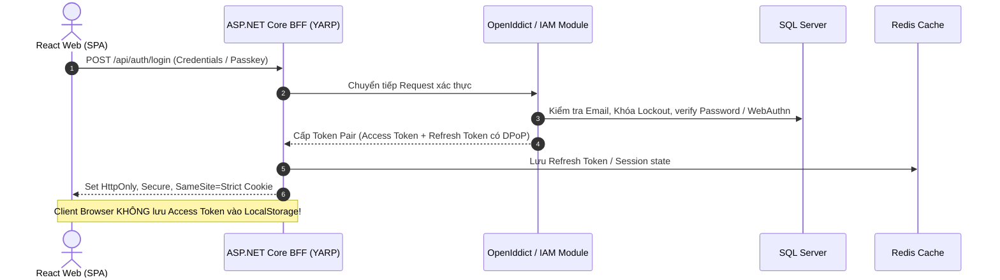
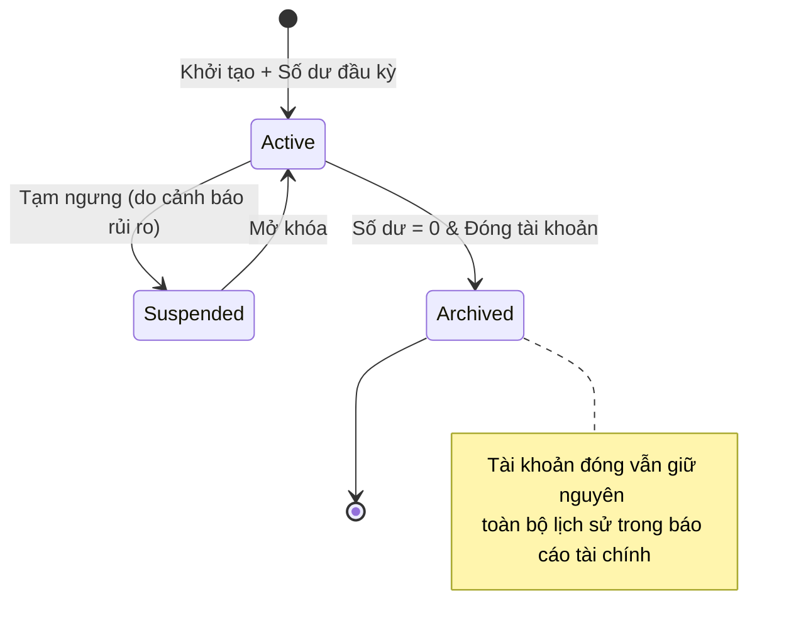
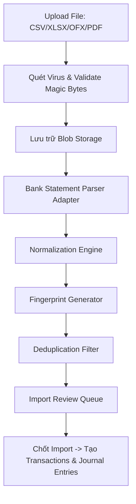
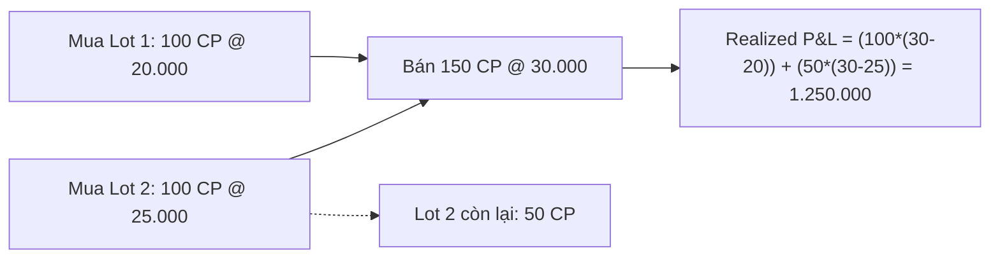
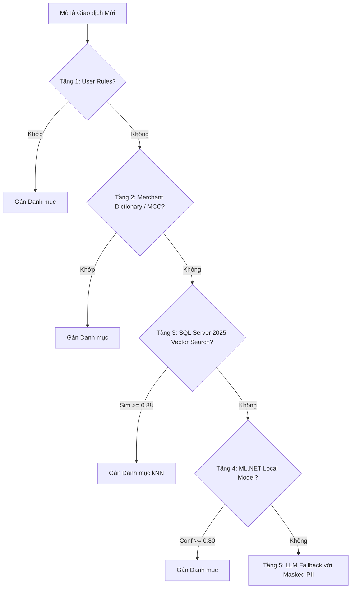
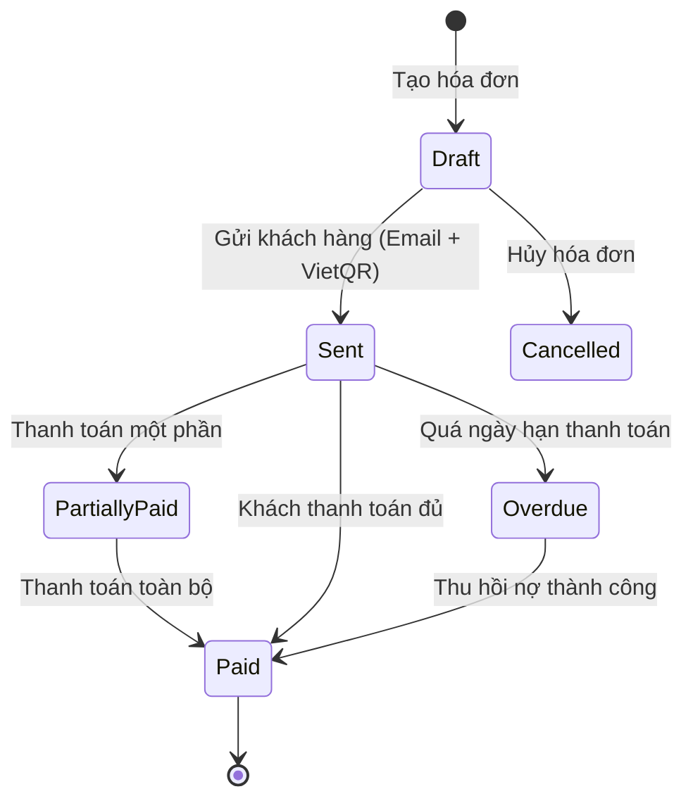

# 🔬 FinTech Platform — Phân tích kỹ thuật & Thiết kế chi tiết từng Module (Deep-Dive Specification)

> **Tài liệu tham chiếu:** [fintech_architecture_dotnet.md](./fintech_architecture_dotnet.md) · [fintech_functional_specification.md](./fintech_functional_specification.md)  
> **Ngôn ngữ & Nền tảng:** C# 14 / ASP.NET Core 10, SQL Server 2025, Clean Architecture + DDD + CQRS, React 19 (Web), React Native / Expo (Mobile).

---

## Mục lục Phân tích Chuyên sâu (14 Khối Module Nòng cốt)

1. [MODULE 1: IAM & Security (M01, M02, M28)](#module-1-iam-security--data-protection)
2. [MODULE 2: Double-Entry Ledger (M08, M10)](#module-2-double-entry-ledger--multi-currency)
3. [MODULE 3: Accounts & Wallets Engine (M05)](#module-3-accounts--wallets-engine)
4. [MODULE 4: Transactions Engine & Concurrency Control (M07)](#module-4-transactions-engine--concurrency-control)
5. [MODULE 5: Bank Statement Import, Parsing & Deduplication (M09)](#module-5-bank-statement-import-parsing--deduplication)
6. [MODULE 6: Bank Reconciliation Engine (M08)](#module-6-bank-reconciliation-engine)
7. [MODULE 7: Budgeting & Envelope Engine (M11)](#module-7-budgeting--envelope-engine)
8. [MODULE 8: Loans, Amortization & Debt Payoff Planner (M13)](#module-8-loans-amortization--debt-payoff-planner)
9. [MODULE 9: Bills, Subscriptions & Recurrence Engine (M12)](#module-9-bills-subscriptions--recurrence-engine)
10. [MODULE 10: Investments, Lot-Tracking & Performance Metrics (M15)](#module-10-investments-lot-tracking--performance-metrics)
11. [MODULE 11: Cash Flow & Financial Forecasting Engine (M16)](#module-11-cash-flow--financial-forecasting-engine)
12. [MODULE 12: Rule Engine & Event Automation (M22)](#module-12-rule-engine--event-automation)
13. [MODULE 13: AI Categorization & Anomaly/Fraud Detection (M22, M23)](#module-13-ai-categorization--anomalyfraud-detection)
14. [MODULE 14: SME Invoicing, AP/AR & Approval Workflows (M17, M18, M19, M20)](#module-14-sme-invoicing-apar--approval-workflows)

---

## Tiêu chuẩn Trình bày Mỗi Module
Mỗi module bên dưới được phân tích đồng nhất theo 6 trụ cột cốt lõi:
1. **Kiến trúc Domain & Entity Model (DDD):** Entities, Value Objects, Domain Events, Invariants.
2. **Thiết kế Database Chi tiết (SQL Server 2025):** Bảng, kiểu dữ liệu, ràng buộc, Index tối ưu, RLS/Ledger/Temporal.
3. **Luồng Xử lý Nghiệp vụ & Concurrency (Sequence / State Machine):** Khóa dữ liệu, bảo đảm ACID, tranh chấp tài nguyên.
4. **Application CQRS (Command/Query):** Contracts, DTOs, Pipeline behaviors, Idempotency.
5. **Giao tiếp Sự kiện (Integration Events):** Outbox/Inbox Messages, Consumers, Event schema.
6. **Xử lý Biên (Edge Cases, Thất bại & Phục hồi):** Các tình huống lỗi thực tế trên Production.

---

```
                                  KIẾN TRÚC TỔNG THỂ DÒNG DỮ LIỆU
                                  
     [HTTP / Client]
           │
           ▼
    [Idempotency Filter]
           │
           ▼
    [Application Handler] ──(Pessimistic Sort Lock / CAS)──► [SQL Server 2025 (ACID)]
           │                                                         │
           ▼ (Outbox Transaction)                                    ▼
    [Wolverine Outbox] ────► [RabbitMQ Broker] ────► [Async Consumers (Projection / AI / ML)]
```

---

## MODULE 1: IAM, Security & Data Protection

### 1.1 Kiến trúc Domain & Entity Model
- **Aggregate Root:** `User`, `Tenant` (Personal / Household / SME Organization).
- **Entities:** `UserSession`, `PasskeyCredential`, `TenantMembership`, `Role`, `PermissionGrant`.
- **Value Objects:** `Email`, `PhoneNumber`, `HashedPassword`, `DeviceFingerprint`, `IpAddress`.
- **Domain Invariants:**
  - 1 User phải luôn có ít nhất 1 Personal Tenant mặc định.
  - Một SME Tenant phải luôn có ít nhất 1 Active Owner.
  - Khi thu hồi quyền hoặc hủy Session, mọi Token liên quan bị vô hiệu hóa tức thì thông qua Token Blacklist cache (Redis).

### 1.2 Thiết kế Database (SQL Server 2025)
```sql
CREATE SCHEMA iam;
GO

CREATE TABLE iam.Users (
    Id UNIQUEIDENTIFIER NOT NULL CONSTRAINT PK_Users PRIMARY KEY NONCLUSTERED,
    Email NVARCHAR(256) NOT NULL,
    NormalizedEmail NVARCHAR(256) NOT NULL,
    PasswordHash NVARCHAR(500) NULL, -- Nullable nếu chỉ dùng Passkey/Social
    SecurityStamp NVARCHAR(100) NOT NULL,
    IsEmailConfirmed BIT NOT NULL DEFAULT 0,
    PhoneNumber NVARCHAR(20) NULL,
    IsPhoneConfirmed BIT NOT NULL DEFAULT 0,
    TwoFactorEnabled BIT NOT NULL DEFAULT 0,
    TwoFactorSecretKey NVARCHAR(200) NULL, -- Always Encrypted
    LockoutEnd DATETIMEOFFSET(3) NULL,
    AccessFailedCount INT NOT NULL DEFAULT 0,
    CreatedAt DATETIMEOFFSET(3) NOT NULL DEFAULT SYSUTCDATETIME(),
    RowVersion ROWVERSION,
    CONSTRAINT UQ_Users_Email UNIQUE (NormalizedEmail)
);

CREATE TABLE iam.PasskeyCredentials (
    Id UNIQUEIDENTIFIER NOT NULL PRIMARY KEY,
    UserId UNIQUEIDENTIFIER NOT NULL CONSTRAINT FK_Passkeys_User REFERENCES iam.Users(Id) ON DELETE CASCADE,
    CredentialId VARBINARY(128) NOT NULL,
    PublicKey VARBINARY(512) NOT NULL,
    SignCount BIGINT NOT NULL DEFAULT 0,
    DeviceName NVARCHAR(100) NOT NULL,
    AAGUID UNIQUEIDENTIFIER NOT NULL,
    CreatedAt DATETIMEOFFSET(3) NOT NULL DEFAULT SYSUTCDATETIME(),
    CONSTRAINT UQ_Passkey_CredId UNIQUE (CredentialId)
);

CREATE TABLE iam.Tenants (
    Id UNIQUEIDENTIFIER NOT NULL PRIMARY KEY,
    Type TINYINT NOT NULL, -- 1: Personal, 2: Household, 3: SME
    Name NVARCHAR(200) NOT NULL,
    TaxCode NVARCHAR(20) NULL,
    BaseCurrency CHAR(3) NOT NULL DEFAULT 'VND',
    TimeZoneId NVARCHAR(50) NOT NULL DEFAULT 'SE Asia Standard Time',
    FiscalMonthStart TINYINT NOT NULL DEFAULT 1,
    IsActive BIT NOT NULL DEFAULT 1,
    CreatedAt DATETIMEOFFSET(3) NOT NULL DEFAULT SYSUTCDATETIME()
);

CREATE TABLE iam.TenantMemberships (
    TenantId UNIQUEIDENTIFIER NOT NULL CONSTRAINT FK_Mem_Tenant REFERENCES iam.Tenants(Id),
    UserId UNIQUEIDENTIFIER NOT NULL CONSTRAINT FK_Mem_User REFERENCES iam.Users(Id),
    Role NVARCHAR(50) NOT NULL, -- Owner, Admin, Accountant, Approver, Employee, Viewer
    CustomPermissions NVARCHAR(MAX) NULL, -- JSON danh sách granular claims
    JoinedAt DATETIMEOFFSET(3) NOT NULL DEFAULT SYSUTCDATETIME(),
    CONSTRAINT PK_TenantMemberships PRIMARY KEY (TenantId, UserId)
);

CREATE INDEX IX_Users_NormalizedEmail ON iam.Users(NormalizedEmail);
CREATE INDEX IX_Memberships_UserId ON iam.TenantMemberships(UserId);
```

### 1.3 Luồng Xử lý Nghiệp vụ & Token Protection


---

## MODULE 2: Double-Entry Ledger & Multi-Currency

### 2.1 Kiến trúc Domain & Entity Model
- **Aggregate Root:** `JournalEntry`.
- **Entities:** `PostingLine`, `LedgerAccount`.
- **Value Objects:** `Money` (Decimal, Currency), `AccountingPeriod`, `AccountId`.
- **Domain Invariants:**
  - $\sum \text{Postings (Debit)} - \sum \text{Postings (Credit)} = 0$ theo **mỗi Currency riêng biệt**.
  - Không bao giờ có hành động `UPDATE` hoặc `DELETE` trên bảng `Postings`.
  - Mọi điều chỉnh đều phải tạo một `JournalEntry` đảo (Reversal Entry) liên kết qua `ReversesId`.

### 2.2 Thiết kế Database Chi tiết (SQL Server 2025 Ledger Table)
```sql
CREATE SCHEMA ledger;
GO

-- Bảng tài khoản sổ cái
CREATE TABLE ledger.Accounts (
    Id UNIQUEIDENTIFIER NOT NULL CONSTRAINT PK_LedgerAccounts PRIMARY KEY NONCLUSTERED,
    TenantId UNIQUEIDENTIFIER NOT NULL,
    Code NVARCHAR(50) NOT NULL,
    Name NVARCHAR(200) NOT NULL,
    Type TINYINT NOT NULL, -- 1: ASSET, 2: LIABILITY, 3: EQUITY, 4: REVENUE, 5: EXPENSE
    Currency CHAR(3) NOT NULL,
    Balance DECIMAL(19,4) NOT NULL DEFAULT 0,
    AllowNegative BIT NOT NULL DEFAULT 1,
    Version BIGINT NOT NULL DEFAULT 0,
    CreatedAt DATETIMEOFFSET(3) NOT NULL DEFAULT SYSUTCDATETIME(),
    INDEX CIX_Accounts_Tenant CLUSTERED (TenantId, Id)
);

-- Bảng Journal Entries có mật mã bảo vệ (Ledger Append-Only Table)
CREATE TABLE ledger.JournalEntries (
    Id UNIQUEIDENTIFIER NOT NULL PRIMARY KEY NONCLUSTERED,
    TenantId UNIQUEIDENTIFIER NOT NULL,
    IdempotencyKey VARCHAR(128) NOT NULL,
    EffectiveDate DATE NOT NULL,
    RecordedAt DATETIMEOFFSET(3) NOT NULL,
    Description NVARCHAR(500) NULL,
    ReversesId UNIQUEIDENTIFIER NULL,
    Metadata NVARCHAR(MAX) NULL, -- JSON native
    CONSTRAINT UQ_Journal_Idem UNIQUE (TenantId, IdempotencyKey),
    INDEX CIX_JournalEntries CLUSTERED (TenantId, EffectiveDate, Id)
)
WITH (LEDGER = ON (APPEND_ONLY = ON));

-- Bảng Postings chứa chi tiết nợ/có từng dòng
CREATE TABLE ledger.Postings (
    Id BIGINT IDENTITY(1,1) NOT NULL PRIMARY KEY,
    EntryId UNIQUEIDENTIFIER NOT NULL,
    TenantId UNIQUEIDENTIFIER NOT NULL,
    AccountId UNIQUEIDENTIFIER NOT NULL,
    Amount DECIMAL(19,4) NOT NULL CHECK (Amount <> 0), -- Dương: Debit, Âm: Credit
    Currency CHAR(3) NOT NULL,
    ExchangeRate DECIMAL(19,6) NOT NULL DEFAULT 1.0, -- Tỷ giá quy đổi về Tenant Base Currency
    BaseCurrencyAmount DECIMAL(19,4) NOT NULL,
    INDEX IX_Postings_Account (AccountId, TenantId) INCLUDE (Amount, BaseCurrencyAmount)
)
WITH (LEDGER = ON (APPEND_ONLY = ON));
```

### 2.3 Thuật toán Kiểm tra Toàn vẹn & Chống Sai lệch
```csharp
public sealed record PostJournalEntryCommand(
    Guid TenantId,
    string IdempotencyKey,
    DateOnly EffectiveDate,
    IReadOnlyList<PostingLineDto> Lines,
    string? Description) : ICommand<Result<Guid>>;

public class PostJournalEntryHandler(
    ILedgerDbContext db,
    ITenantProvider tenantProvider) : ICommandHandler<PostJournalEntryCommand, Result<Guid>>
{
    public async ValueTask<Result<Guid>> Handle(PostJournalEntryCommand cmd, CancellationToken ct)
    {
        // 1. Kiểm tra Invariant cân bằng Debit = Credit theo từng loại tiền
        var currencyGroups = cmd.Lines.GroupBy(l => l.Currency);
        foreach (var group in currencyGroups)
        {
            var sum = group.Sum(l => l.Amount);
            if (sum != 0m)
            {
                return LedgerErrors.Unbalanced(group.Key, sum);
            }
        }

        // 2. Deadlock Free: Khóa các tài khoản theo Id tăng dần
        var accountIds = cmd.Lines.Select(l => l.AccountId).Distinct().OrderBy(id => id).ToList();

        // 3. Thực thi cập nhật số dư nguyên tử bằng SQL
        foreach (var line in cmd.Lines)
        {
            var affected = await db.Database.ExecuteSqlInterpolatedAsync($"""
                UPDATE ledger.Accounts WITH (ROWLOCK)
                SET Balance = Balance + {line.Amount},
                    Version = Version + 1
                WHERE Id = {line.AccountId}
                  AND TenantId = {cmd.TenantId}
                  AND Currency = {line.Currency}
                  AND (AllowNegative = 1 OR Balance + {line.Amount} >= 0);
            """, ct);

            if (affected == 0)
                return LedgerErrors.InsufficientFundsOrInvalidAccount(line.AccountId);
        }

        // 4. Ghi JournalEntry & Postings vào Ledger Table
        var entryId = Guid.CreateVersion7();
        // ... (Insert Entry + Postings + Outbox Event)
        return entryId;
    }
}
```

---

## MODULE 3: Accounts & Wallets Engine

### 3.1 Mô hình Domain & Phân loại Tài khoản
- **Các loại tài khoản (AccountType):**
  1. `CashWallet`: Ví tiền mặt vật lý, không cho phép âm.
  2. `CheckingAccount`: Tài khoản thanh toán ngân hàng (VCB, TCB, MB...).
  3. `CreditCard`: Thẻ tín dụng (Liability), theo dõi ngày chốt sao kê (`BillingCycleCloseDay`) và hạn trả (`PaymentDueDay`).
  4. `TermDeposit`: Tiền gửi tiết kiệm ngân hàng có kỳ hạn và lãi suất dự kiến.
  5. `InvestmentAsset`: Tài khoản chứng khoán / vàng / tài sản số.
- **Ràng buộc:** Mỗi tài khoản ngoài đời thực gắn trực tiếp 1-1 với một `ledger.Accounts` tương ứng.

### 3.2 Sơ đồ Trạng thái Tài khoản


---

## MODULE 4: Transactions Engine & Concurrency Control

### 4.1 Kiến trúc Domain & Entity Model
- **Aggregate Root:** `FinancialTransaction`.
- **Entities:** `TransactionSplitItem`, `AttachmentReceipt`.
- **Value Objects:** `TransactionStatus` (`Pending`, `Cleared`, `Reconciled`, `Voided`), `MerchantInfo`.
- **Domain Invariants:**
  - Giao dịch Split: $\sum \text{SplitAmounts} = \text{Transaction.TotalAmount}$.
  - Giao dịch nội bộ (Transfer): Tạo 1 JournalEntry gồm 2 Postings đối ứng giữa 2 tài khoản, không làm thay đổi báo cáo Thu/Chi tổng.

### 4.2 Database Schema (SQL Server 2025)
```sql
CREATE SCHEMA txn;
GO

CREATE TABLE txn.Transactions (
    Id UNIQUEIDENTIFIER NOT NULL CONSTRAINT PK_Transactions PRIMARY KEY NONCLUSTERED,
    TenantId UNIQUEIDENTIFIER NOT NULL,
    AccountId UNIQUEIDENTIFIER NOT NULL,
    DestinationAccountId UNIQUEIDENTIFIER NULL, -- Dành cho Chuyển khoản nội bộ
    Type TINYINT NOT NULL, -- 1: Expense, 2: Income, 3: Transfer, 4: Adjustment
    Status TINYINT NOT NULL DEFAULT 1, -- 1: Pending, 2: Cleared, 3: Reconciled, 4: Void
    Amount DECIMAL(19,4) NOT NULL,
    Currency CHAR(3) NOT NULL,
    TransactionDate DATETIMEOFFSET(3) NOT NULL,
    CategoryId UNIQUEIDENTIFIER NULL,
    PayeeId UNIQUEIDENTIFIER NULL,
    Description NVARCHAR(500) NULL,
    OriginalBankDescription NVARCHAR(500) NULL, -- Dữ liệu gốc khi import
    IsReconciled BIT NOT NULL DEFAULT 0,
    HasAttachments BIT NOT NULL DEFAULT 0,
    LedgerEntryId UNIQUEIDENTIFIER NULL,
    CreatedAt DATETIMEOFFSET(3) NOT NULL DEFAULT SYSUTCDATETIME(),
    RowVer ROWVERSION,
    INDEX CIX_Transactions CLUSTERED (TenantId, TransactionDate DESC, Id)
);

CREATE TABLE txn.TransactionSplits (
    Id BIGINT IDENTITY(1,1) NOT NULL PRIMARY KEY,
    TransactionId UNIQUEIDENTIFIER NOT NULL CONSTRAINT FK_Splits_Txn REFERENCES txn.Transactions(Id) ON DELETE CASCADE,
    CategoryId UNIQUEIDENTIFIER NOT NULL,
    Amount DECIMAL(19,4) NOT NULL,
    Note NVARCHAR(255) NULL
);
```

### 4.3 Xử lý Concurrency & Tránh Race Condition
1. **Idempotency Header:** Sử dụng Redis distributed set + bảng `idempotency.Keys` lưu trữ trong cùng transaction DB.
2. **Deadlock Resolution:** Khi có 2 transaction chuyển khoản đồng thời giữa Account A và B ($A \to B$ và $B \to A$), hệ thống luôn sắp xếp tài nguyên khóa theo thứ tự:
   $$\min(\text{Id}_A, \text{Id}_B) \to \max(\text{Id}_A, \text{Id}_B)$$
3. **Optimistic Locking:** Sử dụng trường `RowVer` (`rowversion`) để kiểm tra xung đột khi sửa đổi Metadata của giao dịch.

---

## MODULE 5: Bank Statement Import, Parsing & Deduplication

### 5.1 Kiến trúc Xử lý Pipeline
Hệ thống sử dụng mô hình Adapter Pipeline mở rộng để phân tích các định dạng sao kê:



### 5.2 Thuật toán Sinh Fingerprint Chống Trùng lặp
```csharp
public static class TransactionFingerprint
{
    public static string Compute(
        Guid accountId, 
        DateOnly date, 
        decimal amount, 
        string normalizedDescription, 
        string? bankRef)
    {
        // 1. Nếu ngân hàng có Reference Code duy nhất
        if (!string.IsNullOrWhiteSpace(bankRef))
        {
            return SHA256.HashData(Encoding.UTF8.GetBytes($"{accountId}_{bankRef.Trim().ToUpperInvariant()}"))
                         .ToHexString();
        }

        // 2. Thuật toán Fingerprint mờ (Fuzzy Dedup) đối với ngân hàng không có Ref Code
        var cleanDesc = Regex.Replace(normalizedDescription.ToUpperInvariant(), @"[\s\p{P}]+", "");
        var rawKey = $"{accountId:N}_{date:yyyyMMdd}_{amount:F2}_{cleanDesc}";
        return SHA256.HashData(Encoding.UTF8.GetBytes(rawKey)).ToHexString();
    }
}
```

---

## MODULE 6: Bank Reconciliation Engine

### 6.1 Mô hình Trạng thái & Cơ chế Đối soát
- **Dữ liệu vào:** 
  1. `StatementBalance`: Số dư thực tế cuối kỳ trên sao kê ngân hàng.
  2. `ClearedTransactions`: Tập hợp các giao dịch đã tick chọn trong kỳ.
- **Quy tắc Kiểm tra Bất biến:**
  $$\text{LedgerOpeningBalance} + \sum \text{ClearedInflows} - \sum \text{ClearedOutflows} = \text{StatementBalance}$$
- Khi $\Delta = 0$, phiên đối soát được đóng (`ReconciliationSession.Closed`). Mọi giao dịch liên quan được chuyển sang trạng thái `IsReconciled = 1` và bị khóa quyền chỉnh sửa.

---

## MODULE 7: Budgeting & Envelope Engine

### 7.1 Kiến trúc Envelope vs Category-Limit
Hệ thống hỗ trợ song song 2 phương pháp:
1. **Category Limit (Cổ điển):** Đặt hạn mức chi tối đa cho Danh mục $C$ trong tháng $M$.
2. **Zero-Based Budgeting (YNAB Envelope):**
   - Tiền chưa phân bổ: $U = \text{Total Income} - \sum \text{Allocated Envelopes}$.
   - Khi chi tiêu danh mục $C$: Trừ tiền từ phong bì $C$. Nếu âm: Cho phép mượn tiền từ phong bì khác hoặc đánh dấu cảnh báo.

### 7.2 Database Schema (SQL Server System-Versioned Temporal Tables)
```sql
CREATE SCHEMA budget;
GO

CREATE TABLE budget.Budgets (
    Id UNIQUEIDENTIFIER NOT NULL CONSTRAINT PK_Budgets PRIMARY KEY,
    TenantId UNIQUEIDENTIFIER NOT NULL,
    CategoryId UNIQUEIDENTIFIER NOT NULL,
    PeriodStartDate DATE NOT NULL,
    PeriodEndDate DATE NOT NULL,
    AllocatedAmount DECIMAL(19,4) NOT NULL,
    RolloverAmount DECIMAL(19,4) NOT NULL DEFAULT 0,
    SpentAmount DECIMAL(19,4) NOT NULL DEFAULT 0,
    ThresholdWarningPercent INT NOT NULL DEFAULT 80,
    SysStartTime DATETIME2 GENERATED ALWAYS AS ROW START NOT NULL,
    SysEndTime DATETIME2 GENERATED ALWAYS AS ROW END NOT NULL,
    PERIOD FOR SYSTEM_TIME (SysStartTime, SysEndTime),
    CONSTRAINT UQ_Budget_CatPeriod UNIQUE (TenantId, CategoryId, PeriodStartDate)
)
WITH (SYSTEM_VERSIONING = ON (HISTORY_TABLE = budget.BudgetsHistory));
```

---

## MODULE 8: Loans, Amortization & Debt Payoff Planner

### 8.1 Thuật toán Amortization (Annuity Formula & Allocation)
Khoản vay gốc $P$, lãi suất tháng $r = \frac{\text{Lãi suất năm}}{12}$, số kỳ $n$.
Khoản thanh toán cố định mỗi kỳ:
$$PMT = P \times \frac{r(1+r)^n}{(1+r)^n - 1}$$

```csharp
public static List<AmortizationScheduleItem> GenerateSchedule(
    decimal principal, 
    decimal annualInterestRate, 
    int totalMonths, 
    DateOnly startDate)
{
    var monthlyRate = annualInterestRate / 12m / 100m;
    var pmt = principal * (monthlyRate * (decimal)Math.Pow((double)(1 + monthlyRate), totalMonths)) 
              / ((decimal)Math.Pow((double)(1 + monthlyRate), totalMonths) - 1);
    
    pmt = Math.Round(pmt, 0, MidpointRounding.AwayFromZero); // Banker's rounding
    var remainingPrincipal = principal;
    var schedule = new List<AmortizationScheduleItem>();

    for (int month = 1; month <= totalMonths; month++)
    {
        var interest = Math.Round(remainingPrincipal * monthlyRate, 0, MidpointRounding.AwayFromZero);
        var principalPaid = (month == totalMonths) ? remainingPrincipal : (pmt - interest);
        
        remainingPrincipal -= principalPaid;

        schedule.Add(new AmortizationScheduleItem(
            Period: month,
            DueDate: startDate.AddMonths(month),
            PrincipalAmount: principalPaid,
            InterestAmount: interest,
            TotalPayment: principalPaid + interest,
            RemainingBalance: Math.Max(0, remainingPrincipal)
        ));
    }
    return schedule;
}
```

---

## MODULE 9: Bills, Subscriptions & Recurrence Engine

### 9.1 Kiến trúc Recurrence dựa trên RFC 5545 (iCalendar RRULE)
- Cho phép biểu diễn các lịch trình phức tạp:
  - "Ngày 15 hàng tháng": `FREQ=MONTHLY;BYMONTHDAY=15`
  - "Thứ 6 cuối cùng của tháng": `FREQ=MONTHLY;BYDAY=-1FR`
  - "Mỗi 2 tuần vào thứ 2": `FREQ=WEEKLY;INTERVAL=2;BYDAY=MO`
- **Subscription Discovery:** Worker quét qua bảng `txn.Transactions` nhóm theo `Merchant` và tìm kiếm chu kỳ thời gian cách đều $\Delta t \in [28, 31]$ ngày với độ lệch số tiền $\sigma \le 5\%$.

---

## MODULE 10: Investments, Lot-Tracking & Performance Metrics

### 10.1 Kiến trúc Lot Accounting (FIFO & Average Cost)
Khi người dùng mua một mã chứng khoán hoặc tài sản, một **Lot** mới được mở. Khi bán, hệ thống phân bổ trừ dần số lượng từ các Lot mở theo thứ tự thời gian (FIFO) để tính toán chính xác Lãi/Lỗ đã thực hiện (Realized P&L).



### 10.2 Công thức Hiệu suất Đầu tư
1. **XIRR (Extended Internal Rate of Return):** Giải phương trình dòng tiền không đều:
   $$\sum_{i=1}^{N} \frac{C_i}{(1 + \text{XIRR})^{\frac{d_i - d_0}{365}}} = 0$$
2. **TWR (Time-Weighted Return):** Loại bỏ biến động dòng tiền nạp/rút bằng cách chia nhỏ các khoảng thời gian trước mỗi lần nạp/rút tiền.

---

## MODULE 11: Cash Flow & Financial Forecasting Engine

### 11.1 Thuật toán Dự báo 3 Lớp
1. **Lớp 1 (Deterministic - Chắc chắn 100%):** Dựa trên các lịch trình đã biết: Lương định kỳ, Hóa đơn (Bills), Khoản trả góp (Loans) từ Amortization Schedule.
2. **Lớp 2 (Statistical - Chi tiêu Biến đổi):** Sử dụng thuật toán Single Spectrum Analysis (SSA) hoặc Moving Average với trọng số thời gian trên các danh mục ăn uống, mua sắm.
3. **Lớp 3 (Stress Test / What-If Scenarios):** Thêm vào các giả định ("Nếu bị giảm lương 30% trong 6 tháng tới") $\to$ Xuất biểu đồ dải tin cậy số dư tiền mặt P10, P50, P90.

---

## MODULE 12: Rule Engine & Event Automation

### 12.1 Thiết kế DSL & Expression Tree Compiler
Không sử dụng `eval` hoặc JavaScript Engine trong backend để tránh lỗ hổng bảo mật RCE (Remote Code Execution). Bộ luật chuyển đổi điều kiện JSON sang `System.Linq.Expressions.Expression`:

```json
{
  "RuleId": "RULE_AUTO_GRAB",
  "Conditions": {
    "Field": "OriginalBankDescription",
    "Operator": "Contains",
    "Value": "GRAB"
  },
  "Actions": [
    { "SetCategory": "CAT_TRANSPORT" },
    { "AddTag": "DiChuyen" }
  ]
}
```

```csharp
// Biên dịch an toàn tại thời điểm khởi tạo
public static Func<TransactionImportDto, bool> CompileRule(RuleCondition condition)
{
    var parameter = Expression.Parameter(typeof(TransactionImportDto), "txn");
    var property = Expression.Property(parameter, condition.Field);
    var constant = Expression.Constant(condition.Value);
    var method = typeof(string).GetMethod("Contains", new[] { typeof(string), typeof(StringComparison) })!;
    var call = Expression.Call(property, method, constant, Expression.Constant(StringComparison.OrdinalIgnoreCase));
    
    return Expression.Lambda<Func<TransactionImportDto, bool>>(call, parameter).Compile();
}
```

---

## MODULE 13: AI Categorization & Anomaly/Fraud Detection

### 13.1 Kiến trúc Phân loại Đa tầng (Cascade Classifier)


### 13.2 Thuật toán Phát hiện Bất thường (Anomaly Detection)
- **Z-Score / MAD (Median Absolute Deviation) trên danh mục:**
  $$Z = \frac{x_i - \mu}{\sigma}$$
  Nếu $Z > 3.5$ hoặc số tiền lớn hơn 3 lần trung bình 90 ngày của User tại danh mục đó $\to$ Kích hoạt `AnomalyDetectedEvent`.
- **Card Testing / Double Charge:** Quét cửa sổ thời gian 5 phút: Nếu xuất hiện $\ge 2$ giao dịch cùng số tiền và cùng merchant $\to$ Cảnh báo tức thì qua Notification.

---

## MODULE 14: SME Invoicing, AP/AR & Approval Workflows

### 14.1 Quy trình Quản lý Hóa đơn Bán (AR) & Mua (AP)


### 14.2 Multi-tier Approval Engine
- **Chính sách:** Hạn mức chi tiêu phân tầng:
  - Dưới 5.000.000 VND: Tự động duyệt / Trưởng phòng duyệt.
  - Từ 5.000.000 VND đến 50.000.000 VND: Kế toán trưởng + Trưởng phòng duyệt.
  - Trên 50.000.000 VND: Tổng Giám đốc (Owner) duyệt.
- **Workflow State:** Tích hợp với **Temporal .NET SDK** để đảm bảo workflow chạy bền bỉ kéo dài nhiều ngày, hỗ trợ nhắc nhở (Escalation SLA) nếu người duyệt không phản hồi sau 48 giờ.

---

## Tổng kết & Sơ đồ Ma trận Tích hợp Giữa các Module

```
+-----------------------------------------------------------------------------+
|                          WORKSPACE & IAM LAYER                              |
+-----------------------------------------------------------------------------+
        │                                                     │
        ▼                                                     ▼
+──────────────────────────+                           +──────────────────────+
|   ACCOUNTS & WALLETS     |                           |    RULE ENGINE &     |
|   (Checking, Credit...)  |                           |    AI INFERENCE      |
+──────────────────────────+                           +──────────────────────+
        │                                                     ▲
        ▼ (Postings)                                          │ (Transaction Event)
+──────────────────────────+                           +──────────────────────+
|   DOUBLE-ENTRY LEDGER    |◄──────────────────────────|  TRANSACTION ENGINE  |
|   (Append-Only Tables)   |                           |  (Imports & Manual)  |
+──────────────────────────+                           +──────────────────────+
        │                                                     │
        ├──────────────────────┬──────────────────────────────┤
        ▼                      ▼                              ▼
+────────────────+     +────────────────+             +───────────────────────+
| BUDGET ENGINE  |     | LOANS & BILLS  |             | CASH FLOW & FORECAST  |
+────────────────+     +────────────────+             +───────────────────────+
```

Tài liệu này đóng vai trò là kim chỉ nam kỹ thuật (Technical Blueprint) để lập trình viên hiện thực hóa mã nguồn các module mà không gặp phải các mâu thuẫn kiến trúc hay lỗ hổng toàn vẹn dữ liệu.


Tóm tắt các nội dung kỹ thuật chuyên sâu được phân tích trong file:
M01: IAM & Bảo mật dữ liệu (BFF + Passkeys + RLS):

Thiết kế mô hình Auth Cookie an toàn (BFF Pattern với YARP) ngăn chặn đánh cắp Token qua XSS.
Hỗ trợ FIDO2/WebAuthn Passkeys natively kết hợp bảo mật trường nhạy cảm bằng SQL Server Always Encrypted.
M02: Double-Entry Ledger (Sổ cái kế toán kép):

Ứng dụng SQL Server 2025 Ledger Append-Only Tables với chuỗi khối băm mật mã (Cryptographic Hash Chain) ngăn chặn triệt để can thiệp DB trực tiếp.
Cơ chế cân bằng nợ/có $\sum(\text{Debit}) - \sum(\text{Credit}) = 0$ theo từng mã tiền tệ.
M03 & M04: Quản lý Tài khoản, Giao dịch & Concurrency Control:

Chiến lược khóa Pessimistic Sort Locking theo thứ tự $Id$ tăng dần để loại bỏ nguy cơ Deadlock khi chuyển tiền chéo đồng thời.
Idempotency Filter kết hợp Redis Distributed Key + Outbox Table đảm bảo tính nhất quán tuyệt đối khi mất mạng/retry.
M05 & M06: Import sao kê ngân hàng & Đối soát tự động (Reconciliation):

Bộ giải thuật Fuzzy Deduplication Fingerprint bằng hàm băm SHA-256 kết hợp chuẩn hóa Regex cho các ngân hàng Việt Nam (VCB, TCB, MB, ACB...).
Động cơ đối soát số dư với sao kê và khóa bảo vệ giao dịch đã đối soát.
M07: Ngân sách (Budgeting):

Hỗ trợ cả 2 mô hình: Hạn mức danh mục và Zero-Based Envelope (YNAB).
Sử dụng SQL Server System-Versioned Temporal Tables để theo dõi lịch sử điều chỉnh ngân sách theo thời gian mà không cần viết logic audit thủ công.
M08: Khoản vay & Lịch trả nợ (Amortization & Debt Payoff):

Công thức Annuity, quy đổi lãi phẳng sang APR thực tế, thuật toán phân bổ tiền lẻ (Largest Remainder) để kỳ cuối cùng luôn khớp sạch dư nợ gốc.
Mô phỏng trả nợ theo chiến lược Snowball vs Avalanche.
M09 & M10: Hóa đơn/Subscriptions & Đầu tư (Investments):

Phân tích định kỳ bằng chuẩn RFC 5545 RRULE.
Quản lý danh mục đầu tư theo từng lô (Lot Accounting - FIFO & Average Cost) và thuật toán giải phương trình dòng tiền không đều XIRR & TWR.
M11: Dự báo Dòng tiền (Cash Flow Forecasting):

Dự báo 3 lớp: Xác định (Deterministic) $\to$ Thống kê chuỗi thời gian (Statistical SSA) $\to$ Kịch bản Stress test (What-if) với dải tin cậy P10, P50, P90.
M12: Rule Engine:

Biên dịch DSL JSON trực tiếp thành C# Expression Trees (System.Linq.Expressions) để tối đa hóa hiệu năng và tuyệt đối không dùng eval/JS Engine (loại bỏ nguy cơ RCE).
M13: AI Categorization & Anomaly/Fraud Detection:

Kiến trúc phân loại dạng bậc thang (Cascade): User Rules $\to$ Merchant Dictionary $\to$ Vector Search kNN (SQL Server 2025) $\to$ ML.NET $\to$ LLM Fallback (đã che giấu PII).
Bộ lọc phát hiện trừ tiền trùng và giao dịch bất thường theo ngưỡng độ lệch chuẩn (Z-score / MAD).
M14: SME Invoicing & Luồng Phê duyệt:

Chu trình vòng đời hóa đơn bán (AR) & mua (AP) tích hợp VietQR động.
Động cơ phê duyệt đa cấp theo hạn mức phân tầng và tích hợp Temporal.NET Workflow kéo dài nhiều ngày.
