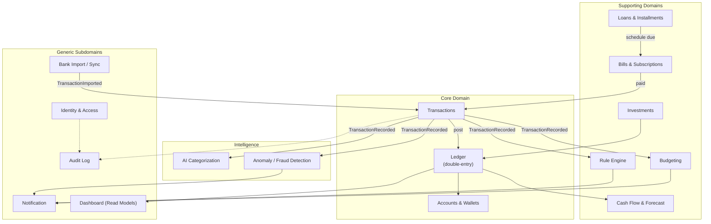
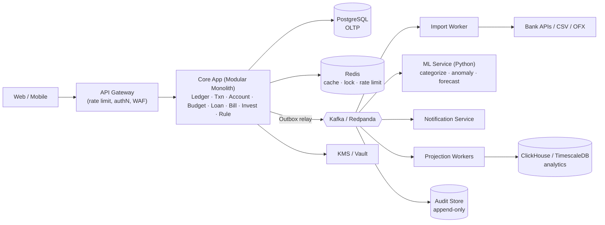
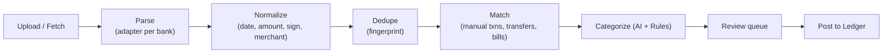

# 🏦 FinTech Platform — Phân tích kiến trúc chuyên sâu
> Personal / SME Finance OS · tập trung vào Backend Engineering, Security, Distributed Systems

---

## 0. Câu hỏi nền tảng cần trả lời TRƯỚC khi viết code

| Câu hỏi | Tại sao quan trọng |
|---|---|
| Platform **có giữ tiền thật** không? | Nếu **có** (ví điện tử) → cần giấy phép trung gian thanh toán của NHNN, KYC/AML, đối soát ngân hàng. Nếu **không** (chỉ ghi nhận, kiểu YNAB/Money Lover/Xero) → độ khó nằm ở *tính nhất quán dữ liệu* chứ không phải ở chuyển tiền. |
| Nguồn sự thật (source of truth) là ai? | Với PFM, **ngân hàng là sự thật**, hệ thống của bạn chỉ là *bản ghi quan sát*. ⇒ Cần **Reconciliation** (đối soát) như một khái niệm hạng nhất. |
| Personal hay SME? | SME kéo theo multi-tenant, phân quyền nhiều người dùng, phê duyệt (approval), kế toán (VAT, hóa đơn điện tử), báo cáo tài chính. |

> [!IMPORTANT]
> **Khuyến nghị:** Thiết kế lõi như một **sổ cái kế toán kép (double-entry ledger)** dù không giữ tiền thật. Đây là "xương sống" làm mọi tính năng khác (vay, trả góp, đầu tư, dòng tiền) trở nên nhất quán và kiểm toán được. Thiết kế sẵn ranh giới để sau này có thể cắm thêm module "ví thật".

---

## 1. Bounded Contexts (Domain-Driven Design)



**Nguyên tắc ranh giới:**
- **Ledger** là module duy nhất được phép thay đổi số dư. Mọi module khác (Loan, Investment, Bill) **yêu cầu** Ledger ghi bút toán, không tự sửa balance.
- **Intelligence** (AI, Fraud) chỉ *đọc* event và *đề xuất* — không bao giờ ghi trực tiếp vào Ledger.
- **Dashboard** là read model (CQRS) — có thể bị trễ vài giây, không sao.

---

## 2. Kiến trúc tổng thể — Modular Monolith trước, Microservices sau

> [!TIP]
> **Đừng bắt đầu bằng microservices.** Distributed transaction là thứ khó nhất; nếu chia service quá sớm bạn sẽ phải giải bài toán saga cho cả những thứ lẽ ra chỉ cần 1 transaction DB. Hãy bắt đầu **Modular Monolith** (mỗi module = 1 schema Postgres riêng, giao tiếp qua interface + event nội bộ), sau đó tách dần những module có lý do rõ ràng (ML, Import, Notification).



### Đề xuất Tech Stack

| Lớp | Lựa chọn | Lý do |
|---|---|---|
| Core backend | **Kotlin/Java + Spring Boot** hoặc **Go** | Kiểu mạnh, BigDecimal chuẩn, hệ sinh thái tài chính trưởng thành. NestJS cũng được nhưng phải cẩn thận với `number`. |
| DB chính | **PostgreSQL 16** | ACID, `SERIALIZABLE`, `SELECT ... FOR UPDATE`, Row-Level Security, `NUMERIC`, partitioning. |
| Message bus | **Kafka / Redpanda** (hoặc NATS JetStream để nhẹ hơn) | Ordering theo partition key, replay, retention. |
| Workflow/Saga | **Temporal** | Saga, retry, timer (trả góp, nhắc hóa đơn) bền vững. |
| ML | **Python + FastAPI**, scikit-learn, LightGBM, Prophet | |
| Analytics | **ClickHouse** hoặc TimescaleDB | Dashboard, aggregation theo thời gian. |
| Secrets | **HashiCorp Vault** / AWS KMS | Envelope encryption. |
| Observability | OpenTelemetry + Prometheus + Grafana + Loki/Tempo | |

---

## 3. 💰 Money Precision — điểm khó #1

### 3.1 Quy tắc bất di bất dịch
1. **KHÔNG BAO GIỜ dùng `float`/`double`.** `0.1 + 0.2 = 0.30000000000000004`.
2. Lưu tiền bằng **số nguyên đơn vị nhỏ nhất (minor units)** `BIGINT` *hoặc* `NUMERIC(20,4)`. Mỗi lựa chọn có trade-off:

| | `BIGINT` minor units | `NUMERIC(p,s)` |
|---|---|---|
| Hiệu năng | Rất nhanh | Chậm hơn |
| Đa tiền tệ | Phải biết exponent mỗi currency (VND=0, USD=2, BHD=3, BTC=8) | Linh hoạt |
| Tính lãi / tỉ giá trung gian | Cần thêm độ chính xác | Tự nhiên |
| **Khuyến nghị** | Số dư & bút toán | Lãi suất, tỉ giá, giá cổ phiếu, số lượng đơn vị quỹ |

3. **Tiền luôn đi kèm currency** — `Money(amount, currency)` là Value Object bất biến. Cộng `VND + USD` phải **ném exception** ở compile/runtime.
4. Trong JSON API, truyền tiền dưới dạng **string** (`"amount": "1250000"`) để tránh client JS làm tròn số > 2^53.

### 3.2 Làm tròn (Rounding)
- Định nghĩa **rõ policy cho từng nghiệp vụ**: lãi vay dùng `HALF_EVEN` (banker's rounding) để không lệch hệ thống; phí hiển thị có thể `HALF_UP`; thuế theo quy định pháp luật.
- **Chỉ làm tròn 1 lần, ở bước cuối**, không làm tròn ở từng bước trung gian.

### 3.3 Chia tiền (Allocation) — lỗi kinh điển
Chia 100.000đ cho 3 kỳ trả góp: `33.333 × 3 = 99.999` → **mất 1 đồng**. Dùng thuật toán *largest remainder*:

```kotlin
fun allocate(total: Long, ratios: List<Long>): List<Long> {
    val sum = ratios.sum()
    val shares = ratios.map { total * it / sum }.toMutableList()
    var remainder = total - shares.sum()
    // phân phối phần dư cho các phần có phần thập phân lớn nhất
    val order = ratios.indices.sortedByDescending { (total * ratios[it]) % sum }
    for (i in order) { if (remainder == 0L) break; shares[i]++; remainder-- }
    return shares // sum(shares) == total LUÔN ĐÚNG
}
```

> [!TIP]
> Viết **property-based test** (jqwik / Hypothesis): với mọi `total` và `ratios` ngẫu nhiên, `sum(allocate(total, ratios)) == total`. Đây là cách học test cho hệ thống tài chính.

### 3.4 Đa tiền tệ & Tỉ giá
- Mỗi tài khoản có **1 currency gốc**. Giao dịch chéo tiền tệ = 2 bút toán ở 2 currency + bản ghi `fx_rate` (rate, source, timestamp).
- Báo cáo tổng tài sản quy đổi về *reporting currency* theo tỉ giá **tại thời điểm báo cáo** (unrealized) — tách bạch với tỉ giá **tại thời điểm giao dịch** (realized). Chênh lệch = lãi/lỗ tỉ giá.

---

## 4. 📒 Double-Entry Ledger — trái tim của hệ thống

### 4.1 Khái niệm
Mỗi giao dịch (journal entry) gồm ≥ 2 posting, **tổng Debit = tổng Credit** (theo từng currency). Không bao giờ UPDATE/DELETE posting — sai thì ghi bút toán **đảo (reversal)**.

Ví dụ trả khoản vay 5.000.000đ (4.200.000 gốc + 800.000 lãi) từ tài khoản ngân hàng:

| Account | Debit | Credit |
|---|---|---|
| Liability: Khoản vay mua xe | 4.200.000 | |
| Expense: Lãi vay | 800.000 | |
| Asset: VCB Checking | | 5.000.000 |

→ Một bút toán duy nhất cập nhật đúng **dư nợ**, **chi phí lãi** (cho báo cáo), và **số dư ngân hàng**. Đây là lý do double-entry làm Loan/Installment/Investment trở nên "miễn phí".

### 4.2 Schema lõi

```sql
CREATE TABLE ledger_accounts (
  id            UUID PRIMARY KEY,
  tenant_id     UUID NOT NULL,
  type          TEXT NOT NULL CHECK (type IN ('ASSET','LIABILITY','EQUITY','INCOME','EXPENSE')),
  currency      CHAR(3) NOT NULL,
  balance       BIGINT NOT NULL DEFAULT 0,      -- minor units, denormalized
  version       BIGINT NOT NULL DEFAULT 0,      -- optimistic locking
  allow_negative BOOLEAN NOT NULL DEFAULT TRUE,
  created_at    TIMESTAMPTZ NOT NULL DEFAULT now()
);

CREATE TABLE journal_entries (
  id               UUID PRIMARY KEY,
  tenant_id        UUID NOT NULL,
  idempotency_key  TEXT NOT NULL,
  effective_date   DATE NOT NULL,          -- ngày nghiệp vụ
  recorded_at      TIMESTAMPTZ NOT NULL DEFAULT now(), -- ngày ghi sổ (bitemporal)
  description      TEXT,
  reverses_id      UUID REFERENCES journal_entries(id),
  metadata         JSONB,
  UNIQUE (tenant_id, idempotency_key)
);

CREATE TABLE postings (
  id          BIGSERIAL PRIMARY KEY,
  entry_id    UUID NOT NULL REFERENCES journal_entries(id),
  account_id  UUID NOT NULL REFERENCES ledger_accounts(id),
  amount      BIGINT NOT NULL CHECK (amount <> 0), -- dương = debit, âm = credit
  currency    CHAR(3) NOT NULL
) PARTITION BY RANGE (id);

-- Chặn UPDATE/DELETE ở tầng DB
REVOKE UPDATE, DELETE ON postings, journal_entries FROM app_user;
```

**Invariant kiểm tra liên tục (job định kỳ + trigger):**
- `SUM(amount) GROUP BY entry_id, currency = 0`
- `ledger_accounts.balance = SUM(postings.amount) WHERE account_id = ...`

### 4.3 Bitemporal
Hai trục thời gian: **effective_date** (giao dịch xảy ra khi nào) và **recorded_at** (hệ thống biết khi nào). Cho phép trả lời: *"Vào ngày 1/3, hệ thống nghĩ số dư tháng 2 là bao nhiêu?"* — quan trọng cho audit và khi import giao dịch trễ.

---

## 5. 🔒 Transaction Consistency & Concurrency — điểm khó #2

### 5.1 Các kịch bản race condition thực tế
| Kịch bản | Hậu quả nếu sai |
|---|---|
| User double-click "Chuyển tiền" | Trừ tiền 2 lần |
| Mobile retry do timeout mạng | Trừ tiền 2 lần |
| 2 thiết bị cùng chi từ 1 ví | Lost update → số dư sai |
| Import ngân hàng chạy song song với user nhập tay | Giao dịch trùng |
| Chuyển A→B và B→A đồng thời | **Deadlock** |

### 5.2 Idempotency — tuyến phòng thủ đầu tiên
```
POST /v1/transfers
Idempotency-Key: 7f3c...-uuid-v4 (client sinh)
```
Luồng xử lý:
1. `INSERT INTO idempotency_keys (key, tenant, request_hash, status='PROCESSING')` — nếu conflict:
   - status `COMPLETED` → trả lại **response đã lưu**.
   - status `PROCESSING` → `409 Conflict`.
   - `request_hash` khác → `422` (cùng key nhưng khác payload = lỗi client).
2. Thực thi nghiệp vụ **trong cùng DB transaction** với việc lưu response.
3. TTL 24h–7 ngày.

### 5.3 Chiến lược khóa

```kotlin
@Transactional(isolation = READ_COMMITTED)
fun post(entry: JournalEntry) {
    // 1. Khóa theo THỨ TỰ CỐ ĐỊNH (sort by id) → loại bỏ deadlock
    val accountIds = entry.postings.map { it.accountId }.distinct().sorted()
    val accounts = repo.lockForUpdate(accountIds) // SELECT ... FOR UPDATE ORDER BY id

    // 2. Validate: cân bằng, currency khớp, không âm nếu không cho phép
    entry.assertBalanced()
    accounts.forEach { it.assertSufficient(entry.deltaFor(it.id)) }

    // 3. Ghi postings + cập nhật balance + ghi outbox event — CÙNG 1 TRANSACTION
    repo.insertEntry(entry)
    accounts.forEach { repo.updateBalance(it.id, it.balance + entry.deltaFor(it.id)) }
    outbox.add(LedgerEntryPosted(entry))
}
```

| Kỹ thuật | Khi nào dùng |
|---|---|
| **Pessimistic** (`FOR UPDATE`) | Ledger posting — xung đột cao, cần đúng tuyệt đối |
| **Optimistic** (`version` column) | Sửa budget, category, cài đặt — xung đột thấp |
| **`SERIALIZABLE`** | Nghiệp vụ kiểm tra điều kiện trên tập dữ liệu (vd: "tổng chi tháng không vượt hạn mức") — phải có retry khi `40001` |
| **Advisory lock / Redis lock** | Job định kỳ (chạy trả góp tháng) để chỉ 1 instance chạy |

### 5.4 Hot Account Problem
Tài khoản "hệ thống" (vd: `fees_income`) bị mọi giao dịch ghi vào → lock contention.
Giải pháp: **sharded sub-accounts** (`fees_income_0..15`, chọn ngẫu nhiên, cộng lại khi báo cáo) hoặc **không lưu balance denormalized** cho account đó (tính bằng SUM + snapshot định kỳ).

### 5.5 Outbox Pattern — cầu nối DB ↔ Event Bus
Vấn đề **dual-write**: ghi DB thành công nhưng publish Kafka thất bại (hoặc ngược lại).

```mermaid
sequenceDiagram
    participant API
    participant DB as PostgreSQL
    participant Relay as Outbox Relay / Debezium
    participant K as Kafka
    participant C as Consumer
    API->>DB: BEGIN; INSERT postings; UPDATE balance; INSERT outbox; COMMIT
    Relay->>DB: poll / CDC (WAL)
    Relay->>K: publish (key = account_id)
    Relay->>DB: mark sent
    K->>C: deliver (at-least-once)
    C->>C: check processed_events(event_id) → skip nếu trùng
```

> [!WARNING]
> Kafka đảm bảo **at-least-once**. "Exactly-once" end-to-end chỉ đạt được bằng **consumer idempotent** (bảng `processed_events` hoặc upsert theo `event_id`). Mọi consumer đều PHẢI idempotent.

### 5.6 Saga cho nghiệp vụ xuyên module
Ví dụ "Thanh toán hóa đơn tự động": Bill → Ledger → Notification → (nếu là ví thật) Payment Gateway.
- **Orchestration** (Temporal workflow) được khuyến nghị cho luồng tiền vì dễ quan sát và có compensation rõ ràng.
- Mỗi bước có **compensating action** (vd: ghi bút toán đảo), không phải rollback.
- Trạng thái trung gian phải hiển thị cho user (`PENDING`, `SETTLED`, `FAILED`, `REVERSED`).

---

## 6. 📡 Event-Driven Architecture

### 6.1 Danh mục event chính
| Event | Producer | Consumers |
|---|---|---|
| `TransactionImported` | Import | Txn (dedupe, match) |
| `TransactionRecorded` | Txn | Categorization, Fraud, Rule, Budget, Projection |
| `TransactionCategorized` | Categorization | Budget, Projection |
| `LedgerEntryPosted` | Ledger | CashFlow, Dashboard, Audit |
| `BudgetThresholdReached` | Budget | Notification |
| `AnomalyDetected` | Fraud | Notification, Rule (auto-freeze) |
| `InstallmentDue` | Loan (Temporal timer) | Bill, Notification |
| `SubscriptionDetected` | Recurring detector | Bill, Notification |

### 6.2 Quy tắc thiết kế event
- **Partition key = `account_id`** (hoặc `tenant_id`) → giữ thứ tự cho cùng 1 tài khoản.
- **Envelope chuẩn** (CloudEvents): `event_id`, `type`, `version`, `occurred_at`, `tenant_id`, `correlation_id`, `causation_id`.
- **Schema Registry** (Avro/Protobuf) + quy tắc tương thích ngược. Không bao giờ đổi nghĩa field cũ.
- Phân biệt **domain event** (nội bộ, chi tiết) và **integration event** (public, ổn định).
- **Dead Letter Queue** + cơ chế replay có kiểm soát.

### 6.3 Event Sourcing — có nên không?
Ledger *bản chất* đã là append-only log, nên bạn có 80% lợi ích của Event Sourcing mà không cần toàn bộ độ phức tạp. **Khuyến nghị:** Ledger append-only + Outbox; chỉ áp dụng Event Sourcing đầy đủ nếu muốn học (vd cho module Budget hoặc Loan).

---

## 7. Phân tích từng module

### 7.1 Tài khoản & Ví
- Phân loại: Cash, Bank, E-wallet (MoMo, ZaloPay), Credit Card (là **Liability**!), Loan, Investment, Savings (sổ tiết kiệm có kỳ hạn + lãi).
- Mỗi tài khoản user nhìn thấy ↔ 1 `ledger_account`. Category chi tiêu ↔ `EXPENSE`/`INCOME` account.
- Thẻ tín dụng: theo dõi **kỳ sao kê**, **hạn thanh toán**, **hạn mức khả dụng**.

### 7.2 Giao dịch
- Trạng thái: `PENDING → POSTED → RECONCILED` | `VOIDED` | `REVERSED`.
- **Split transaction**: 1 hóa đơn siêu thị 1.000.000đ = 700k thực phẩm + 300k đồ gia dụng → 1 journal entry nhiều posting.
- **Transfer** giữa 2 tài khoản của chính mình **không phải** thu/chi → không tính vào báo cáo chi tiêu. Phát hiện transfer tự động khi import từ 2 ngân hàng (cùng số tiền, lệch ≤ 2 ngày, đối ứng).

### 7.3 Ngân sách (Budget)
- Mô hình: **envelope budgeting** (YNAB — "give every đồng a job") hoặc **limit-based** (mỗi category tối đa X/tháng). Hỗ trợ cả hai.
- Rollover: số dư dư/thiếu chuyển sang tháng sau.
- Tính toán qua **read model** cập nhật bởi `TransactionCategorized` — không query SUM realtime trên bảng postings.
- Ngưỡng cảnh báo 50/80/100% → event `BudgetThresholdReached` (dedupe: mỗi ngưỡng chỉ bắn 1 lần/kỳ).

### 7.4 Khoản vay & Trả góp
- Phương pháp tính: **dư nợ giảm dần** (annuity — trả đều), **gốc đều lãi giảm dần**, **lãi phẳng** (flat — các app tài chính tiêu dùng VN hay dùng, lãi thực cao gấp ~1.8 lần → tính APR thực để cảnh báo user!).
- Công thức annuity: `PMT = P · r / (1 − (1+r)^−n)`.
- Sinh **amortization schedule** khi tạo khoản vay; mỗi kỳ = 1 bản ghi `scheduled`. Kỳ cuối điều chỉnh để tổng gốc khớp tuyệt đối (allocation).
- Sự kiện phức tạp: trả trước hạn (phí phạt), lãi suất thả nổi (re-schedule từ kỳ hiện tại), trễ hạn (lãi phạt), cơ cấu lại nợ. → Schedule phải **versioned**.
- Tính năng giá trị: **Debt payoff planner** (Snowball vs Avalanche), so sánh tổng lãi.

### 7.5 Hóa đơn & Subscription
- Bill: kỳ hạn, số tiền cố định/biến đổi, nhắc trước N ngày, đánh dấu đã trả bằng cách **match** với giao dịch.
- **Recurring detection** (học được nhiều nhất): nhóm giao dịch theo merchant chuẩn hóa → kiểm tra khoảng cách ngày có chu kỳ (7/14/30/365 ± tolerance) và độ lệch số tiền thấp → đề xuất "Có vẻ bạn đang đăng ký Netflix 260.000đ/tháng".
- Phát hiện: tăng giá subscription, subscription "zombie" (không dùng), trial sắp chuyển thành trả phí.
- Lịch dùng **RRULE (RFC 5545)** để biểu diễn recurrence; cẩn thận với ngày 31, năm nhuận, timezone.

### 7.6 Đầu tư
- Tài sản: cổ phiếu, quỹ mở, vàng, crypto, tiết kiệm, BĐS.
- Mô hình **Lot** (lô mua): mỗi lần mua tạo 1 lot (qty, cost). Bán → khớp lot theo **FIFO / Average Cost / Specific ID** để tính **realized P&L**.
- **Unrealized P&L** = (giá thị trường − giá vốn) × qty; giá lấy từ market data feed, cache, có `price_as_of`.
- Corporate actions: chia cổ tức tiền/cổ phiếu, split, quyền mua → khó và rất thực tế.
- Hiệu suất: **TWR** (time-weighted return, loại bỏ ảnh hưởng nạp/rút) vs **XIRR** (money-weighted).
- Số lượng dùng `NUMERIC(28,10)` (crypto, chứng chỉ quỹ lẻ).

### 7.7 Dòng tiền & Forecasting
- **Cash flow statement**: Operating / Investing / Financing (cho SME), hoặc Income vs Expense theo thời gian (cho cá nhân).
- **Forecast 3 lớp:**
  1. *Deterministic*: các khoản đã biết — lương, bill, trả góp, subscription (từ schedule).
  2. *Statistical*: chi tiêu biến đổi theo category (Prophet / ETS / moving average + seasonality: Tết, đầu năm học).
  3. *Scenario*: "Nếu tôi mua xe trả góp 8tr/tháng thì 6 tháng tới có âm tiền không?"
- Output: dải dự báo (P10/P50/P90), cảnh báo "Dự kiến số dư tài khoản VCB âm vào ngày 25/11".

### 7.8 Import giao dịch ngân hàng
- Nguồn: **CSV/Excel** sao kê (mỗi ngân hàng VN một format!), **OFX/QFX**, **MT940/CAMT.053** (SME), **email/SMS biến động số dư** (parse), **Open Banking API** (VN đang triển khai theo Thông tư 64/2024 của NHNN), aggregator.
- Pipeline:

- **Fingerprint dedupe**: `hash(account_id, date, amount, normalized_description, bank_ref)`; với giao dịch trùng hợp lệ (2 ly cà phê 35k cùng ngày) dùng thêm *occurrence index*.
- Import phải **idempotent** (import lại cùng file không sinh trùng) và **có thể hoàn tác theo batch**.
- **Reconciliation**: so sánh số dư cuối kỳ sao kê với số dư ledger → nếu lệch, chỉ ra giao dịch thiếu/thừa.

### 7.9 Phân loại giao dịch bằng AI
Kiến trúc **cascade** (rẻ → đắt):

| Tầng | Kỹ thuật | Độ phủ dự kiến |
|---|---|---|
| 1 | **User rules** ("chứa 'GRAB' → Di chuyển") | cao nhất ưu tiên |
| 2 | **Merchant dictionary** (MCC code, merchant đã biết) | ~50% |
| 3 | **ML model** (TF-IDF/char n-gram + LightGBM, hoặc embedding + kNN) trên description + amount + time + account | ~35% |
| 4 | **LLM** (fallback cho câu mô tả khó, tiếng Việt không dấu, viết tắt) | phần còn lại |
| 5 | Human review | confidence < ngưỡng |

- **Feedback loop**: user sửa category → event `CategoryCorrected` → (a) sinh rule cá nhân đề xuất, (b) dữ liệu huấn luyện. Model **per-user fine-tune nhẹ** (kNN trên lịch sử của user) thắng model toàn cục.
- Tiền xử lý tiếng Việt: bỏ dấu, chuẩn hóa "CK/chuyen khoan/TT", tách mã giao dịch ngân hàng.
- **Privacy**: không gửi PII (số tài khoản, tên người nhận) ra LLM bên ngoài — mask trước.
- Lưu `category_source` (`RULE|ML|LLM|USER`) + `confidence` + `model_version` → audit & đánh giá.

### 7.10 Phát hiện giao dịch bất thường
Với PFM, "fraud" chủ yếu là: thẻ bị lộ, phí lạ, bị trừ tiền 2 lần, subscription tăng giá, chi tiêu đột biến. Với ví thật: account takeover, money mule.

| Lớp | Ví dụ |
|---|---|
| **Rule-based** (realtime) | Giao dịch > 3× trung bình category; nhiều giao dịch nhỏ liên tiếp (card testing); giao dịch nước ngoài lúc 3h sáng; trùng số tiền + merchant trong 5 phút (double charge) |
| **Statistical** | Z-score / MAD theo user × category; velocity (số giao dịch / giờ) |
| **ML unsupervised** | Isolation Forest, Autoencoder trên feature vector của user |
| **Behavioral (security)** | Đăng nhập thiết bị mới + đổi mật khẩu + chuyển tiền lớn trong 10 phút → step-up auth |

- Feature store: aggregates theo cửa sổ thời gian (1h, 24h, 30d) — tính bằng **stream processing** (Kafka Streams / Flink) hoặc Redis sorted sets.
- Output là **risk score + lý do giải thích được** ("Cao hơn 4.2 lần mức chi trung bình cho Ăn uống"). Không có explainability = user không tin.
- Đo **precision/recall**, quản lý alert fatigue.

### 7.11 Rule Engine
Cho phép user (và hệ thống) định nghĩa: *WHEN event IF conditions THEN actions*.

```json
{
  "id": "rule_123",
  "trigger": "TransactionRecorded",
  "conditions": {
    "all": [
      { "field": "description", "op": "contains_any", "value": ["GRAB", "BE ", "XANH SM"] },
      { "field": "amount", "op": "lt", "value": "500000" }
    ]
  },
  "actions": [
    { "type": "set_category", "category_id": "transport" },
    { "type": "add_tag", "tag": "commute" }
  ],
  "priority": 10,
  "stop_processing": true
}
```
- **Không dùng `eval`** / script tùy ý (lỗ hổng RCE). Dùng DSL JSON đã định nghĩa sẵn operator, hoặc CEL (Common Expression Language) có sandbox, giới hạn thời gian.
- Vấn đề cần giải: thứ tự ưu tiên, xung đột rule, vòng lặp (rule A sinh event kích hoạt rule B kích hoạt A → giới hạn depth), **dry-run** ("rule này sẽ ảnh hưởng 42 giao dịch cũ"), versioning.
- Ứng dụng: auto-categorize, auto-split lương vào các "hũ" (6 jars), cảnh báo tùy chỉnh, SME approval ("chi > 10tr cần kế toán trưởng duyệt").

### 7.12 Audit Log
- Ghi lại **ai, làm gì, trên đối tượng nào, khi nào, từ đâu (IP, device), giá trị trước/sau**.
- **Append-only, tamper-evident** bằng hash chain:
  `hash_n = SHA256(hash_{n-1} || canonical_json(record_n))` — định kỳ "neo" hash vào nơi bên ngoài (S3 Object Lock / WORM).
- Tách biệt quyền: app chỉ có quyền INSERT; không ai (kể cả admin) sửa được.
- Audit cả **hành động đọc dữ liệu nhạy cảm** (nhân viên support xem tài khoản khách).
- Lưu trữ dài hạn (luật kế toán VN: chứng từ kế toán lưu ≥ 10 năm cho SME).

### 7.13 Notification
- Kênh: in-app, push (FCM/APNs), email, SMS, Zalo ZNS, webhook (SME).
- **Notification service độc lập**, tiêu thụ event → áp dụng **preference** (user tắt kênh nào), **quiet hours**, **dedupe/throttle**, **digest** (gộp 10 cảnh báo thành 1).
- Template đa ngôn ngữ, versioned. Trạng thái giao: `QUEUED → SENT → DELIVERED → READ / FAILED` + retry exponential backoff.
- **Không đưa dữ liệu nhạy cảm đầy đủ** trong push/SMS (lock screen): "Có giao dịch 5.000.000đ tại tài khoản •••1234".

### 7.14 Financial Dashboard
- **CQRS**: projection workers xây read model (net worth theo ngày, chi theo category/tháng, cash flow) trong ClickHouse/bảng summary.
- **Snapshot số dư hằng ngày** (`daily_balances`) → vẽ biểu đồ net worth không cần quét toàn bộ ledger.
- Chỉ số: Net worth, Savings rate, Burn rate & runway (SME), Debt-to-income, Emergency fund coverage (số tháng), Top merchants.

---

## 8. 🛡️ Security — điểm khó #3

### 8.1 Threat model (STRIDE rút gọn)
| Mối đe dọa | Ví dụ | Biện pháp |
|---|---|---|
| **Spoofing** | Credential stuffing, chiếm session | MFA (TOTP/**WebAuthn passkey**), rate limit, device binding, phát hiện login bất thường |
| **Tampering** | Sửa `amount` trong request, sửa DB trực tiếp | Validate server-side, ledger append-only, hash chain audit, request signing cho webhook |
| **Repudiation** | "Tôi không thực hiện giao dịch đó" | Audit log đầy đủ, step-up auth cho hành động nhạy cảm |
| **Information disclosure** | **IDOR** (`GET /accounts/123` → đổi thành 124) | Kiểm tra ownership MỌI request + **Postgres Row-Level Security** làm lưới an toàn thứ 2 |
| **DoS** | Spam import file lớn | Giới hạn kích thước, quota, queue riêng |
| **Elevation of privilege** | Member SME tự nâng quyền Owner | RBAC + ABAC, kiểm tra quyền phía server, audit thay đổi quyền |

### 8.2 Authentication & Session
- OAuth 2.1 / OIDC (Keycloak tự host để học, hoặc Auth0/Cognito).
- Access token ngắn (5–15 phút), refresh token **rotation + reuse detection**.
- Mobile: PKCE, lưu token trong Keychain/Keystore; cân nhắc **DPoP** để ràng buộc token với thiết bị.
- **Step-up authentication** cho: xuất dữ liệu, thêm người dùng SME, thay đổi email/2FA, kết nối ngân hàng.

### 8.3 Authorization (SME multi-tenant)
- **RBAC**: Owner, Admin, Accountant, Approver, Viewer.
- **ABAC**: "Accountant chỉ xem chi nhánh Hà Nội", "Approver duyệt ≤ 50tr".
- Dùng policy engine (**OPA / Cedar / Casbin**) thay vì `if` rải rác.
- **Row-Level Security**:
```sql
ALTER TABLE ledger_accounts ENABLE ROW LEVEL SECURITY;
CREATE POLICY tenant_isolation ON ledger_accounts
  USING (tenant_id = current_setting('app.tenant_id')::uuid);
```

### 8.4 Bảo vệ dữ liệu
- TLS 1.3 everywhere, mTLS giữa các service.
- **Envelope encryption** cho dữ liệu nhạy cảm (số tài khoản, token ngân hàng, CCCD): DEK mã hóa dữ liệu, KEK trong KMS; hỗ trợ **key rotation** và **crypto-shredding** (xóa DEK của user = xóa dữ liệu khi họ yêu cầu).
- Tìm kiếm trên trường mã hóa: lưu thêm **blind index** (HMAC).
- **Tokenization**: không bao giờ lưu số thẻ đầy đủ (PCI DSS) — chỉ 4 số cuối + token từ provider.
- Log: **masking tự động** PII; không log request body của endpoint nhạy cảm.
- Tuân thủ **Nghị định 13/2023/NĐ-CP** (bảo vệ dữ liệu cá nhân VN): đồng ý, quyền xóa, thông báo vi phạm trong 72h; **GDPR** nếu có user EU.

### 8.5 Application Security
- OWASP ASVS Level 2 làm checklist; OWASP API Top 10 (BOLA/IDOR là #1).
- Mass assignment: DTO tường minh, không bind trực tiếp entity.
- Upload file import: kiểm tra MIME, giới hạn kích thước, parse trong sandbox, chống **CSV injection** khi xuất (`=cmd|...`) và **zip bomb / XXE** (OFX là SGML/XML).
- Supply chain: Dependabot/Renovate, SCA (Trivy/Snyk), SBOM, ký image (cosign).
- Secrets: không bao giờ trong code/env file commit; dùng Vault + rotation.

---

## 9. Multi-tenancy (SME)

| Mô hình | Ưu | Nhược |
|---|---|---|
| Shared schema + `tenant_id` + RLS | Rẻ, dễ vận hành | Noisy neighbor, rủi ro rò rỉ nếu quên filter |
| Schema-per-tenant | Cách ly tốt hơn | Migration phức tạp khi nhiều tenant |
| DB-per-tenant | Cách ly mạnh nhất, khách enterprise | Đắt |

**Khuyến nghị:** Shared + RLS, thiết kế `tenant_id` ở mọi bảng ngay từ đầu (kể cả personal — 1 user = 1 tenant "household", sau mở rộng thành gia đình dùng chung).

---

## 10. Observability & Vận hành

- **Business metrics** quan trọng không kém tech metrics: số giao dịch posted/phút, tỉ lệ import thất bại theo ngân hàng, độ chính xác categorization, **số entry mất cân bằng (phải luôn = 0)**.
- Distributed tracing với `correlation_id` xuyên qua HTTP → Kafka → consumer.
- **Reconciliation jobs** hằng đêm: kiểm tra invariant ledger, so sánh balance denormalized vs SUM, so sánh với sao kê ngân hàng → alert nếu lệch.
- Backup + **PITR** (point-in-time recovery), diễn tập khôi phục định kỳ. Mục tiêu RPO ≈ 0 (sync replica), RTO < 1h.

---

## 11. Chiến lược Testing

| Loại | Mục tiêu |
|---|---|
| Unit + **property-based** | Money, allocation, amortization, rounding — mọi đầu vào |
| **Concurrency tests** | 100 thread cùng chi từ 1 tài khoản → số dư cuối đúng, không âm khi không cho phép |
| Integration (Testcontainers) | Postgres, Kafka thật |
| **Contract tests** (Pact) | Giữa các service / event schema |
| Golden files | Parser sao kê của từng ngân hàng |
| Chaos | Kill consumer giữa chừng, Kafka duplicate, DB failover → không mất/trùng tiền |
| Security | DAST (ZAP), test IDOR tự động cho mọi endpoint, pentest |
| Load (k6/Gatling) | Hot account, import file 100k dòng |

---

## 12. Lộ trình (Roadmap) theo giá trị học tập

```mermaid
gantt
    dateFormat  YYYY-MM-DD
    title Lộ trình đề xuất (~6-9 tháng, 1 người)
    section Phase 1 Foundation
    Money VO, Ledger double-entry, Accounts, Txn CRUD     :p1, 2026-10-13, 4w
    Idempotency, locking, concurrency tests                :p1b, after p1, 2w
    AuthN/AuthZ, RLS, Audit log (hash chain)               :p1c, after p1b, 2w
    section Phase 2 Domain
    Budget, Bills, Recurring, Loans & amortization         :p2, after p1c, 4w
    CSV/OFX import, dedupe, reconciliation                 :p2b, after p2, 3w
    section Phase 3 Event-driven
    Outbox + Kafka, consumers idempotent, projections      :p3, after p2b, 3w
    Notification service, Rule engine                      :p3b, after p3, 3w
    section Phase 4 Intelligence
    Categorization cascade + feedback loop                 :p4, after p3b, 3w
    Anomaly detection, Forecasting                         :p4b, after p4, 3w
    section Phase 5 Advanced
    Investments (lots, P&L, TWR), Multi-currency           :p5, after p4b, 3w
    SME multi-user, approval workflow (Temporal)           :p5b, after p5, 3w
    Hardening: chaos, pentest, observability               :p5c, after p5b, 2w
```

| Phase | Bạn sẽ học được |
|---|---|
| 1 | Domain modeling, ACID, isolation levels, locking, idempotency, AuthZ |
| 2 | Thuật toán tài chính, parsing dữ liệu bẩn, reconciliation |
| 3 | Outbox, CDC, at-least-once, consumer idempotency, CQRS, schema evolution |
| 4 | ML pipeline, feature engineering, MLOps nhẹ, explainability |
| 5 | Saga/workflow, multi-tenant, phân tích hiệu suất đầu tư, chaos engineering |

---

## 13. Những cạm bẫy phổ biến (Pitfalls)

1. ❌ Dùng `float`, hoặc `number` trong JS cho tiền.
2. ❌ `UPDATE accounts SET balance = ?` với giá trị tính ở application (lost update) — phải `balance = balance + ?` dưới lock, hoặc kiểm tra version.
3. ❌ Xóa/sửa giao dịch đã ghi sổ thay vì bút toán đảo.
4. ❌ Publish event **ngoài** transaction DB (dual-write).
5. ❌ Consumer không idempotent.
6. ❌ Lưu timestamp không có timezone; dùng `LocalDate` server cho "hôm nay" của user ở múi giờ khác → budget tháng bị lệch.
7. ❌ Kiểm tra quyền chỉ ở frontend / chỉ kiểm tra "đã đăng nhập".
8. ❌ Tách microservices trước khi hiểu rõ ranh giới domain.
9. ❌ Gửi dữ liệu tài chính thô ra LLM bên ngoài.
10. ❌ Tính dashboard bằng `SUM()` realtime trên bảng postings hàng chục triệu dòng.

---

## 14. Các quyết định cần bạn chốt

1. **Ngôn ngữ backend**: Kotlin/Spring, Go, hay NestJS (TypeScript)?
2. **Phạm vi ban đầu**: Personal trước rồi SME, hay SME ngay từ đầu?
3. **Có giữ tiền thật (ví) không**, hay chỉ ghi nhận + import?
4. **Hạ tầng**: chạy local bằng Docker Compose để học, hay deploy cloud (AWS/GCP) với Kubernetes?
5. Bạn muốn bước tiếp theo là gì: **thiết kế chi tiết DB schema đầy đủ**, **scaffold repo modular monolith**, hay **đặc tả API (OpenAPI)**?
