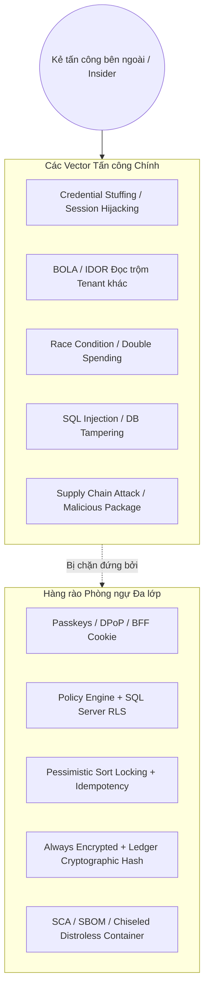
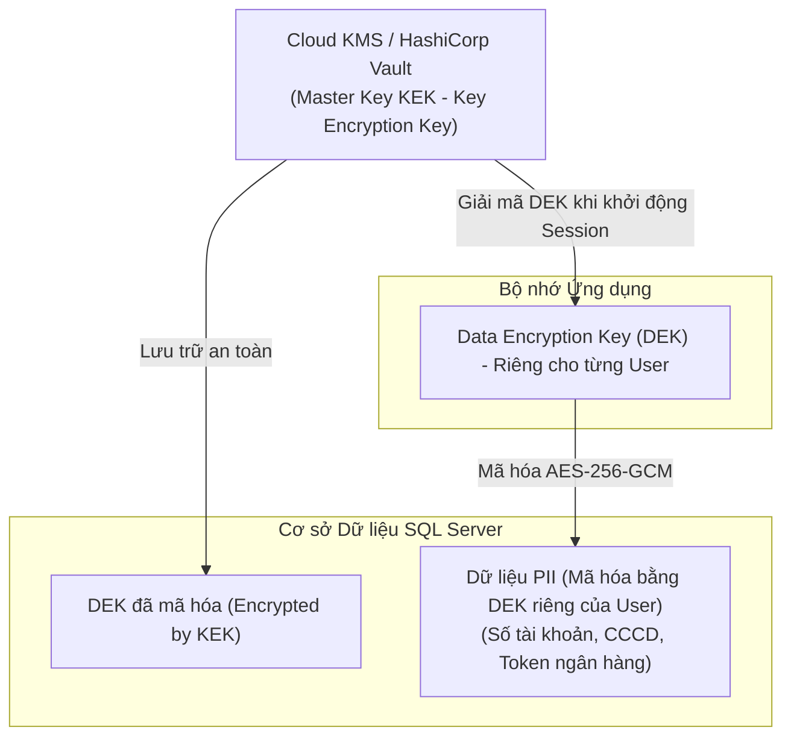
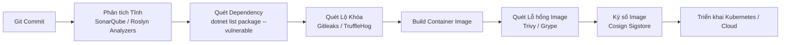

# 🛡️ FinTech Platform — Phân tích Chuyên sâu Kiến trúc Bảo mật Toàn diện (Security Blueprint & Threat Model)

> **Tài liệu tham chiếu:** [fintech_architecture_dotnet.md](./fintech_architecture_dotnet.md) · [fintech_modules_deep_dive.md](./fintech_modules_deep_dive.md)  
> **Tiêu chuẩn áp dụng:** OWASP ASVS 4.0.3 (Level 2/3), OWASP API Top 10 (2023), PCI DSS 4.0 (Scoped), NIST SP 800-63B, FIDO2/WebAuthn, Nghị định 13/2023/NĐ-CP (Bảo vệ dữ liệu cá nhân VN).

---

## Mục lục Phân tích Bảo mật Chuyên sâu

1. [Mô hình Đe dọa STRIDE & Ma trận Rủi ro (Threat Modeling)](#1-mô-hình-đe-dọa-stride--ma-trận-rủi-ro)
2. [Kiến trúc Xác thực Đa lớp (Authentication & Identity Security)](#2-kiến-trúc-xác-thực-đa-lớp-authentication--identity)
3. [Kiến trúc Phân quyền & Cách ly Dữ liệu (Authorization & Multi-Tenancy Isolation)](#3-kiến-trúc-phân-quyền--cách-ly-dữ-liệu-authorization--isolation)
4. [Mã hóa Dữ liệu & Quản lý Khóa (Data Encryption & Key Management Architecture)](#4-mã-hóa-dữ-liệu--quản-lý-khóa-data-protection--kms)
5. [Bảo mật API, Network Edge & Chống Tấn công Tự động](#5-bảo-mật-api-network-edge--chống-tấn-công-tự-động)
6. [Bảo mật Phía Client: Web (React) & Mobile (React Native/Expo)](#6-bảo-mật-client-web-react-19--mobile-react-native)
7. [Chống Gian lận Tài chính & Phát hiện Xâm nhập (Fraud Detection & SIEM)](#7-chống-gian-lận-tài-chính--phát-hiện-xâm-nhập)
8. [Audit Logging Chống Sửa đổi & Tuân thủ Pháp lý (Nghị định 13/2023/NĐ-CP)](#8-audit-logging-chống-sửa-đổi--tuân-thủ-pháp-lý)
9. [DevSecOps, Quản lý Lỗ hổng & Ứng phó Sự cố (Incident Response)](#9-devsecops-quản-lý-lỗ-hổng--kế-hoạch-ứng-phó-sự-cố)

---

## 1. Mô hình Đe dọa STRIDE & Ma trận Rủi ro

Trong một FinTech OS (kết hợp cá nhân và SME), tài sản cốt lõi cần bảo vệ gồm: **Số dư sổ cái, thông tin thẻ/tài khoản ngân hàng, thông tin định danh cá nhân (PII), và nhật ký kiểm toán (audit trail)**.



### Bảng Phân tích Rủi ro & Biện pháp Kỹ thuật

| Mối đe dọa (STRIDE) | Vector tấn công cụ thể | Mức độ | Biện pháp Phòng vệ Kỹ thuật Chi tiết |
|---|---|:---:|---|
| **Spoofing** (Giả mạo) | Chiếm phiên bằng đánh cắp JWT Token qua XSS hoặc trộm Refresh Token | **CRITICAL** | Loại bỏ JWT ở Client bằng **BFF Pattern** (HttpOnly Cookie). Mobile dùng **DPoP (RFC 9449)** và **FIDO2 Passkeys**. |
| **Tampering** (Can thiệp) | Can thiệp trực tiếp vào DB sửa số dư tài khoản hoặc xóa vết giao dịch | **CRITICAL** | **SQL Server Ledger Tables** (Cryptographic Append-Only Block Hash) + DB user runtime chỉ có quyền `INSERT`. |
| **Repudiation** (Chối bỏ) | SME Approver chối bỏ việc đã duyệt chi một khoản tiền lớn | **HIGH** | Ký số phê duyệt bằng Private Key của thiết bị (WebAuthn Assertion Signature) lưu vào `AuditLog`. |
| **Info Disclosure** (Lộ lọt) | Khai thác BOLA/IDOR để duyệt danh sách giao dịch của doanh nghiệp khác | **CRITICAL** | Phòng ngự 2 lớp: ASP.NET Core Resource Authorization + **SQL Server Row-Level Security (`SESSION_CONTEXT`)**. |
| **Denial of Service** | Gửi hàng loạt file sao kê Excel 100MB giả mạo để làm cạn kiệt CPU/RAM | **HIGH** | Validate Magic Bytes, giới hạn kích thước ở Gateway (YARP), giải nén và parse trong background worker cô lập. |
| **Elevation of Privilege** | Thành viên thường tự thêm claim `Role=Owner` trong payload | **HIGH** | Immutable Claims Principal trích xuất từ Server Session DB; cấm nhận Role từ Client Request Body. |

---

## 2. Kiến trúc Xác thực Đa lớp (Authentication & Identity)

### 2.1 Backend-For-Frontend (BFF) Pattern — Bảo vệ Web SPA
Tuyệt đối không lưu Access Token hoặc Refresh Token trong `localStorage`, `sessionStorage`, hay biến bộ nhớ JavaScript của React (vì chỉ cần một lỗ hổng thư viện NPM dính XSS là mất toàn bộ quyền).

```mermaid
sequenceDiagram
    autonumber
    actor Browser as React 19 SPA
    participant BFF as ASP.NET Core BFF (YARP + Data Protection)
    participant OpenIddict as Identity Server
    participant Redis as Redis Session Store

    Browser->>BFF: POST /api/auth/login (Passkey / Credentials)
    BFF->>OpenIddict: Xác thực Resource Owner / Assertion
    OpenIddict-->>BFF: Cấp Token Pair (JWT Access + Refresh Token)
    BFF->>Redis: Lưu trữ Token Pair theo SessionId (Server-side)
    BFF-->>Browser: Set-Cookie: __Host-fintech-session=UUID; HttpOnly; Secure; SameSite=Strict; Path=/
    Note over Browser,BFF: Trình duyệt chỉ giữ Cookie opaque, JS hoàn toàn không thấy Token!
    
    Browser->>BFF: GET /api/v1/accounts (kèm Cookie + X-CSRF-Token)
    BFF->>BFF: Validate Anti-Forgery Token
    BFF->>Redis: Lấy JWT Access Token còn hạn
    BFF->>BFF: Gắn Authorization: Bearer <JWT>
    BFF->>BFF: Reverse Proxy tới Core API Service
```

### 2.2 DPoP (Demonstrating Proof-of-Possession - RFC 9449) cho Mobile
Trên ứng dụng React Native / Expo, Token được gắn chặt với cặp khóa mật mã tạo từ chip phần cứng bảo mật (**iOS Secure Enclave** hoặc **Android Keystore/StrongBox**):
1. Mobile tạo cặp khóa bất đối xứng nội bộ (Private Key không thể export ra ngoài).
2. Khi gửi request, Mobile ký một header `DPoP` chứa: `HTTP Method`, `HTTP URI`, `Timestamp`, `Nonce`.
3. Nếu kẻ trộm bắt lén được Access Token qua proxy/network, Token đó **vô dụng** vì kẻ trộm không có Private Key trong Secure Enclave để tạo chữ ký DPoP hợp lệ.

### 2.3 Tiêu chuẩn FIDO2 / WebAuthn & Passkeys
- Không lưu mật khẩu dạng plaintext. Nếu dùng mật khẩu truyền thống: Áp dụng **Argon2id** (Memory cost: 64MB, Iterations: 3, Parallelism: 4) hoặc PBKDF2 với SHA-512 (600.000 rounds).
- Đăng nhập ưu tiên Passkeys: Kháng hoàn toàn tấn công Phishing (Credential gắn với Origin domain của hệ thống).

---

## 3. Kiến trúc Phân quyền & Cách ly Dữ liệu (Authorization & Isolation)

### 3.1 Phòng thủ Chiều sâu Chống Lỗ hổng BOLA / IDOR
BOLA (Broken Object Level Authorization - Lỗ hổng API #1 theo OWASP) xảy ra khi kẻ tấn công đổi `accountId=123` thành `accountId=456`. Hệ thống triển khai cơ chế **phòng thủ 2 lớp (Defense-in-Depth)**:

#### Lớp 1: Application Policy-Based Authorization (C#)
```csharp
public sealed class AccountAuthorizationHandler(ITenantContext tenantContext) 
    : AuthorizationHandler<MustOwnAccountRequirement, Guid>
{
    protected override Task HandleRequirementAsync(
        AuthorizationHandlerContext context, 
        MustOwnAccountRequirement requirement, 
        Guid targetAccountId)
    {
        // 1. Kiểm tra Tenant ID hiện tại có quyền truy cập Account này không
        if (!tenantContext.HasAccountAccess(targetAccountId))
        {
            // Trả về Fail -> API trả về 404 Not Found (thay vì 403 để tránh lộ sự tồn tại của resource)
            context.Fail(new AuthorizationFailureReason(this, "Resource not found"));
            return Task.CompletedTask;
        }

        context.Succeed(requirement);
        return Task.CompletedTask;
    }
}
```

#### Lớp 2: SQL Server Row-Level Security (Hạ tầng Database)
Dù lập trình viên vô tình viết thiếu điều kiện `WHERE TenantId = ...` trong câu query Dapper/EF Core, Database sẽ tự động chặn đứng việc đọc dữ liệu của Tenant khác:

```sql
CREATE SCHEMA sec;
GO

-- Hàm Predicate đọc TenantId từ Context an toàn của Session
CREATE FUNCTION sec.fn_TenantAccessPredicate(@TenantId UNIQUEIDENTIFIER)
RETURNS TABLE
WITH SCHEMABINDING
AS
RETURN SELECT 1 AS AccessResult
WHERE @TenantId = CAST(SESSION_CONTEXT(N'ActiveTenantId') AS UNIQUEIDENTIFIER);
GO

-- Áp dụng Security Policy bắt buộc trên bảng tài khoản và giao dịch
CREATE SECURITY POLICY sec.TenantIsolationPolicy
    ADD FILTER PREDICATE sec.fn_TenantAccessPredicate(TenantId) ON ledger.Accounts,
    ADD BLOCK PREDICATE sec.fn_TenantAccessPredicate(TenantId) ON ledger.Accounts AFTER INSERT,
    ADD FILTER PREDICATE sec.fn_TenantAccessPredicate(TenantId) ON txn.Transactions,
    ADD BLOCK PREDICATE sec.fn_TenantAccessPredicate(TenantId) ON txn.Transactions AFTER INSERT
WITH (STATE = ON);
GO
```

---

## 4. Mã hóa Dữ liệu & Quản lý Khóa (Data Protection & KMS)

### 4.1 Mô hình Khóa Phân tầng (Envelope Encryption)
Để tuân thủ yêu cầu **Quyền được lãng quên (Right to be Forgotten)** theo Nghị định 13/2023/NĐ-CP mà không làm hỏng cấu trúc bảng liên kết trong cơ sở dữ liệu:



> **Cơ chế Crypto-Shredding (Xóa vĩnh viễn dữ liệu cá nhân):**  
> Khi User yêu cầu xóa tài khoản, hệ thống chỉ cần xóa bản ghi `EncryptedDEK` tương ứng của User đó trong DB. Toàn bộ dữ liệu PII trong mọi bản sao lưu (Backup / Log) sẽ lập tức trở thành chuỗi rác mã hóa ngẫu nhiên không thể giải mã, ngay cả khi hacker đánh cắp được file sao lưu `.bak`.

### 4.2 SQL Server Always Encrypted với Secure Enclaves
- **Dữ liệu áp dụng:** Số thẻ tín dụng, Số tài khoản ngân hàng liên kết, Khóa bí mật 2FA TOTP.
- Cột được mã hóa bằng thuật toán `AEAD_AES_256_CBC_HMAC_SHA_256`.
- **Lợi ích:** Kể cả Quản trị viên Cơ sở dữ liệu (DBA) có quyền `sa` cao nhất chạy lệnh `SELECT *` cũng chỉ thấy chuỗi byte mã hóa; dữ liệu chỉ được giải mã trong Enclave bảo vệ của CPU hoặc trong ứng dụng có chứng chỉ khóa.

---

## 5. Bảo mật API, Network Edge & Chống Tấn công Tự động

### 5.1 Kiến trúc Biên giới Mạng (Edge Gateway)
```mermaid
graph LR
    User([Khách hàng]) --> Cloudflare[WAF & DDoS Protection<br/>Cloudflare / Azure Front Door]
    Cloudflare -->|mTLS| YARP[ASP.NET Core YARP Gateway<br/>(BFF, Rate Limit, IP Rep)]
    YARP -->|Private VNet / mTLS| CoreAPI[FinTech Core Micro-Services]
    CoreAPI -->|Private Endpoint| SQLServer[(SQL Server 2025)]
```

### 5.2 Chiến lược Rate Limiting (Chống Brute-force & SMS Pumping)
Sử dụng **Token Bucket Limiter** tích hợp sẵn của .NET 10 kết hợp Redis Distributed Store:

| Điểm cuối (Endpoint) | Hạn mức Giới hạn (Rate Limit) | Hành động khi Vi phạm |
|---|---|---|
| `POST /api/auth/login` | 5 requests / 1 phút / IP | Khóa IP 15 phút, yêu cầu giải CAPTCHA |
| `POST /api/auth/send-otp` | 1 OTP / 60 giây; tối đa 5 OTP / ngày / SĐT | Chặn gửi SMS để chống cạn kiệt chi phí (SMS Pumping) |
| `POST /api/v1/ledger/entries` | 20 requests / 10 giây / User | Trả về `429 Too Many Requests` + Header `Retry-After` |
| `POST /api/v1/import/upload` | 3 files / 5 phút / Tenant | Tạm dừng nhận file để tránh quá tải Worker |

### 5.3 Bảo vệ File Upload & Chống Mã độc
1. **Validation nghiêm ngặt:** Không bao giờ tin tưởng đuôi mở rộng file (`.xlsx`, `.csv`). Kiểm tra **Magic Bytes** ở phần đầu của Stream dữ liệu.
2. **Chống Zip Bomb / Excel XML Entity Expansion (Billion Laughs):** Vô hiệu hóa phân giải thực thể DTD trong trình phân tích XML (`DtdProcessing.Prohibit`).
3. **Chống CSV Formula Injection:** Khi xuất dữ liệu giao dịch ra CSV, nếu ký tự đầu tiên của ô là `=`, `+`, `-`, `@`, `\t`, `\r` $\to$ Tự động chèn ký tự nháy đơn `'` ở đầu để vô hiệu hóa thực thi macro trong Excel.

---

## 6. Bảo mật Client: Web (React 19) & Mobile (React Native)

### 6.1 Chính sách Bảo vệ Web (Security Headers)
Mọi phản hồi từ Web Server bắt buộc cấu hình các Security Headers sau:
```http
Content-Security-Policy: default-src 'self'; script-src 'self'; object-src 'none'; frame-ancestors 'none'; base-uri 'self'; form-action 'self';
X-Content-Type-Options: nosniff
X-Frame-Options: DENY
Referrer-Policy: strict-origin-when-cross-origin
Strict-Transport-Security: max-age=63072000; includeSubDomains; preload
Permissions-Policy: camera=(), microphone=(), geolocation=()
```

### 6.2 Bảo mật Ứng dụng Mobile (React Native / Expo)
- **Certificate Pinning:** Nhúng Public Key Hash (SPKI PIN) của Server Certificate vào file cấu hình native. Ứng dụng sẽ từ chối kết nối nếu phát hiện các công cụ bắt gói tin như Charles Proxy hay Burp Suite chèn chứng chỉ giả mạo.
- **Phát hiện Môi trường Rủi ro (Root / Jailbreak Detection):** Sử dụng các module native để kiểm tra tính toàn vẹn (SafetyNet / Play Integrity API trên Android; DeviceCheck / App Attest trên iOS). Nếu phát hiện máy bị bẻ khóa $\to$ Vô hiệu hóa tính năng nhập vân tay/Face ID và buộc đăng xuất.
- **Làm mờ Màn hình khi vào Background (Screen Obscuring):** Tự động che mờ ảnh chụp ứng dụng trong App Switcher để tránh lộ số dư tài khoản khi chuyển app.
- **Chống Chụp màn hình (Screen Capture Protection):** Bật cờ `FLAG_SECURE` trên Android ở các màn hình hiển thị thông tin thẻ hoặc mật khẩu.

---

## 7. Chống Gian lận Tài chính & Phát hiện Xâm nhập

### 7.1 Bộ Luật Phát hiện Gian lận Thời gian Thực (Realtime Fraud Rules)
Mỗi sự kiện `TransactionCreatedEvent` được truyền qua Worker phân tích rủi ro trong vòng < 500ms:

```
[Giao dịch Phát sinh] 
        │
        ├──► Rule 1: [Velocity Check] > 5 giao dịch trong 60 giây? ──────► [Flag: Rủi ro Cao]
        │
        ├──► Rule 2: [Card Testing] >= 3 giao dịch số tiền < 20.000 VND? ─► [Flag: Rủi ro Vừa]
        │
        ├──► Rule 3: [Spike Alert] Số tiền > 5x Trung bình 90 ngày? ─────► [Push Confirm User]
        │
        └──► Rule 4: [Impossible Travel] Khoảng cách 2 IP liên tiếp ──────► [Yêu cầu Step-up MFA]
```

### 7.2 Step-up Authentication (Xác thực Nâng bước)
Khi người dùng thực hiện một trong các hành động sau, hệ thống **bắt buộc yêu cầu xác thực lại** bằng Sinh trắc học (Biometrics) hoặc OTP TOTP ngay cả khi phiên đăng nhập vẫn còn hạn:
1. Thêm mới tài khoản nhận tiền / Chuyển khoản số tiền lớn vượt hạn mức cấu hình.
2. Xuất toàn bộ dữ liệu tài chính (Export Full Backup ZIP).
3. Đổi email, số điện thoại hoặc mật khẩu.
4. Mời thêm thành viên quản trị (Admin/Owner) vào SME Workspace.

---

## 8. Audit Logging Chống Sửa đổi & Tuân thủ Pháp lý

### 8.1 Cấu trúc Chuỗi Băm Mật mã (Tamper-Evident Hash Chain)
Mỗi bản ghi trong bảng Audit Log được liên kết chặt chẽ với bản ghi liền trước bằng giải thuật băm tương tự Block-chain:
$$\text{Hash}_n = \text{HMAC-SHA256}\Big(\text{Hash}_{n-1} \parallel \text{CanonicalJSON}(\text{AuditRecord}_n), \text{SecretKey}\Big)$$

```sql
CREATE SCHEMA audit;
GO

CREATE TABLE audit.SecurityAuditTrail (
    Id BIGINT IDENTITY(1,1) NOT NULL PRIMARY KEY,
    EventId UNIQUEIDENTIFIER NOT NULL,
    Timestamp DATETIMEOFFSET(3) NOT NULL,
    TenantId UNIQUEIDENTIFIER NULL,
    ActorUserId UNIQUEIDENTIFIER NOT NULL,
    IpAddress VARCHAR(45) NOT NULL,
    UserAgent NVARCHAR(256) NOT NULL,
    Action NVARCHAR(100) NOT NULL, -- e.g., "Ledger.PostEntry", "IAM.StepUpFailed"
    ResourceName NVARCHAR(100) NOT NULL,
    ResourceId NVARCHAR(100) NOT NULL,
    OldValuesJson NVARCHAR(MAX) NULL,
    NewValuesJson NVARCHAR(MAX) NULL,
    PreviousRecordHash CHAR(64) NOT NULL,
    CurrentRecordHash CHAR(64) NOT NULL
)
WITH (LEDGER = ON (APPEND_ONLY = ON));
```

### 8.2 Tuân thủ Nghị định 13/2023/NĐ-CP (Bảo vệ Dữ liệu Cá nhân VN)
1. **Lưu vết Đồng ý (Consent Management):** Lưu trữ rõ ràng thời điểm, phiên bản điều khoản và loại dữ liệu mà người dùng đã đồng ý cho phép xử lý.
2. **Biện pháp Kỹ thuật 72 Giờ:** Có quy trình tự động cô lập hệ thống và trích xuất báo cáo kỹ thuật khi phát hiện dấu hiệu lộ lọt dữ liệu để phục vụ nghĩa vụ thông báo cho Cục An ninh mạng trong vòng 72 giờ theo luật định.

---

## 9. DevSecOps, Quản lý Lỗ hổng & Kế hoạch Ứng phó Sự cố

### 9.1 Quy trình Tự động hóa CI/CD Pipeline


### 9.2 Quy trình Ứng phó Sự cố Bảo mật (Security Incident Playbook)

```
GIAI ĐOẠN 1: PHÁT HIỆN & PHÂN LOẠI
├── Kích hoạt cảnh báo từ SIEM / Cảnh báo bất thường Ledger mất cân bằng
└── Phân loại mức độ sự cố: P1 (Critical - Mất tiền/Rò rỉ dữ liệu) đến P4 (Low)

GIAI ĐOẠN 2: NGĂN CHẶN TỨC THÌ (CONTAINMENT)
├── Bật Kill Switch (Feature Flag) tạm dừng module bị tấn công
├── Thu hồi ngay lập tức Session của các tài khoản bị nghi ngờ trong Redis
└── Cô lập Pods / Database bị nghi ngờ khỏi mạng nội bộ

GIAI ĐOẠN 3: ĐIỀU TRA & KHẮC PHỤC (ERADICATION)
├── Trích xuất Forensic Image và kiểm tra Hash Chain của Audit Log
├── Vá lỗ hổng mã nguồn, xoay (Rotate) toàn bộ KEK trong Key Vault
└── Khôi phục Database về trạng thái nhất quán gần nhất (PITR)

GIAI ĐOẠN 4: HỒI PHỤC & BÁO CÁO (POST-INCIDENT)
├── Mở lại dịch vụ có giám sát chặt chẽ
└── Họp Retrospective, viết báo cáo Post-Mortem và cải tiến quy trình phòng ngự
```

---

## Kết luận

Kiến trúc bảo mật trên tạo thành một **hệ thống phòng thủ chiều sâu (Defense-in-Depth)** không có điểm yếu đơn lẻ (No Single Point of Failure). Ngay cả khi một lớp bảo vệ bị xuyên thủng (ví dụ: máy tính người dùng bị nhiễm phần mềm gián điệp hoặc DBA phản bội), các lớp bảo vệ bên dưới (BFF Cookie, DPoP, SQL Server RLS, Ledger Cryptographic Hash, và Always Encrypted) vẫn đảm bảo dữ liệu tài chính không thể bị đánh cắp hay thao túng số dư trái phép.
